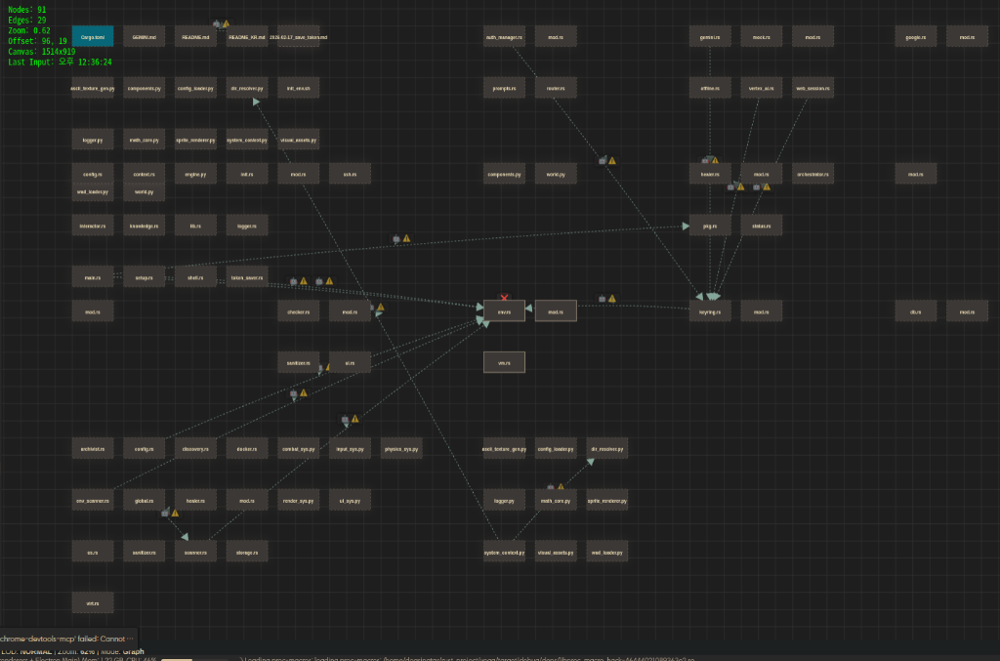
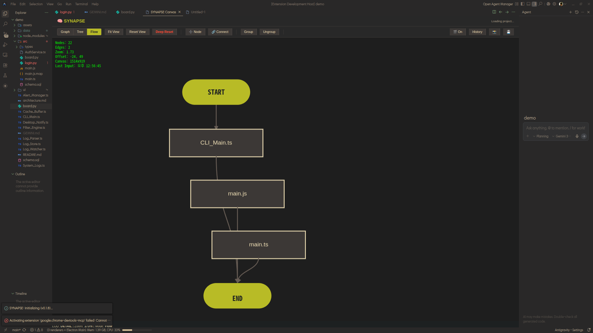

# 🧠 SYNAPSE: VS Code Visual Architecture Engine

> **Visual Studio Code (VS Code) Extension**  
> "보이는 것이 곧 LLM의 논리다 (WYSIWYG Logic for AI)"

[🇰🇷 한국어 (Korean)](README.ko.md) | [🇺🇸 English (English)](README.md)

SYNAPSE는 **Google Antigravity** 및 **Visual Studio Code** 사용자를 위해 구축된 차세대 확장 프로그램입니다. LLM(Large Language Model)이 생성하거나 분석한 복잡한 추론 논리를 물리적 공간과 노드-엣지 네트워크로 시각화하여, AI의 사고 과정을 직관적으로 설계, 구현, 문서화할 수 있게 돕습니다.

## 🚀 Key Features

- **🌐 Topology View**: 프로젝트의 폴더 구조 및 파일 간의 의존성을 노드-엣지 네트워크로 시각화.
- **🌳 Tree View**: 프로젝트 구조를 계층적으로 조감.
- **➡️ Flow View (강화! 🏁)**: 특정 로직의 실행 흐름을 수평 분기가 포함된 순서도로 투사하며, Mermaid 출력 시 클러스터링(subgraph) 지원이 추가되었습니다 (v0.2.2).
- **🛡️ Node Diet (Smart Scanning)**: `.venv`, `node_modules` 등 불필요한 폴더를 자동으로 무시합니다.
- **📦 Ghost Node Storage (신규! 📥)**: 의존성이 없는 고립된 노드들을 별도의 보관소(Storage) 클러스터로 자동 격리하여 메인 뷰를 깨끗하게 유지합니다.
- **📂 Auto Folder Clustering**: 디렉토리 구조에 기반한 자동 그룹화 기능을 제공하며, 이제 Mermaid 파일 생성 시에도 이 그룹화가 유지됩니다 (v0.2.2).
- **🔄 Deep Reset**: 엉망이 된 배치를 즉시 초기화하고 최신 필터로 재스캔하는 심층 초기화.
- **🎯 Scan Scope Control**: `GEMINI.md`에서 `Scan Paths`를 지정하여 원하는 영역만 정밀 스캔 가능.
- **⌨️ Arrow Key Navigation**: 방향키와 Shift 키를 이용한 빠르고 정밀한 캔버스 탐색 지원.
- **🔍 Semantic Zooming (LOD)**: 수천 개의 노드도 성능 저하 없이 조작 가능한 단계별 상세도 제어.
- **💾 Persistence**: 모든 시각적 상태를 `project_state.json`에 영구 저장 및 Git 관리.
- **🛠️ Standalone Bridge**: VS Code 없이 브라우저 단독 구동 모드 지원.
- **💾 Prompt Traceability**: 캔버스에서 직접 프롬프트와 설계 결정을 기록 및 저장 (자동 저장 지원).
- **🔌 강화된 LSP 연동 (New! 🚀)**: `GEMINI.md`에서 코드 Hover, 정의 이동(Definition), 실시간 유효성 검사를 통해 설계와 실제 코드를 강력하게 연결.

## 🎥 데모 비디오
https://www.youtube.com/watch?v=Va4vZWkqC8E
> *위 링크를 클릭하면 YouTube에서 전체 영상을 시청할 수 있습니다.*

## 📸 스크린샷

### 🌐 Graph View
LLM의 추론 논리와 파일 간의 물리적 연결 상태를 노드-엣지 네트워크로 시각화합니다.


### 🌳 Tree View
프로젝트의 폴더 구조와 파일 계층을 직관적으로 조감할 수 있습니다.


### ➡️ Flow View
특정 이벤트나 함수의 로직 실행 흐름을 선형적인 순서도로 투사합니다. 이는 코드 편집과 노드 편집의 모든 결과물이 결합되어 반영되는 **최종적인 권위적 산출물**입니다.


## 🗂️ 언어 지원 (Language Support)

SYNAPSE는 다양한 언어 아키텍처 분석을 지원합니다:
- 🐍 **Python**: `.py` 파일 분석 및 가상환경 필터링 지원
- 🦀 **Rust**: `Cargo` 프로젝트 구조 및 `.rs` 로직 분석
- 🇨 **C / C++**: 헤더 및 소스 파일 의존성 분석 (ReDoS 방지 최적화 완료)
- 🐚 **Shell Script**: `.sh` 자동화 스크립트 흐름 및 함수 분석
- 🗄️ **SQL**: `.sql` 테이블 정의 및 스키마 시각화
- ⚙️ **Config (JSON/YAML/TOML)**: 인프라 설정 파일 간의 관계 분석 (The Glue)
- 📜 **TypeScript / JavaScript**: 인터페이스, 타입, 비동기 로직 완벽 분석 (v0.2.1+ 엔진 강화! 🚀)

## 🛠️ 기술 스택 (Technology Stack)

- **Base**: Google Antigravity & Visual Studio Code (VS Code)
- **Language**: TypeScript
- **Engine**: HTML5 Canvas API (High Performance Rendering)
- **Scanner**: 정규식 기반 고속 다중 언어 스캐너 (Python, C++, Rust, Shell, SQL, Config, TS)
- **Architecture**: LSP 연동 기반 Visual-First 설계

## 📦 설치 및 시작하기

### 1. VS Code 확장 프로그램 (추천)
[Releases 탭](https://github.com/dogsinatas29/SYNAPSE/releases)에서 가장 최신의 `.vsix` 파일을 다운로드하십시오.

#### 설치 방법:
*   **방법 A: 드래그 앤 드롭 (가장 간편)**
    - 다운로드한 `.vsix` 파일을 VS Code 창으로 드래그합니다.
*   **방법 B: 확장 메뉴 이용**
    1. 확장(Extensions) 아이콘 클릭 (`Ctrl+Shift+X`).
    2. 상단 더보기 `...` 메뉴 클릭.
    3. **'Install from VSIX...'** 선택 후 파일 지정.
*   **방법 C: 터미널 명령어**
    - `code --install-extension synapse-extension.vsix`

### 2. 소스 코드에서 빌드하기
```bash
git clone https://github.com/dogsinatas29/SYNAPSE.git
npm install
npm run watch
# VS Code에서 F5를 눌러 실행
```

### 3. Standalone 브라우저 모드
VS Code 없이 브라우저에서 직접 엔진을 구동하고 싶을 때 사용합니다.
```bash
# 터미널 1: API Server
npm run dev:standalone

# 터미널 2: UI Server
npm run dev:ui
```
- API 서버: `http://localhost:3000`
- UI 서버: `http://localhost:8080`

### 4. 개발자 패키징 (Build)
1. `npm install -g @vscode/vsce`
2. `npx vsce package --out synapse-extension.vsix`

## 🎯 매뉴얼 및 사용 가이드

### 🧱 노드 및 엣지 관리 (WYSIWYG)
- **노드 추가**: 상단 툴바의 `Add Node` 버튼 클릭.
- **삭제**: 툴바의 **🗑️ Delete** 버튼, `Delete` 키, 또는 우클릭 컨텍스트 메뉴를 사용하여 노드와 엣지를 삭제합니다.
- **수동 엣지**: 노드의 연결 핸들을 **Alt + 클릭**한 후 대상 노드로 드래그하여 관계(Dependency, Call 등)를 설정합니다.

### 📦 클러스터링 및 관리
- **그룹 생성**: 여러 노드 선택 후 `Group` 클릭.
- **그룹 관리**: 헤더 더블 클릭으로 이름 수정, `[-]`/`[+]` 버튼으로 접기/펴기 가능.
- **그룹 해제**: 그룹 선택 후 `Ungroup` 클릭.

### 💾 스냅샷 및 롤백
- **스냅샷**: 카메라 아이콘을 클릭해 현재 시각적 상태 저장.
- **롤백**: 시계 아이콘을 클릭해 설계 히스토리 확인 및 복원.
- **프롬프트 기록**: `Ctrl+Alt+M`으로 설계 아이디어를 캔버스에 즉시 노드로 추가.

### 🧹 데이터 정형화 원칙
- **분리**: 로직은 `GEMINI.md`에, 좌표는 `project_state.json`에 저장됩니다.
- **정규화**: 정렬된 JSON 키를 통해 Git Diff를 최소화합니다.
- **Git Shield**: `.vsix` 및 루트 `GEMINI.md` 등 불필요한 파일을 자동 무시합니다 (v0.2.2).
- **휘발성 엣지**: 자동 스캔된 엣지는 실시간으로 재생성되어 데이터의 무결성을 지킵니다.

### 🔥 핵심 전략
- **멀티 MD 전략**: 모든 `.md` 파일을 컨텍스트로 활용합니다. `[링크](경로)`를 통해 문서와 코드를 연결하세요.
- **자동 파일 관리**: 모든 로그는 `prompts/` 폴더에 저장되며 Git에 자동 커밋되어 설계 히스토리를 보존합니다.

## 📐 Philosophy
"아이들에게는 직관적인 놀이터, 전문가에게는 강력한 관제탑."  
복잡한 시스템을 선으로 연결하는 단순한 행위가 사실은 가장 고차원적인 아키텍처 설계라는 믿음으로 제작되었습니다.

## 📜 License
이 프로젝트는 [GNU General Public License v3.0](LICENSE) 라이선스 하에 배포됩니다.

---
Created by [dogsinatas29](https://github.com/dogsinatas29)
