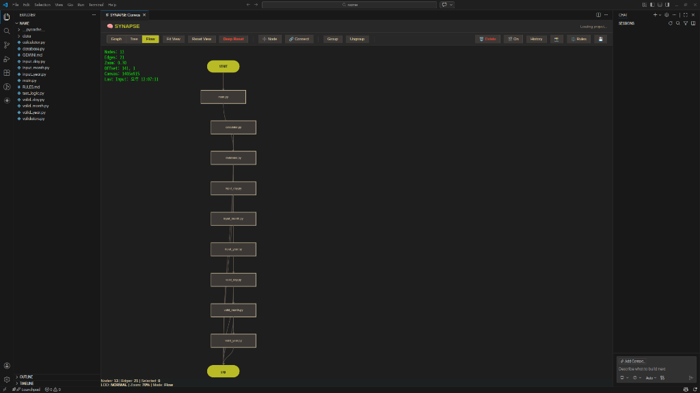
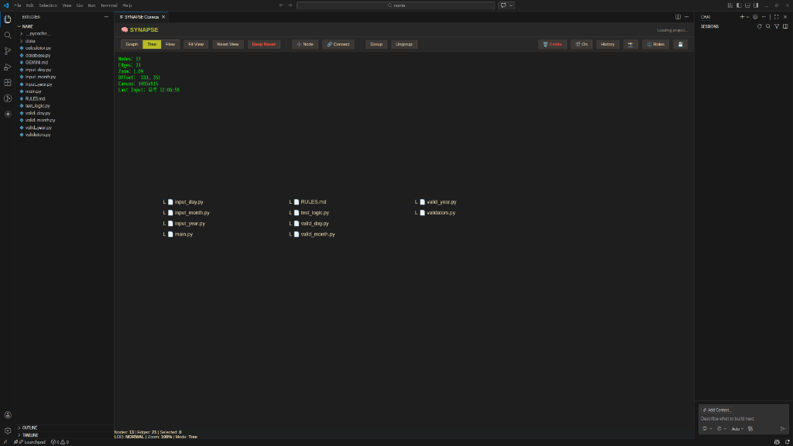

#  SYNAPSE: 비주얼 아키텍처 엔진

> **"눈에 보이는 것이 곧 LLM의 논리입니다."** — *AI를 위한 WYSIWYG 논리 설계 도구*

[

[](https://www.typescriptlang.org/)
[](https://code.visualstudio.com/)

[🇺🇸 English Version](README.md) | [🇰🇷 한국어 버전](README.ko.md)

---

**SYNAPSE**는 **Google Antigravity**와 **VS Code** 사용자를 위한 차세대 시각적 제어 센터입니다. 대규모 언어 모델(LLM)의 추론 과정과 실제 코드 아키텍처 사이의 간극을 메워, 추상적인 논리를 고성능의 인터랙티브 노드-에지 네트워크로 변환합니다.

## 🌟 다중 언어 지능 (v0.2.11 신규 기능)

SYNAPSE는 이제 사용하는 언어에 관계없이 프로젝트의 깊은 의미를 이해하는 통합 스캐닝 엔진을 탑재했습니다.

| 언어 | 고급 해석 엔진 | 로직 플로우 분석 | 최적의 용도 |
| :--- | :---: | :---: | :--- |
| 🐍 **Python** | 심층 임포트 해석 | 전체 지원 | 웹, 데이터 과학, AI |
| 🦀 **Rust** | Crate/Super/Self | `match` 및 에러 핸들링 | 시스템, 고성능 엔진 |
| 🇨 **C / C++** | 로컬 vs 시스템 헤더 | 제어 구조 분석 | 레거시, 성능 최적화, 임베디드 |
| 📜 **JS / TS** | Async/Types | 전체 지원 | 웹, 확장 프로그램, 툴링 |

---

## 🚀 핵심 기능

### 🌐 토폴로지 뷰 (아키텍처 맵)
프로젝트의 폴더 구조와 파일 의존성을 네트워크 형태로 시각화합니다.
- **Node Diet**: 빌드 결과물, 모듈 폴더 등 불필요한 노이즈를 자동으로 필터링합니다.
- **Ghost Node Storage**: 연결되지 않은 컴포넌트들을 별도 클러스터로 격리하여 캔버스를 깨끗하게 유지합니다.
- **Rule Engine**: `RULES.md`를 통해 일관된 발견 규칙과 아이콘 표준을 적용합니다.

### ➡️ 플로우 뷰 (로직 실행 흐름)
복잡한 실행 흐름을 직관적인 순서도로 투영합니다.
- **지능형 분기 감지**: `if/else`, 루프, `try/catch` 등을 높은 정밀도로 포착합니다.
- **Rust 패턴 지원**: Rust 고유의 `match` 식과 에러 처리 패턴을 완벽하게 시각화합니다.
- **권위 있는 결과**: 수동 설계 결정과 실제 소스 코드 로직을 결합하여 최종 결과물을 도출합니다.

### 🧠 지능형 컨텍스트 보관소 (Intelligent Context Vault)
- **무중단 컨텍스트 캡처 (`Ctrl+Alt+M`)**: 레코딩 시작(`REC`) 시 백그라운드에서 최근 VS Code AI 채팅(예: GitHub Copilot) 세션을 팝업 없이 자동으로 추적합니다. 코딩 완료 후 다시 버튼을 누르면, **[AI와 나눈 질답 + 실제 수정된 소스코드 Git Diff]**가 완벽한 마크다운 문서로 자동 병합/기록됩니다.
- **시맨틱 줌 (LOD)**: 수천 개의 노드도 성능 저하 없이 부드럽게 탐색할 수 있는 단계별 상세도 제어 기능을 제공합니다.
- **지속성(Persistence)**: 모든 시각적 상태를 Git 친화적인 `project_state.json`에 영구적으로 저장합니다.

---

## 📸 시각적 개요

### 프로젝트 토폴로지 (Topology)
LLM 추론 논리와 소스 파일 간의 물리적 연결 상태를 시각화합니다.


### 논리 흐름 (Flow)
코드 변경 사항과 수동 편집 사항이 모두 반영된 논리 실행 흐름도입니다.


### 계층 구조 (Tree)
프로젝트 구조를 한눈에 파악할 수 있는 체계적인 트리 뷰를 제공합니다.


---

## 🛠️ 설치 방법

1. [Releases](https://github.com/dogsinatas29/SYNAPSE/releases) 페이지에서 최신 `.vsix` 파일을 다운로드합니다.
2. 파일을 **VS Code** 창으로 드래그 앤 드롭합니다.
3. 또는 터미널에서 다음 명령어를 입력합니다:### 빠른 설치
```bash
code --install-extension synapse-visual-architecture-0.2.15.vsix
```
현재 버전: **v0.2.15** (Bypass 로직 및 플로우 수정)

---

## 🆕 버전 히스토리

### v0.2.14
- **💎 순서도 기하학 도형 반영**: Graph View의 노드들이 의미론적 로직에 기반하여 표준 순서도 도형으로 렌더링됩니다 (`if/valid_`는 다이아몬드, `for/loop`는 육각형, `print`는 평행사변형).
- **🛡️ 작전 지휘소(War Room) 엔진 도입**: SYNAPSE를 기술 감사 및 진단 센터로 변모시킵니다.
- **로직 분석기(Logic Analyzer)**: 순환 의존성, 병목 지점, 논리 단절을 자동으로 탐지합니다.
- **실시간 펄스 애니메이션**: 로직의 전파 가시성(Reachability)을 가시화하는 입자 효과를 지원합니다.
- **인터랙티브 리포트**: `리포트.md`의 탐지 항목 클릭 시 캔버스가 해당 노드로 즉시 자동 포커싱됩니다.

### v0.2.13
- **🌟 클러스터 UX 전면 개편**: 캔버스 상호작용이 획기적으로 개선되었습니다.
- **드래그 앤 드롭**: 이제 전체 클러스터를 상단 헤더 블록을 잡고 부드럽게 끌어서 이동할 수 있습니다.
- **내부 노드 일괄 선택**: 클러스터를 실수로 드래그하지 않고도, 내부 빈 공간에 다중 선택 박스를 그려 특정 노드들을 손쉽게 선택 가능합니다.
- **Gruvbox 색상 지원**: 식별성 강화를 위해 모든 클러스터에 고유 ID 해시값을 적용하여 일관된 개별 색상(Gruvbox Palette)을 자동 부여합니다.

### v0.2.12
- **🧠 지능형 컨텍스트 보관소**: 팝업창 및 수동 복사/붙여넣기 없이, VS Code Copilot 채팅 기록을 캔버스 기록(`context.md`)으로 자동 추출합니다.
- **Zero-Click 워크플로 맵핑**: `Ctrl+Alt+M` 누르면 알아서 최신 대화록과 Git Diff를 병합하여 마크다운 문서 생성.

### v0.2.11
- **✨ 다중 언어 지능화**: Python, C/C++, Rust를 위한 정교한 스캐닝 지원.
- **고급 해석 엔진**: 모든 주요 언어의 내부 경로 추적 기능 강화.
- **통합 플로우 뷰**: C/C++ 및 Rust의 로직 실행 시각화 지원 추가.

### v0.2.10
- **🐛 중요 수정**: 활성화 오류 해결 및 다중 노드 삭제 안정성 개선.

---

## 📜 라이선스 및 제작자
본 프로젝트는 [GNU General Public License v3.0](LICENSE) 라이선스를 따릅니다.  
[dogsinatas29](https://github.com/dogsinatas29)가 🧠와 정성을 담아 제작했습니다.
