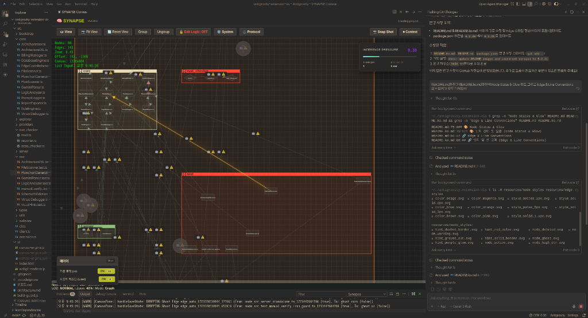

#  🧠 SYNAPSE: 비주얼 아키텍처 엔진 (v0.2.21)

> **"눈에 보이는 것이 곧 LLM의 논리입니다."** — *AI를 위한 WYSIWYG 논리 설계 도구*

[](https://github.com/dogsinatas29/SYNAPSE/releases)

[](https://www.typescriptlang.org/)
[](https://code.visualstudio.com/)

[🇰🇷 한국어 버전](README.ko.md) | [🇺🇸 English Version](README.md)

---

**SYNAPSE**는 **Google Antigravity**와 **VS Code**를 위한 차세대 시각적 제어 타워입니다. 대규모 언어 모델(LLM)의 추론 과정과 실제 코드 아키텍처 사이의 간극을 메워, 추상적인 논리를 상호작용 가능한 고성능 노드-에지 네트워크로 변환합니다.

## 🌟 다중 언어 지능 (v0.2.11 신규 기능)

SYNAPSE는 이제 사용하는 언어에 관계없이 프로젝트의 심층적인 의미를 이해하는 통합 스캐닝 엔진을 탑재했습니다.

| 언어 | 고급 해석 엔진 | 로직 플로우 분석 | 최적의 용도 |
| :--- | :---: | :---: | :--- |
| 🐍 **Python** | 심층 임포트 해석 | 전체 지원 | 웹, 데이터 과학, AI |
| 🦀 **Rust** | Crate/Super/Self | `match` 및 에러 핸들링 | 시스템, 고성능 엔진 |
| 🇨 **C / C++** | 로컬 vs 시스템 헤더 | 제어 구조 분석 | 레거시, 성능 최적화, 임베디드 |
| 📜 **JS / TS** | Async/Types | 전체 지원 | 웹, 확장 프로그램, 툴링 |

---

## 🚀 핵심 기능

### 🌐 토폴로지 뷰 (아키텍처 맵)
프로젝트의 폴더 구조와 파일 의존성을 실시간 네트워크로 시각화합니다.
- **Node Diet**: venv, node_modules, 빌드 아티팩트와 같은 불필요한 노이즈를 자동으로 필터링합니다.
- **Ghost Node Storage**: 연결되지 않은 컴포넌트들을 별도로 격리하여 워크스페이스를 깨끗하게 유지합니다. ([Ghost Node 가이드 보기](GHOST_NODE.md))
- **Rule Engine**: `RULES.md`를 기반으로 일관된 발견 규칙과 아이콘 표준을 적용합니다.

### ➡️ 플로우 뷰 (로직 실행 흐름)
복잡한 실행 흐름을 직관적인 순서도로 투영합니다.
- **지능형 분기 감지**: `if/else`, 루프, `try/catch` 등을 높은 정밀도로 포착합니다.
- **Rust 패턴 지원**: Rust 고유의 `match` 패턴 매칭을 완벽하게 시각화합니다.
- **권위 있는 결과**: 수동 설계 결정과 실제 소스 코드 로직을 통합하여 최상의 정합성을 보장합니다.

### 🧠 지능형 컨텍스트 보관소
- **무중단 컨텍스트 캡처 (`Ctrl+Alt+M`)**: 레코딩 시작(`REC`) 시 백그라운드에서 최근 VS Code AI 채팅(예: GitHub Copilot) 세션을 팝업 없이 자동으로 추적합니다. 코딩 완료 후 다시 버튼을 누르면, 프롬프트, 응답, Git diff가 완벽한 마크다운 문서로 자동 기록됩니다.
- **시맨틱 줌 (LOD)**: 성능 최적화된 렌더링을 통해 수천 개의 노드도 부드럽게 탐색할 수 있습니다.
- **지속성(Persistence)**: 모든 시각적 상태를 Git 친화적인 `project_state.json`에 저장합니다.

---

## 🧠 DTR (Density of Thought Reasoning) 엔진
SYNAPSE v0.2.18부터 도입된 **DTR 엔진**은 AI의 추론 깊이와 아키텍처 밀도를 정량적으로 측정합니다. 이는 모호한 AI 확신도를 측정 가능한 엔지니어링 지표로 변환합니다.

### 🌓 DTR 지표 스펙트럼
- **DTR (Density of Thought)**: (0.0 ~ 1.0) 특정 노드에 집중된 추론 노력을 나타냅니다. 높은 DTR 노드는 보라색 아우라로 빛나며 핵심 결정 지점을 표시합니다.
- **$\rho$ (Density Rho)**: 정보 압축률. 하나의 시각적 추상화 내에 얼마나 많은 원시 코드/로직이 캡슐화되어 있는지를 측정합니다.
- **Think-at-N (Simulation Paths)**: 현재 노드를 실체화하기 전 LLM이 시뮬레이션한 대안적 아키텍처 경로의 수입니다.
- **Panic Isolation**: 한 언어 클러스터(예: C++ 크래시)의 로직 실패가 전체 시각화 엔진으로 전염되지 않도록 구조화된 에러 코드로 격리 및 보고하는 안전 프로토콜입니다.

### 🚀 결정론적 사고(Deterministic Thinking)의 기반
DTR은 단순한 시각 효과가 아닙니다. 이는 **결정론적 사고**의 기반이 됩니다. 추론 밀도를 수치화함으로써, AI 확신도가 낮은 아키텍처의 "약한 고리"를 식별하고 사용자에게 수동 검증(`?` 배지 흐름)을 유도합니다.

---

## 🏗️ 노드 규격 (Node Conventions)
SYNAPSE는 컴포넌트의 종류와 현재 추론 상태를 표현하기 위해 고유한 아이콘과 색상을 사용합니다.

### 📄 엔티티 타입 (Entity Types)
| 아이콘 | 타입 | 설명 |
| :---: | :--- | :--- |
| 📄 | **File** | 워크스페이스 내의 실제 소스 파일입니다. |
| 📁 | **Folder** | 여러 노드나 클러스터를 포함하는 디렉토리입니다. |
| 🧩 | **Component** | 논리적 그룹 또는 추상화된 모듈입니다. |
| ⚡ | **Trigger** | 진입점 또는 이벤트 소스입니다. |

### 🎨 노드 상태 및 발광 (Node Status & Glow)
| 상태 | 시각적 힌트 | 색상 | 의미 |
| :--- | :---: | :---: | :--- |
| **Active** |  |  | 검증되었으며 코드베이스에서 활성화된 상태입니다. |
| **High DTR** |  |  | 높은 추론 밀도; 핵심 로직 지점입니다. |
| **Ghost** |  |  | 제안된 아키텍처 노드 (아직 실체화되지 않음)입니다. |
| **Deleted** |  |  | 안전하게 주석 처리되거나 제거된 노드입니다. |
| **Warning** |  |  | 로직 에러, 순환 참조, 또는 데드엔드가 감지되었습니다. |
| **Necrosis** | 💀 |  | 치명적 로직 실패; 빌드 붕괴 또는 심각한 물리적 결함 상태입니다. |
| **Tombstone** | 🪦 |  | 회복 불가능한 결정론적 실패; 명시적인 삭제 권고 대상입니다. |

---

## 🔗 엣지 및 선 규격 (Edge & Line Conventions)
SYNAPSE는 노드 간의 다양한 논리적 연결과 데이터 흐름을 표현하기 위해 고유한 색상과 스타일을 사용합니다.

| 엣지 타입 (종류) | 색상 (색상) | 스타일 및 두께 | 의미 (의미) |
| :--- | :---: | :---: | :--- |
| **Dependency** |  |  | 표준 모듈 의존성 및 참조. (일반적인 모듈 의존성 및 참조) |
| **Data Flow** |  |  | 대량 데이터 전송 또는 페이로드 이동. (데이터의 흐름 및 전달) |
| **Event** |  |  | 이벤트 트리거 또는 비동기 콜백. (이벤트 생성 및 비동기 콜백) |
| **Conditional** |  |  | if/else 또는 match와 같은 조건부 분기. (조건부 로직 분기) |
| **Origin** |  |  | AI 로직 추적을 위한 프롬프트 기원 링크. (프롬프트 기원 및 LLM 추적) |
| **API Call** |  |  | 외부 API 또는 서비스 간 네트워크 호출. (외부 API 호출 및 통신) |
| **DB Query** |  |  | 데이터베이스 쿼리, 수정 또는 트랜잭션. (데이터베이스 쿼리 및 트랜잭션) |
| **Loop / Back**|  |  | 반복문 (`while`/`for`) 또는 역방향 로직 흐름. (반복문 또는 역방향 피드백 흐름) |
| **Highlighted**|  |  | 현재 활성화된 실행 경로 (호버/선택). (마우스 호버나 선택 시 활성화된 실행 경로) |

### 🏷️ 엣지 상호작용 배지 (Edge Interactive Badges)
**Edit Logic** 모드에서 엣지 조작 및 설계를 돕기 위해 상호작용 배지가 나타납니다.

| 배지 | 액션 | 의미 |
| :---: | :--- | :--- |
| ❌ | **삭제 (Delete)** | 빨간색 'X' 아이콘을 클릭하면 엣지와 해당 논리 의존성이 즉시 제거됩니다. |
| ❓ | **대기 (Pending)** | 수동으로 생성된 엣지가 아키텍처 확정을 기다리고 있음을 나타냅니다. |
| ❗️ | **확정 (Confirmed)** | 확정된 설계입니다. 지원되는 언어에서는 클릭 시 **자동 임포트 주입**이 실행됩니다. |

---

## 🛠️ 툴바 및 메뉴 구조 (Toolbar & Menu Structure)
SYNAPSE 툴바는 아키텍처 작업 흐름을 제어하는 핵심 영령 센터입니다.

### 👁️ 뷰 메뉴 (View Menu - 레이아웃 제어)
- **Graph View**: 파일 논리와 폴더 클러스터를 보여주는 확장형 2D 네트워크 맵입니다.
- **Tree View**: 프로젝트의 논리 핵심을 중심으로 한 계층적 트리 구조입니다.
- **Flow View**: 실행 순서와 시퀀스 다이어그램에 특화된 뷰입니다.
- **Show Vault**: AI 지원 세션을 검토할 수 있는 **Context Vault** 사이드 패널을 켜고 끕니다.

### 📷 탐색 제어 (Navigation Control)
- **Fit View**: 현재 화면에 존재하는 모든 노드가 중앙에 들어오도록 즉시 줌과 위치를 조절합니다.
- **Reset View**: 모든 수동 줌 레벨을 초기화하고 기본 1:1 뷰로 돌아갑니다.

### 🔓 로직 편집 메뉴 (Edit Logic Menu - 활성 설계)
- **Toggle Edit Mode**: **마스터 스위치**입니다. 노드 드래그, 엣지 생성, 파일 삭제를 하려면 반드시 `ON` 상태여야 합니다.
- **🛡️ Test Logic**: `LogicAnalyzer`를 실행하여 순환 의존성 등을 체크한 **`architecture_report.md`**를 생성합니다.
- **➕ Node**: 새로운 논리 노드를 생성합니다. "Physical File" 체크 시 빈 소스 파일이 즉시 생성됩니다. **중요: 노드 생성 시 반드시 확장자까지 포함한 전체 파일명(예: `main.py`, `utils.ts`)을 입력해야 합니다.**
- **🔗 Connect**: 드래그 앤 드롭 연결 모드를 활성화합니다 (**시작 노드** 클릭 -> **대상 노드** 클릭).
- **🗑️ Delete**: 선택한 노드나 엣지를 캔버스와 `project_state.json`에서 영구히 제거합니다.

### ⚙️ 시스템 메뉴 (System Menu - 메타 작업)
- **Deep Reset**: 엔진이 프로젝트 전체를 강제로 다시 스캔하여 캐시된 구조를 초기화하도록 합니다.
- **🔄 Reset State**: 현재 아키텍처를 완전히 지우고 빈 캔버스에서 다시 시작합니다.
- **🎬 Animation**: 데이터/실행 방향을 시각화하기 위해 선 위의 입자 흐름 애니메이션을 켭니다.

### ⚖️ 프로토콜 메뉴 (Protocol Menu - 규칙 및 허브)
- **Rules.md**: 프로젝트의 아키텍처 제약 사항이 담긴 규칙 파일을 엽니다.
- **Architecture.md**: SYNAPSE가 전역 의도를 이해하기 위해 읽는 중앙 설계 문서인 **마스터 허브**를 엽니다.

### 📸 스냅샷 메뉴 (Snap Shot Menu - 버전 관리)
- **Save Now**: 현재 캔버스의 시각적, 논리적 상태를 타임스탬프로 기록합니다.
- **History View**: 이전 설계 상태로 미리보기 및 롤백이 가능한 **스냅샷 타임라인**을 엽니다.

### ⏺ 컨텍스트 메뉴 (Context Menu - AI 메모리)
- **REC Toggle**: LLM 프롬프트에 "고밀도 컨텍스트"를 제공하기 위해 사용자 상호작용을 실시간으로 기록합니다.
- **Vault History**: 이전에 저장된 아키텍처 컨텍스트 클립을 찾아보고 가져옵니다.

### 🔍 가상 디버깅 (Virtual Debugging - VDE)
SYNAPSE는 VS Code의 실시간 진단(Diagnostics) 정보를 아키텍처 맵에 직접 통합합니다.
- **실행**: 상단 툴바의 **"🐞 Debug"** 메뉴에서 **"🔍 Virtual Debug"**를 클릭합니다.
- **시뮬레이션 모드**: 실제 에러가 없더라도 선택한 노드에 **💀 Necrosis** 또는 **🪦 Tombstone** 상태를 강제로 부여하여 시각적 영향도를 테스트해 볼 수 있습니다. (Debug 메뉴 내 Simulation 옵션 이용)
- **Node Necrosis (괴사)**: 에러나 경고가 포함된 파일의 노드는 자동으로 '괴사' 상태(어두운 붉은 광채)로 변합니다.
- **Edge Fracture (골절)**: 코드 에러가 있는 노드에서 나가는 모든 엣지는 '골절'된 것으로 표시되어, 불안정한 의존성 상태임을 경고합니다.
- **영향도 분석**: 단일 컴파일 에러가 전체 아키텍처 흐름을 어떻게 "오염"시키는지 시각적으로 추적할 수 있습니다.

---

## 📸 시각적 개요

### 프로젝트 토폴로지 (Project Topology)
LLM 추론 논리와 소스 파일 간의 실제 연결 상태를 시각화합니다.


### 논리 흐름 (Logical Flow)
코드 변경 사항과 수동 편집 사항이 모두 반영된 논리 실행 흐름도입니다. 그룹 기반 계층화와 직교 라우팅을 통해 깔끔하고 읽기 쉬운 다이어그램을 생성합니다.


### 계층 구조 (Hierarchical Tree)
프로젝트 구조를 한눈에 파악할 수 있는 체계적인 트리 뷰를 제공합니다.


---

## 🛠️ 설치 방법

1. [Releases](https://github.com/dogsinatas29/SYNAPSE/releases) 페이지에서 최신 `.vsix` 파일을 다운로드합니다.
2. 파일을 **VS Code** 창으로 드래그 앤 드롭합니다.
### 빠른 설치
```bash
code --install-extension synapse-visual-architecture-0.2.20.vsix
```
현재 버전: **v0.2.20** (Iron Guard & Promotion Awareness)

## 🚀 시작하기 (Getting Started)
시각적 아키텍처 설계를 즉시 시작하는 방법입니다.

1. **확장 기능 설치**: Antigravity/VS Code에 `synapse-visual-architecture-v0.2.20.vsix` (또는 최신 버전) 파일을 설치합니다.
2. **DNA 주입**: 워크스페이스 루트에 `GEMINI.md` (또는 `Project_Spec.md`) 파일을 생성하거나 드롭합니다.
3. **부트스트랩 단계**: 사이드바나 커맨드 팔레트(`Ctrl+Shift+P` -> `SYNAPSE: Open Canvas`)에서 **SYNAPSE Canvas**를 엽니다.
4. **첫 시각화 (First Visualization)**: 
    - 엔진이 폴더를 스캔하고 **제안된 노드 (Proposed Nodes)**(대시 점선 테두리의 투명한 박스)를 표시합니다.
    - 제안 팝업에서 **[Confirm]**을 클릭하면 이 노드들이 실제 파일과 클러스터로 실체화됩니다.
    - **연결 확인**: 엔진이 자동으로 `import`나 `require` 호출을 감지하여 첫 번째 논리 선(Edges)을 그립니다.

### 🖱️ 초보자를 위한 탐색 가이드
- **화면 이동 (Pan)**: 캔버스의 배경을 클릭하고 드래그합니다.
- **확대/축소 (Zoom)**: 마우스 휠을 사용하여 확대(상세 뷰)하거나 축소(위성 뷰)합니다.
- **한눈에 보기 (Fit All)**: 화면을 잃어버렸다면 **`📷 Fit View`** 버튼을 눌러 모든 노드를 중앙으로 정렬합니다.
- **노드 선택**: 노드를 왼쪽 클릭하여 선택합니다 (우측 패널에서 파일 미리보기가 열립니다).

---

## 🧠 핵심 원리: DNA에서 아키텍처로 (Core Principles)
SYNAPSE는 다이어그램이 단순한 그림이 아닌 '진실의 원천'이 되는 '물리적 추상화' 모델을 따릅니다.

### 1. 정적 분석 (LSP 기반)
**`FileScanner`** 엔진은 여러 언어에 대해 실시간 정적 분석을 수행합니다.
- **노드 생성**: `class`, `interface`, `struct`, `function` 등의 선언문을 식별하여 시스템 엔티티를 매핑합니다.
- **엣지 생성**: `import`, `require`, `include`, `use` 구문을 분석하여 의존성과 논리 흐름을 감지합니다.
- **자동 정규화**: 불필요한 메타데이터를 제거하여 `project_state.json` 파일을 가볍고 Git 친화적으로 유지합니다.

### 2. DTR (Deep-Thinking Ratio) 엔진
**DTR 컨트롤러**는 아키텍처의 '인지 밀도'를 관리합니다.
- **High DTR (보라색 광채)**: 더 많은 추론 사이클이 필요하거나 의존성 유입(Fan-in)이 높은 복잡한 노드를 나타냅니다.
- **동적 LOD**: 줌 레벨에 따라 시각적 밀도가 변합니다 (전체 구조를 위한 위성 뷰 ↔ 코드 스니펫을 위한 상세 뷰).

### 3. 로직 편집 및 승인
- **보류 중인 엣지 (❓)**: 수동으로 그린 선은 실제 코드(예: `import` 문)가 주입되고 검증될 때까지 '보류' 상태로 표시됩니다.
- **고스트 노드 (📦)**: 연결되지 않은 파일이나 구현되지 않은 요구사항은 메인 로직에 연결될 때까지 **Storage 클러스터**에 격리됩니다.

---

## 🔍 기술 세부 사양: 분석 깊이 (Technical Specifications)
SYNAPSE는 시각적 명확성을 유지하면서도 전문가 수준의 아키텍처 검증 기능을 제공합니다.

### 🔄 순환 의존성 탐색 (Circular Dependency Detection)
엔진은 순환 의존성(예: `A → B → C → A`)을 탐지하여 프로젝트의 아키텍처 부패를 방지합니다.
- **알고리즘**: `LogicAnalyzer.ts`에서 DFS(Depth-First Search) 기반의 사이클 탐지를 수행합니다.
- **리포트**: 발견된 사이클을 `architecture_report.md`에 **`CRITICAL`** 이슈로 기록합니다.
- **시각적 검증**: 툴바의 `🛡️ Test Logic` 버튼을 눌러 전체 구조에 대한 검증 스윕을 실행할 수 있습니다.

### 🔗 엣지 생성 단계: Level 1 vs. Level 2
SYNAPSE는 그래프가 너무 복잡해지는 '비주얼 스파게티' 현상을 방지하기 위해 하이브리드 방식을 채택합니다.
- **Level 1: 파일 수준 (자동)**: `FileScanner`가 `import`, `require`, `include`, `use` 구문을 자동으로 매핑하여 고수준 의존성 구조(전체적인 숲)를 보여줍니다.
- **Level 2: 로직 흐름 (수동/하이브리드)**: 세부적인 함수 호출(Function Call)이나 데이터 흐름은 **'로직 편집(Logic Edit)' 모드**를 통해 관리합니다.
    - **의도 중심 설계**: 사용자가 아키텍처에서 강제하고자 하는 *핵심* 로직 경로를 직접 그립니다.
    - **코드 동기화**: 수동으로 그린 선은 `[SYNAPSE_PENDING]` 태그를 통해 코드와 동기화되어, 다이어그램이 소스 코드의 살아있는 확장선이 되도록 보장합니다.

---

## 🛠️ 툴바 및 메뉴 구조 (Toolbar & Menu Structure)
SYNAPSE 툴바는 아키텍처 작업 흐름을 최적화하기 위해 논리적인 그룹으로 구성되어 있습니다.

### 👁️ 뷰 메뉴 (View Menu)
- **Graph View**: 파일 의존성과 폴더 구조를 보여주는 병렬 네트워크 맵입니다.
- **Tree View**: 프로젝트 구조를 전통적인 계층형 트리 형태로 보여줍니다.
- **Flow View**: 실행 경로와 분기 로직을 시각화하는 논리 중심의 순서도입니다.
- **Show Vault**: **콘텍스트 볼트(AI 레코딩 브라우저)** 패널을 토글합니다.

### 🔓 로직 편집 메뉴 (Edit Logic Menu)
- **Toggle Edit Mode**: 노드 생성, 엣지 그리기, 삭제 등 파괴적인 편집 액션을 활성화하는 마스터 스위치입니다.
- **🛡️ Test Logic**: 데드엔드, 순환 참조, 병목 현상을 감지하는 정적 분석 엔진을 실행합니다.
- **➕ Node**: 새로운 아키텍처 노드를 생성합니다 (실제 파일이 자동으로 생성됩니다).
- **🔗 Connect**: 노드 간의 엣지 연결 모드를 활성화합니다 (Alt+클릭 단축키 지원).
- **🗑️ Delete**: 노드를 안전하게 삭제(코드 주석 처리)하거나 논리적 연결을 끊습니다.

### ⚙️ 시스템 메뉴 (System Menu)
- **Deep Reset**: 프로젝트 전체를 다시 스캔하여 전체 토폴로지를 초기화합니다.
- **🔄 Reset State**: `project_state.json`을 초기화하여 완전히 깨끗한 캔버스에서 시작합니다.
- **🎬 Animation**: 논리 경로 시각화를 위한 실시간 엣지 애니메이션을 토글합니다.

### ⚖️ 프로토콜 메뉴 (Protocol Menu)
- **Rules.md**: 프로젝트를 규정하는 아키텍처 규칙 파일로 즉시 이동합니다.
- **Architecture.md**: 상위 수준 설계를 위한 중앙 **마스터 허브(Master Hub)** 파일을 엽니다.
- **Modular Specs**: 분리된 세부 스펙 문서(`core`, `agent`, `reporting` 등)에 접근합니다.

### 📸 스냅샷 메뉴 (Snap Shot Menu)
- **Save Now**: 현재 캔버스의 좌표, 줌 레벨, 색상 상태를 즉시 캡처하여 저장합니다.
- **History View**: 이전 설계 상태로 되돌릴 수 있는 **아키텍처 타임라인**을 엽니다.

### ⏺ 콘텍스트 메뉴 (Context Menu)
- **REC Toggle**: 제로-클릭 AI 콘텍스트 레코딩을 활성화합니다 (`Ctrl+Alt+M`).
- **Vault History**: 이전에 저장된 LLM 상호작용 아티팩트 목록을 확인하고 검토합니다.

---

## 📖 사용 가이드 (v0.2.17 주요 기능)

### 1. 🔄 Reset State (상태 초기화)
캔버스가 손상되거나 완전히 새로운 아키텍처를 시작하고 싶을 때 상단 툴바의 **`Reset State`** 버튼을 사용합니다.
- **디스크 정리**: `project_state.json`에서 모든 노드, 엣지, 클러스터를 즉시 삭제합니다.
- **메모리 Flush 및 시각적 리셋**: 현재 활성화된 엔진 메모리를 비우고 깨끗한 캔버스로 되돌립니다.
- **재부팅**: 새로운 아키텍처 생성을 위해 `GEMINI.md` 로드를 제안합니다.

### 2. ✏️ Edit Logic 모드 (WYSIWYG 파일 관리)
상단 툴바의 `Edit Logic` 버튼을 통해 캔버스에서 직접 워크스페이스를 구성할 수 있습니다.
- **파일 생성**: `Edit Logic` 모드를 켜고 빈 공간을 더블 클릭하여 새 노드를 만든 후 모듈 이름을 부여하면 **실제 파일이 물리적으로 생성**됩니다.
- **안전한 삭제**: `Edit Logic` 모드에서 노드 삭제 시 파일을 영구 삭제하지 않고 `// [SYNAPSE_DELETED]` 주석으로 감싸 코드를 보존합니다.
- **부활**: 실수로 삭제한 경우 자동 스냅샷 및 롤백 시스템을 통해 이전 상태로 되돌리고 파일을 복구할 수 있습니다.

### 3. 🔗 엣지 관리 및 자동 임포트
SYNAPSE v0.2.17은 그림 그리기와 코드 작성 간의 간극을 메웁니다.
- **인라인 삭제 (`X`)**: 엣지 위에 마우스를 올리면 중앙에 빨간색 `X` 배지가 나타납니다. 클릭 시 즉시 연결이 제거됩니다.
- **확정 프로세스 (`?` → `!`)**: `Edit Logic` 모드에서 수동으로 두 노드를 연결하면 노란색 **`?`** 배지가 나타나며 `pending_confirm` 상태임을 표시합니다.
- **자동 임포트 주입**: **`?`** 배지를 클릭하여 설계를 확정하면, 대상 노드를 분석하여 언어(`.py`, `.ts`, `.js`)에 맞는 **`import` 또는 `require()` 구문을 파일 최상단에 자동 주입**합니다. 이후 배지는 녹색(**`!`**)으로 변경됩니다.

---

## 🆕 버전 히스토리

### v0.2.21 (결정판: GPU 가속 및 UI 정밀화)
- **Documentation Shelf 외부 패널화**: 문서 리스트를 독립적이고 드래그 가능한 외부 패널로 분리하여 캔버스 공간을 확보했습니다.
- **FZF 방식의 퍼지 검색**: Context Vault 및 Documentation Shelf 검색에 퍼지 매칭 알고리즘을 도입했습니다.
- **선택 인터페이스 정교화**: 단일 클릭(탐색)과 더블 클릭(파일 열기)을 분리하고, 엣지 히트박스를 개선했습니다.
- **GPU 가속 렌더링**: 수만 개의 노드를 실시간으로 핸들링하는 WebGL 기반 렌더러를 통합했습니다.
- **가상 디버그 엔진 (Virtual Debug)**: LSP 진단 정보를 기반으로 노드 괴사 및 엣지 파손을 시각적으로 렌더링합니다.

### v0.2.20 (Hybrid Guardrail & Promotion Awareness)
- **Iron Guard Protocol (v0.3.0 Preview)**: `LogicAnalyzer.ts` 및 VS Code Diagnostics를 연동하여 실시간 엣지 위반(💀) 건을 시각적으로 도출.
- **폭포수 규칙 (Layer Gravity)**: 단방향 참조 흐름(예: Frontend -> API -> DB)을 강제하여, 하위 계층이 상위를 호출하는 역류 현상을 즉시 차단(CRITICAL VIOLATION)합니다.
- **Promotion Awareness System**: 노드가 고스트(Ghost)에서 활성(Active)으로 전환될 때 파티클 애니메이션(`PromotionParticle`) 및 컬러 모핑 연출 추가.
- **Sovereign Principles Validation**: 캔버스 기동 시 `GEMINI.md`의 `# Principles`를 강제 검증하고, 위반 시 사용자 경고 알림. 조작 차단 방식을 해제하여 원칙이 없어도 접근은 가능하도록 UX 완화.
- **UX & 안정성 확보**: 드래그 Jitter(5px 임계점 도입) 버그 및 다중 선택, 클러스터 제목 드래그 관련 참조 소실 버그 해결. 0 FPS(Idle) 상태에서 인터랙션 발생 시 즉시 60 FPS로 전환되는 Wake-up 구현.
- **가상 디버그 엔진 (Virtual Debug)**: LSP 진단 정보의 노드 괴사(Necrosis), 엣지 파손, 시스템 레드아웃 시뮬레이션 적용.

### v0.2.19 (Promotion & Side Panel Optimization)
- **고스트 전이 시각화**: 캔버스 상에서 기능 실체가 등록될 때의 직관적인 변화(Morphing) 효과 제공.
- **패널 분리 효율성**: Context Vault와 Snapshot History 창을 캔버스 메인 영역에서 분리된 플로팅/슬라이딩 UI 형태로 변경하여 작업 도메인을 확보.

### v0.2.18.1 (Iron Guard Protocol & Modular Architecture)
- **문서 모듈화 허브**: 거대한 `architecture.md`를 4개의 전문 스펙(`core_synapse`, `vega_agent`, `reporting`, `data_scheme`)으로 분리하고 마스터 허브 체계를 수립했습니다.
- **경량 스키마 가드 (LOD)**: `project_state.json` 저장/로드 시 핵심 필드(ID, Type, Status) 무결성을 엄격히 검증합니다.
- **Panic Isolation 기틀**: 이종 언어 간 예외를 에러 코드로 변환하여 격리하는 표준을 정립하여 에러 전염을 방지합니다.
- **Ghost Node 워크플로우**: `Ghost` (제안) -> `Materialize` (승인) -> `Reserved` (대기) -> `Active` (코드) 전이 모델을 공식화했습니다.
- **계층형 UI 최적화**: 툴바를 논리적 메뉴 그룹(`View`, `System`, `Protocol`, `Snap Shot`)으로 재구조화하여 작업 공간을 개선했습니다.
- **컨텍스트 볼트 격리**: 비대한 컨텍스트 노드들을 전용 링크 버튼을 통해 외부 패널로 물리적으로 분리했습니다.
- **고스트 노드 부활 방지**: `saveState` 시(`CanvasPanel.ts`) 명시적 검증 로직을 추가하여 UI에서 삭제된 노드가 캐시로 인해 부활하는 현상을 차단했습니다.
- **엣지 배지 클릭 반경 확장**: 확정(`?`) 및 삭제(`trash`) 배지의 클릭 영역을 대폭 확장하여 접근성을 높였습니다.
- **Buffer ➔ Reserved 자동화**: 버퍼 클러스터에서 이탈하는 드래그를 차단하고, `Reserved` 클러스터 할당 시 좌표를 `[-1500, 1000]`으로 자동 이동하도록 개선했습니다.
- **엄격한 엣지 임포트 의미론 (A ➔ B)**: Node A에서 B로의 연결이 명시적으로 "A가 B를 임포트함"을 의미하도록 정의하고 상태바 알림을 추가했습니다.

### v0.2.17 (DTR & WYSIWYG Logic Editing)
- **DTR 시각화**: AI 추론 밀도가 보라색으로 빛나며, VS Code 상태바에서 인퍼런스 압력을 직접 제어할 수 있습니다.
- **버퍼 클러스터 자동화**: 수동 생성된 노드가 `Buffer Cluster`로 자동 스폰되며 카메라가 포커스합니다.
- **로직 편집 마스터 스위치**: 파괴적인 생성 도구(`Node`, `Connect`)들이 `Edit Logic` 스위치 활성화 시에만 노출됩니다.
- **안전한 노드 삭제**: 데이터 손실 방지를 위해 물리 파일을 삭제 대신 주석 처리합니다.
- **상태 변경 자동 스냅샷**: 노드/엣지 삭제나 위치 변경 등의 모든 캔버스 조작은 즉각적으로 스냅샷 히스토리에 기록됩니다.
- **엣지 자동 임포트**: 엣지 확정 시 실제 `import` 구문을 소스에 주입합니다. 대기/확정 배지(`?`, `!`)의 크기를 대폭 키워 가시성을 확보했습니다.
- **Reset State 프로토콜**: 4단계 전체 리셋 시스템 (디스크, 메모리, 캔버스, 프롬프트).
- **데이터 위생**: JSON 버퍼 인코딩 손상 및 RangeError 이슈를 해결했습니다.

### v0.2.16 (Strategic Execution Flow Update)
- **Ready Handshake**: 웹뷰 준비 상태를 대기하도록 수정하여 초기화 레이스 컨디션을 해결했습니다.
- **Stable Layout BFS**: 위상 정렬 기반의 안정적인 랭크 계산법 도입.
- **NaN/Infinity 가드**: 복잡한 그래프에서의 엔진 프리징 방지.
- **Throttled Communication**: UI 성능 향상을 위해 업데이트 빈도 조절 및 메시지 배치 처리.
- **Recursion Safety**: 비정상적 재귀 차단을 위한 랭크 계산 깊이 제한 추가.

### v0.2.15 (Performance & Visibility Release)

### v0.2.14fix (The Clarity Update)
- **Group-Aware Hierarchy**: Flow View에서 모듈 컨텍스트를 유지하기 위해 점선 박스(`[ MODULES ]`)와 `cluster_id`를 보존합니다.
- **Orthogonal Edge Routing**: 90도 맨해튼 라우팅을 도입하여 대각선 스파게티 선을 제거했습니다.
- **가상 버스 터미널**: 로직이 집중되는 `END` 지점 앞에 `Merge / Sync` 노드 추가하여 병렬 경로를 깔끔하게 통합합니다.
- **Decision Node 리사이징**: 그리드 정렬 유지를 위해 다이아몬드 노드의 가로 크기를 조정했습니다.

### v0.2.14
- **💎 Flowchart Geometric Shapes**: 시맨틱 로직에 따라 표준 순서도 도형 지원 (조건: 다이아몬드, 루프: 육각형, 출력: 평행사변형).
- **🛡️ War Room Implementation**: 순환 참조, 병목 지점, 데드엔드 등을 분석하는 기술적 감사 센터 기능을 구축했습니다.
- **Pulse Animation**: 로직 도달 가능성 시각화를 위한 실시간 신호 애니메이션.
- **Interactive Reports**: `리포트.md`의 결과 클릭 시 해당 노드를 자동 포커싱합니다.

### v0.2.13
- **🌟 Cluster UX 개편**: 클러스터 헤더 드래그 기능 및 다중 선택 박스 지원.
- **Gruvbox Colors**: 전체 클러스터에 Gruvbox 테마 기반의 고유 해시 색상을 적용하여 가독성을 높였습니다.

### v0.2.12
- **🧠 지능형 컨텍스트 보관소**: VS Code Copilot 채팅 세션을 `context.md`로 팝업 없이 자동 추출합니다.
- **무중단 작업 매핑**: `Ctrl+Alt+M`으로 AI 대화와 Git diff를 한 번에 캡처합니다.

### v0.2.11
- **✨ 다중 언어 지능**: Python, C/C++, Rust에 대한 정교한 스캐닝 지원.
- **고급 해석 엔진**: 주요 언어들의 내부 경로 추적 및 로직 플로우 시각화 지원.

### v0.2.10
- **🐛 Critical Fixes**: 활성화 에러 수정 및 다중 노드 삭제 안정성 개선.

---

## 🗺️ 로드맵: v0.3.0 (The Iron Guard Protocol)

SYNAPSE는 단순한 시각화 분석 도구에서 **아키텍처 규칙 엔진(Architecture Guardrail)**으로 진화합니다.

- **Sovereign Mastery (마스터 허브 체계)**: `architecture.md`를 최상위 중심으로 하여 하위 모듈 문서를 중앙 통제.
- **클러스터 간 시맨틱 연결**: 축소 시 여러 복잡한 엣지를 '단 하나의 대표선'으로 추출하는 시맨틱 줌(Semantic Zooming) 및 제약선(Constraint Edge) 강제 기능.
- **실시간 가드레일 제재**: UI에서 Repository 등 지정되지 않은 레이어를 건너뛰는 역류(Layer Gravity 위반) 발견 즉시 차단(CRITICAL VIOLATION).
- **인터랙티브 프로토타이핑**: 드래그 앤 드롭으로 구조적 제약을 만들면 시스템 코어 템플릿 코드 구조까지 자동화 생성.

---

## 📜 라이선스 및 제작자
본 프로젝트는 [GNU General Public License v3.0](LICENSE) 라이선스를 따릅니다.  
[dogsinatas29](https://github.com/dogsinatas29)가 🧠와 정성을 담아 제작했습니다.
