#  SYNAPSE

> **LLM 시스템을 위한 시각적 아키텍처 엔진**

**코드를 읽지 마세요. 아키텍처를 보세요.**

소프트웨어가 어려운 이유는 코드 때문이 아닙니다.

소프트웨어가 어려운 이유는 보이지 않는 관계성(relationships) 때문입니다.

SYNAPSE는 소스 코드를 탐색 가능한 아키텍처 맵으로 변환하여,
엔지니어가 대규모 소프트웨어 시스템 전반의 의존성, 실행 흐름,
병목 현상, 그리고 시스템 전체의 상호작용을 시각화할 수 있게 해줍니다.

[](https://github.com/dogsinatas29/SYNAPSE)
[](https://github.com/dogsinatas29/SYNAPSE/releases)


[🇺🇸 English Version](./README.md)


---

SYNAPSE가 어떻게 시스템을 이해하도록 도와주는가?

수백 개의 파일과 수천 개의 의존성 속에서,
실제로 중요한 단 몇 개의 핵심 노드들만을 직관적으로 보여줍니다.

## 시냅스가 시스템의 구조를 어떻게 이해하는가?

| 1. 전체 의존성 맵 | 2. 외부 의존성 제거 |
| :---: | :---: |
| 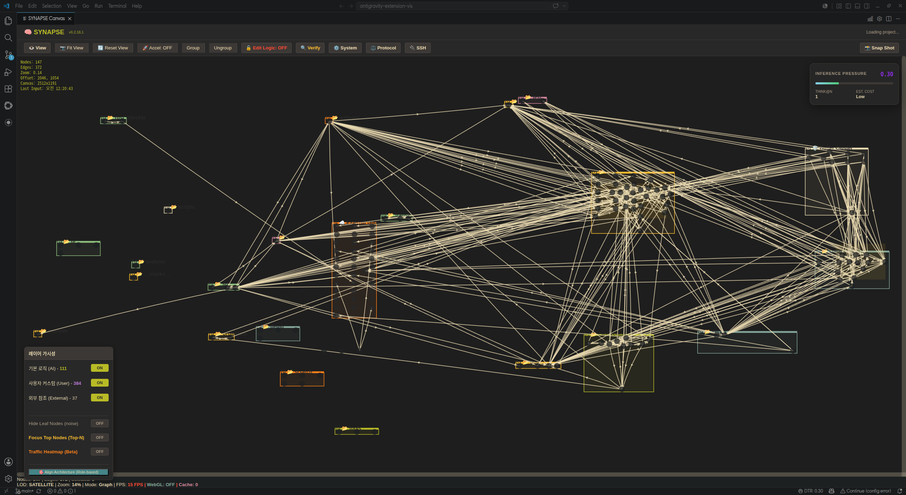 | 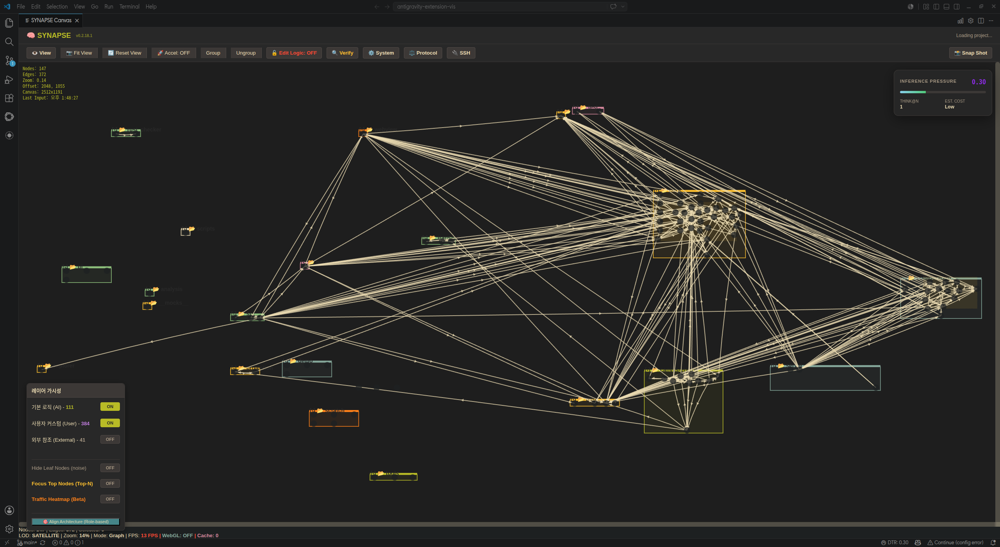 |
| *"실제 프로젝트는 이렇게 생겼습니다."* | *"노이즈를 제거합니다"* |
| **3. 핵심 노드 집중** | **4. 트래픽 히트맵** |
| 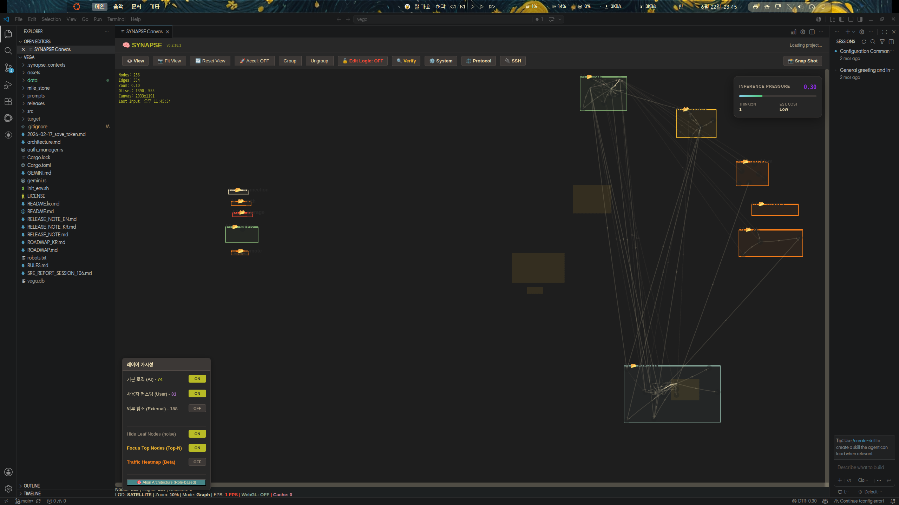 | 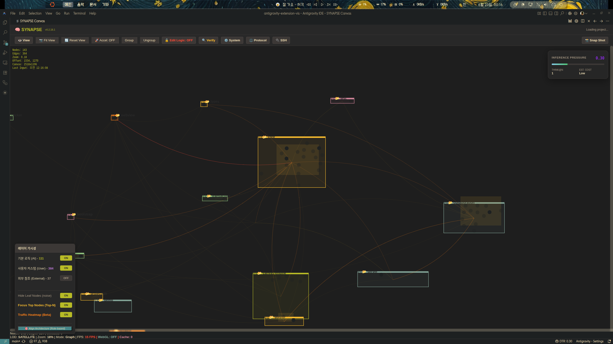 |
| *"어디를 봐야 하는지 알려줍니다"* | *"어디가 가장 중요한지 보여줍니다"* |

---

# 왜 시냅스인가? (Why SYNAPSE?)

현대의 소프트웨어는 더 이상 단일 개발자에 의해 작성되지 않습니다.

문제는 코드를 작성하는 것이 아닙니다.

문제는 수천 개의 파일, 수많은 개발자, 그리고 분산된 시스템이 전체로서 어떻게 상호작용하는지 '이해'하는 것입니다.

SYNAPSE는 소스 코드를 시각적인 아키텍처 맵으로 변환합니다.

아키텍트와 시니어 엔지니어는 다음을 수행할 수 있습니다:

* 아키텍처 병목 현상 식별
* 의존성 체인 추적
* 프로젝트 전체의 논리 구조 시각화
* 하비스트(Harvest)를 통한 원격 팀 산출물 수집
* 수동으로 파일을 탐색할 필요 없이 거대한 코드베이스 리뷰

SYNAPSE는 **가시성(Visibility)**에 최우선적으로 집중합니다.

동기화(Synchronization)가 아닙니다.
이슈 트래킹(Issue tracking)이 아닙니다.
소스 제어(Source control)가 아닙니다.

오로지 **가시성(Visibility)**입니다.

---

# 누구를 위한 것인가? (Who Is It For?)

### 아키텍처 리뷰 (Architecture Review)
* 테크 리드 (Tech Leads)
* 스태프 엔지니어 (Staff Engineers)
* CTO

거대한 프로젝트의 구조 파악하고 의존성을 추적해야 하는 사람들.

### 분산 개발 팀 (Distributed Development Teams)
* 원격 근무 팀
* VM 기반 개발 환경
* 다중 OS 환경

여러 사람이 만든 결과물을 한 공간에서 시각화해야 하는 팀.

### 레거시 프로젝트 (Legacy & Brownfield Projects)
* 오래된 코드베이스
* 문서 없는 프로젝트
* 구조 파악이 어려운 시스템

코드를 읽기 전에 구조를 먼저 보고 싶은 사람들.

## 📸 데모


*확대/축소, 레이어 가시성 제어 및 트래픽 히트맵 데모.*


*아이콘, 배지, 툴팁을 보여주는 딥 줌 세부 화면.*


SYNAPSE는 풍부한 시각적 어휘를 사용하여 아키텍처의 성격과 건강 상태를 전달합니다.

### 1. 📄 엔티티 타입 (정체성 아이콘)
노드의 물리적 성격이나 아키텍처적 역할을 정의합니다.

| 아이콘 | 타입 | 의미 | 시각적 스타일 |
| :--- | :--- | :--- | :--- |
| 📄 | Active Source | 물리적 소스 파일 (Logic, Config 등). | 단색 테두리, 기본 색상 |
| ⚡ | Atomic Logic | 핵심 로직 또는 진입점 (Atomic 서명 포함). | 보라색 빛 (DTR) |
| 📁 | Folder | 디렉토리 구조 클러스터. | 폴더 클러스터 컨테이너 |
| ☁️ | External API | 외부 라이브러리 (os, fs) 또는 API 호출 의존성. | 구름 모양 UI |
| 📚 | Doc Shelf | 마일스톤, 릴리즈 노트, 아키텍처 문서. | 캔버스에서 기본적으로 숨김 처리 |
| 🧪 | Test Case | 단위 테스트 및 검증 스크립트 (.test.ts). | 주황색 테두리 |
| 🧩 | Component | 모듈화된 UI 또는 논리적 컴포넌트 단위. | 청록색 테두리 |
| ⚙️ | Processor | 데이터 변환 또는 연산 엔진. | 회보라색 테두리 |
| 🤝 | Service | 공유 로직 또는 인프라 서비스 레이어. | 파란색 테두리 |
| ⛩️ | Gate | 보안, 인증 또는 트래픽 컨트롤러. | 두꺼운 노란색 테두리 |
| 📋 | Data Record | DB 스키마, JSON 모델 또는 순수 데이터 정의. | 두꺼운 테두리, 어두운 배경 |
| 👻 | Ghost Source | 물리적 파일이 누락된 내부 소스 참조. | 점선 테두리 |

### 2. 🎨 노드 상태 & 빛 효과 (Glow)
노드의 현재 추론 상태와 시각적 중요도를 정의합니다.

| 상태 | 시각적 힌트 | 색상 | 의미 |
| :--- | :--- | :--- | :--- |
| **Active** | 실선 테두리 | `#83a598` | 코드베이스에서 검증되고 현재 활성화됨. |
| **High DTR** | 보라색 빛 | `#8a2be2` | 높은 추론 밀도; 중요한 논리 지점. |
| **Ghost** | 점선 테두리 | `#928374` | 제안된 아키텍처 노드 (아직 구체화되지 않음). |
| **Deleted** | 회색 처리 | `#282828` | 안전하게 주석 처리되거나 폐기된 노드. |
| **Warning** | 붉은색 파동 | `#fb4934` | 논리 오류, 순환 참조 또는 막다른 길 감지됨. |
| **Necrosis** | 💀 | `#1d2021` | 치명적인 논리 실패; 빌드 실패 또는 심각한 물리적 결함. |
| **Tombstone** | 🪦 | `#1d2021` | 복구 불가능한 결정론적 실패; 삭제 권장. |

### 3. ➡️ 논리 & 흐름 마커
확대 수준(LOD)에 따라 노드나 엣지에 나타나는 마커입니다.

| 아이콘 | 타입 | 의미 |
| :--- | :--- | :--- |
| ↻ | Loop | 반복 로직 (for, while, map). |
| ◈ | Decision | 분기 로직 (if, switch, 검증). |
| 🖨️ | Output | 터미널 로깅, 출력 또는 부수 효과. |
| 📡 | Signal | 네트워크 요청 또는 원격 프로시저 호출 (RPC). |
| 📊 | Payload | 고대역폭 데이터 이동 또는 스트림. |
| 🕒 | Async | 비동기 처리 또는 대기 상태. |

### 4. ⚠️ 위험 & 정화 마커
시스템의 순도와 아키텍처적 건강 상태를 시각적으로 나타냅니다.

| 아이콘 | 타입 | 의미 | 시각적 스타일 |
| :--- | :--- | :--- | :--- |
| 💀 | Necrosis | 아키텍처적 실패 (순환 참조 등). | 어두운 배경 + 노이즈 |
| 🪦 | Tombstone | 지속적인 결정론적 위반 기록. | 묘비 마커 |
| 💣 | Mine | 고위험 지점 (호환성 깨짐 감지). | 붉은 경고 |
| ⚠️ | Logic Fault | 특정 코드 레벨의 오류 또는 동기화 실패. | 붉은 파동 / 경고 아이콘 |
| 🔴 | Dirty Dot | 동기화/푸시가 필요한 로컬 변경 사항. | 우측 상단 붉은 점 |

### 5. ✅ 상호작용 & 승인 배지
동기화 및 사용자 명령 상태를 나타내는 지능형 배지입니다.

| 배지 | 상태 | 의미 |
| :--- | :--- | :--- |
| ✅ | Confirmed | 아키텍트(Commander)가 수동으로 승인함. |
| 🤖 | AI Validated | 코드베이스에 대해 자동으로 검증됨. |
| ❓ | Pending | 검증 대기 중인 제안된 설계 (초안). |
| ❌ | Purge | 물리적 제거 또는 삭제 대기 상태. |
| 🔒 | Locked | 불변 상태; 수정으로부터 보호됨. |

### 🔗 엣지(연결선) 규칙
SYNAPSE는 노드 간의 다양한 논리적 연결과 데이터 흐름을 구별하기 위해 고유한 색상과 스타일을 사용합니다.

| 엣지 타입 | 색상 | 스타일 & 두께 | 의미 |
| :--- | :--- | :--- | :--- |
| **Dependency** | `#ebdbb2` | 실선 2px | 표준 모듈 의존성 또는 임포트. |
| **Data Flow** | `#83a598` | 실선 3px | 무거운 데이터 전송 또는 페이로드 이동. |
| **Event** | `#fe8019` | 실선 2px | 이벤트 트리거 또는 비동기 콜백. |
| **Conditional** | `#d3869b` | 실선 1px | if/else 또는 match와 같은 조건 분기. |
| **Origin** | `#d65d0e` | 실선 1.5px | AI 로직 추적을 위한 프롬프트 기원 링크. |
| **API Call** | `#8ec07c` | 점선 2px | 외부 API 또는 크로스 서비스 네트워크 호출. |
| **DB Query** | `#d3869b` | 실선 3px | 데이터베이스 쿼리, 뮤테이션 또는 트랜잭션. |
| **Loop / Back** | `#fe8019` | 점선(dotted) 2px | 루프백(while/for) 또는 역방향 로직 흐름. |
| **Highlighted** | `#fabd2f` | 파동 5px | 활성 실행 경로 (호버/선택 시). |

## 🚀 빠른 시작

단 몇 초 만에 시각적 아키텍처 여정을 시작해 보세요.

### 1. 확장 프로그램 설치
[Releases](https://github.com/dogsinatas29/SYNAPSE/releases)에서 최신 `.vsix` 파일을 다운로드하고 다음 명령을 실행하세요:
```bash
code --install-extension synapse-visual-architecture-v0.3.33.1_fix2.vsix
```

### 2. 캔버스 실행
에디터 제목 표시줄이나 사이드바에서 **🧠 캔버스 아이콘**을 클릭합니다.

### 3. 즉각적인 분석
**"Lite Bootstrap"**을 선택하여 프로젝트 아키텍처를 자동으로 스캔하고 시각화합니다.

---

## ✨ 주요 기능

- **🧠 실시간 그래프 시각화**: 프로젝트의 라이브 네트워크 매핑.
- **🚫 하이브리드 블랙리스트 시스템**: O(1) 경로 매칭을 통한 노이즈(node_modules, dist) 지능적 제외.
- **🖱️ 탐색기 컨텍스트 통합**: 파일/폴더를 우클릭하여 즉시 블랙리스트에 추가하고 그래프를 새로 고침.
  
- **🔍 N-hop 포커스 뷰**: 중요한 핵심 노드 자동 식별 및 집중 조명.
- **⚠️ 진단 지능**: 실시간 아키텍처 분석 (R1-R5 경고 시스템).
- **🧩 AI 스캔 통합**: Python, Rust, C++, TS를 지원하는 통합 스캐닝 엔진.
- **의미론적 줌 (Semantic Zoom, LOD)**: 수천 개의 노드를 탐색할 수 있는 성능 최적화.

---

## 🔍 의미론적 분석 & 레이어 가시성

SYNAPSE는 방대한 그래프를 분석하기 위해 레이어 가시성을 제어하고 중요한 논리 경로를 격리하는 강력한 의미론적 필터를 제공합니다.

| 1. 기본 뷰 (Default View) | 2. 리드 숨기기 (노이즈 감소) |
| :---: | :---: |
|  |  |
| **3. 상위 노드 포커스 (N-hop)** | **4. 트래픽 히트맵 (베타)** |
|  |  |


### 예시

**전체 그래프:**
```text
A ─ B ─ C ─ D ─ E  
│   │  
F   G ─ H ─ I  
```

---

**포커스 뷰 (N = 1, 기준점 = C):**
```text
B ─ C ─ D  
    │  
    G  
```

---

**포커스 뷰 (N = 2, 기준점 = C):**
```text
A ─ B ─ C ─ D ─ E  
│       │  
F       G ─ H  
```

### 왜 중요한가요?
- **즉각적인 범위 축소**: 거대한 그래프에서 디버깅 범위를 순식간에 좁힙니다.
- **경로 추적**: 특정 실행 흐름을 빠르게 추적합니다.
- **지역적 이상 감지**: 특정 영역 내의 구조적 결함을 찾아냅니다.

### 🔀 자동 생성 순서도 (Flow View)
SYNAPSE는 아키텍처 구조를 기반으로 논리적 흐름을 보여주는 순서도(Flowchart)를 자동 생성합니다.

**순서도 생성 조건:**
- 그래프에 `Flow`, `Calls`, `Depends` 등과 같이 유효한 논리 또는 데이터 흐름 엣지(Edge)가 최소 한 개 이상 존재해야 합니다.
- 흩어져 있는 단독 노드들이 아닌 서로 연결된 논리적 맥락을 가진 노드들이 존재해야 합니다.
- UI 상단의 `View -> Flow View` 메뉴를 클릭하여 확인할 수 있습니다.

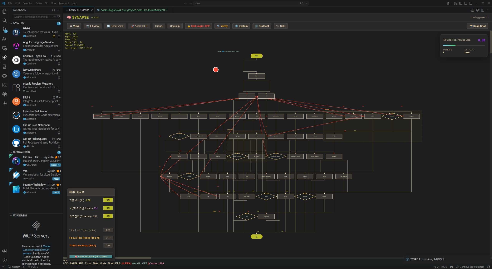
순서도 이미지

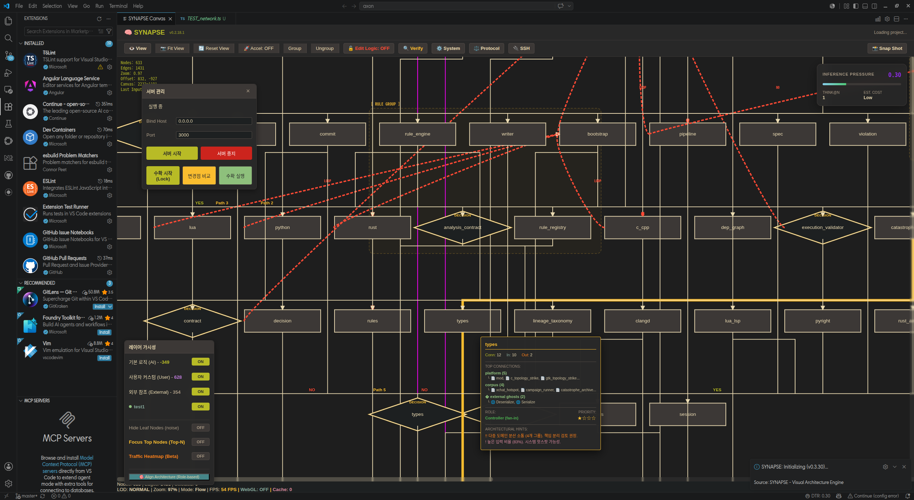
순서도에서도 특정 노드의 정보 확인이 가능하다

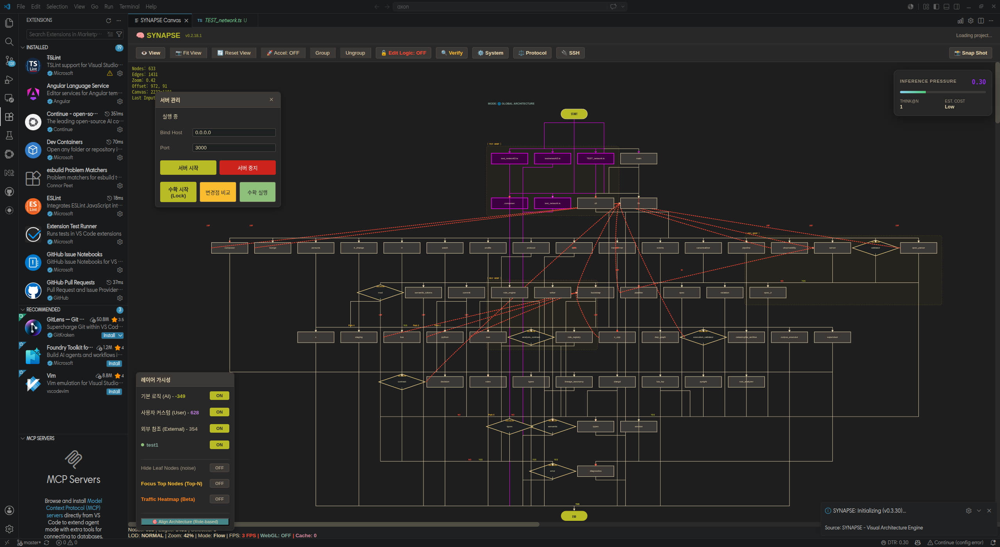
네트워크에 접속한 클라이언트의 로직 역시 순서도에 포함된다.

---

## 📂 클러스터 가시성 (Cluster Visibility)

SYNAPSE는 방대한 아키텍처를 효과적으로 관리하기 위해 **클러스터 가시성 패널**을 제공합니다. 파일 탐색기와 유사한 계층 구조를 통해 복잡한 폴더(클러스터) 구조를 한눈에 파악하고 제어할 수 있습니다.

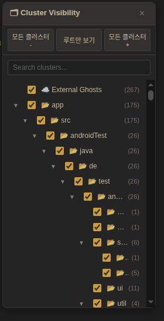

### 퀵 액션 (Quick Actions)
- **모든 클러스터 -**: 전체 클러스터 트리를 접어 최소한의 정보만 표시합니다.
- **루트만 보기**: 최상위 루트 클러스터들만 표시하도록 가시성을 제어합니다.
- **모든 클러스터 +**: 전체 클러스터 트리를 펼쳐 모든 하위 구조를 표시합니다.

### 1. 직관적인 계층 관리 & 누적 카운트
가시성 패널은 프로젝트의 실제 폴더 구조를 그대로 반영합니다. 폴더 이름 옆의 숫자는 해당 폴더 및 모든 하위 폴더에 포함된 **전체 노드(파일)의 누적 합산 개수**를 나타냅니다. 최상위 폴더만 보더라도 그 아래에 얼마나 많은 컴포넌트가 있는지 즉각적으로 알 수 있습니다.

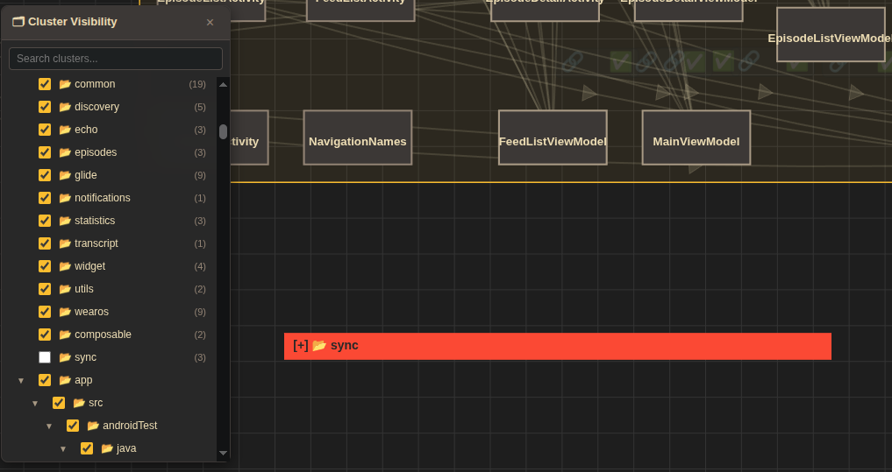

### 2. 가시성 연쇄 제어 (Cascade Toggle)
체크박스를 클릭하여 특정 폴더의 가시성을 끄거나 켤 수 있습니다. 부모 폴더의 가시성을 변경하면 **그 아래에 속한 모든 자식 폴더들의 상태가 연쇄적으로 동기화(Cascade)** 되므로, 수백 개의 노드가 담긴 대형 모듈도 클릭 한 번으로 숨기거나 펼칠 수 있습니다.

### 3. 카메라 추적 (REVEAL)
폴더 옆의 `→` (REVEAL) 버튼을 누르면 캔버스 카메라가 해당 폴더 내의 노드들이 모여있는 위치로 즉시 부드럽게 이동합니다. 사용자가 수동으로 노드를 이리저리 드래그해 옮겼더라도 **실시간 물리 좌표를 정확히 추적**하여 화면 중앙에 맞춰줍니다.

### 4. 네트워크 클라이언트 식별
네트워크에 연결된 클라이언트가 생성한 클러스터들은 가시성 패널에서 명확히 구분되어 표시됩니다. 시스템이 자동으로 클러스터 이름 앞에 클라이언트의 계정명(`[계정명]`)을 덧붙여 주어, 원격 네임스페이스들이 완벽하게 격리되고 손쉽게 식별 가능해집니다.

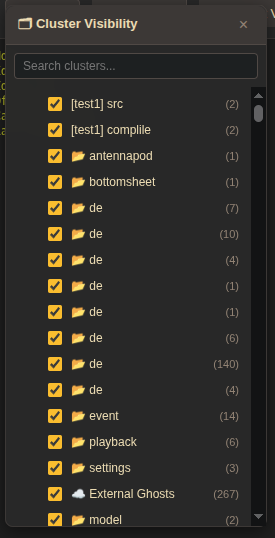

### 5. 자동 스케일 프로파일 (Adaptive Scale Profile)
초거대 모노레포 환경에서 브라우저가 과부하로 인해 멈추는(Lockup) 것을 선제적으로 방지하기 위해, SYNAPSE는 프로젝트 로드 시 그래프 규모를 분석하여 최적의 가시성 프로파일을 자동 적용합니다.

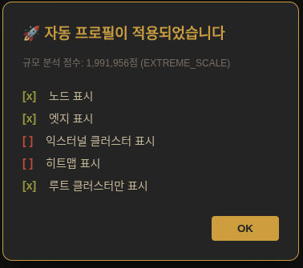

#### 규모 분석 공식 (Scale Score)
프로젝트 규모 점수는 다음 공식을 통해 산정됩니다:
> **`Scale Score` = `노드 수(Nodes)` + `(엣지 수(Edges) × 5)` + `(클러스터 수(Clusters) × 10)`**

점수가 안전 임계값(예: 500,000점)을 초과하면 **EXTREME_SCALE** 프로파일이 발동하며, 시각적 정보량과 렌더링 부하를 제어하기 위해 다음 설정이 강제 적용됩니다:

#### 자동 적용 항목 (EXTREME_SCALE 기준)
- `[x] 노드 표시`: 렌더링 유지
- `[x] 엣지 표시`: 렌더링 유지 (LOD 최적화 적용)
- `[ ] 익스터널 클러스터 표시`: **꺼짐(Hide)** - 수백 개의 외부 의존성(External Packages) 노드들을 화면에서 숨겨 렌더링 부하를 즉시 삭감합니다. (필요 시 가시성 패널에서 수동으로 다시 켤 수 있습니다.)
- `[ ] 히트맵 표시`: **꺼짐(Hide)** - 실시간 트래픽 연산을 중지합니다.
- `[x] 루트 클러스터만 표시`: **활성화(Roots Only)** - 대륙 단위의 최상위 폴더(Root)만 펼쳐두고, 2-Depth 이하의 모든 하위 폴더들을 전부 접음(Collapse) 상태로 초기화하여 광활한 시야를 확보합니다.

---

## 🔬 Simulation Debug: 아키텍처 수술 보고서 (Architecture Surgery Report)

SYNAPSE의 **아키텍처 수술 보고서(Architecture Surgery Report)** 생성기는 원시 의존성 분석을 실행 가능한 아키텍처 의사결정으로 변환합니다. 문제 발견과 수술적 개입 사이의 간격을 메우며, 증거 기반의 의사결정 중심 보고서를 생성합니다.

### 3단계 파이프라인

```
입력 (b5_validation_layer의 검증 데이터)
    ↓
[Stage 1] 데이터 수집 & 분석
    - 그래프 로드 (69,304개 노드, 387,282개 엣지)
    - AST 검증 실행 (9,297개 엣지 샘플링)
    - 상위 영향력 파일 추출
    ↓
[Stage 2] 신뢰도 & 영향도 계산
    - Graph Confidence: 92% (3 run 검증)
    - AST Coverage: 2.4% (9,297 / 387,282 엣지 검사)
    - Verified Sample Accuracy: 93% (검사된 범위 내)
    - Overall Decision Confidence: MEDIUM (65-70%)
    ↓
[Stage 3] 의사결정 프레임 구성
    - Section 0: 신뢰도 투명공시 (Coverage ≠ Confidence)
    - Section 1: 행동 지시 (10개 파일, 2-4일)
    - Section 2-4: 의사결정 시나리오 (범위, 무시 비용)
    - Section 5: 증거강도 레이더 (아는 것/모르는 것)
    - Section 6-7: 기술 실행 가이드
    - Section 8: 증거 저장소 (법정 수준 증명)
    ↓
출력 (Reports + Evidence Artifacts)
```

### 8섹션 의사결정 보고서 구조

| 섹션 | 초점 | 대상 | 예시 출력 |
|------|------|------|---------|
| **0. Report Confidence** | 측정값 vs 신뢰도 투명공시 | 의사결정자 | "Graph 92%, AST Coverage 2.4%, Decision Confidence: MEDIUM" |
| **1. What Should I Do?** | 정확한 행동 지시 | 엔지니어 | "10개 파일, 2-4일, #include 수정 & visibility 적용" |
| **2. What Happens If I Do It?** | 예상 범위 (고정값 아님) | 아키텍트 | "외부 엣지: 6000-9000 (대략 7500), -65% 감소" |
| **3. What Happens If I Ignore It?** | 6개월 악화 시나리오 | CTO/리누스 | "Bridge 12→18+, Entropy 75%→87%, 비용 3일→12-15일" |
| **4. Cost vs Benefit** | ROI 명확화 | 재무/의사결정자 | "지금 3일 투입, 6개월 후 12-15일 절약. 4:1 비율" |
| **5. Evidence Strength** | 증거강도 레이더 | 아키텍트/변호사 | "HIGH: Graph, HIGH: Community Detection, MEDIUM: AST, NONE: Compile" |
| **6. Technical Surgery Guide** | 어디를 보고, 자르고, 붙일지 | 엔지니어 | "상위 파일: 158개 외부 엣지, 344+ 파일에 fanout" |
| **7. AI Prompt Ready** | 측정 가능한 성공 기준 | AI/자동화 | "입력: 17214 edges, 성공: 6000-9000 범위, 검증: compile green" |
| **8. Full Evidence Vault** | 변호사용 증명 아티팩트 | 규제/감사 | 연결된 JSON, chains, symbols, threshold sweeps |

### 핵심 계산 함수들

| 함수 | 입력 | 출력 | 목적 |
|------|------|------|------|
| `calculateConfidenceProgression()` | ValidationReport | {graphConfidence, astCoverage, finalConfidence} | 커버리지가 낮으면 신뢰도 페널티 적용 |
| `calculateReportConfidence()` | presenceMatrix | {stableSpecies, overallConfidence} | 3 run 간 종의 안정성 추적 |
| `extractTopImpactFiles()` | Graph | {filePath, externalEdges, consumers} | 외부 결합도 상위 10개 파일 식별 |
| `runASTVerification()` | graph.json | {resolvedEdges, coverage, accuracy} | 2.4% 샘플을 93% 정확도로 검증 |

### 생성되는 증거 아티팩트

```
report/surgery/
├── ASR_EV-1029.md                    [Main: 8섹션 의사결정 보고서]
├── ASR_EV-1029.html                  [네비게이션: 섹션 가이드 + 링크]
└── evidence/EV-1029/
    ├── stability.json                [종의 안정성 증명 (3 run 비교)]
    ├── chains.json                   [전체 17,214개 외부 엣지 목록]
    ├── symbols.json                  [AST 결과: 9,297 resolved edges]
    ├── false_positives.txt           [188개 제거된 엣지 (Kconfig, generated)]
    ├── threshold_sweep.json          [Mesh 0.80-0.86에서 안정성 증명]
    └── EV-1029_graph.html            [커뮤니티 구조 시각화]
```

### 핵심 정직함의 원칙: Coverage ≠ Confidence

**이전 (거짓):**
```
"AST Confidence: 92%"  ❌ (잘못됨: 2.4%만 검사)
"Prediction: 6025"     ❌ (고정값의 근거 없음)
```

**현재 (정직):**
```
"AST Coverage: 2.4%"               ✅ (사실)
"Verified Sample Accuracy: 93%"    ✅ (검사 범위 내)
"Expected range: 6000-9000"        ✅ (범위 + 전제조건)
"Decision Confidence: MEDIUM"      ✅ (명확한 한계)
```

### 실행 방법

```bash
# 1. 검증 데이터 생성 (선행 단계)
npx ts-node src/cli/b5_validation_layer.ts <graph.json> 3

# 2. 수술 보고서 생성
npm run b5:report:surgery -- EV-1029

# 출력
report/surgery/ASR_EV-1029.md      # 메인 보고서
report/surgery/ASR_EV-1029.html    # 네비게이션 페이지
report/surgery/evidence/EV-1029/   # 증거 저장소
```

### 왜 중요한가?

기존 아키텍처 도구는 **문제 발견**에서 멈춥니다.

SYNAPSE의 수술 보고서는 한 단계 더 나아갑니다:

```
문제 발견 (기존 도구)
    ↓
→ 원인 설명
→ 수술 위치 지정
→ 수술 순서 제안
→ AI 프롬프트 생성 (측정 가능한 기준)
```

이는 분석을 **실행 가능한 아키텍처 수술 지시서(Architecture Surgery Order)**로 변환합니다.

---

## 🌾 Harvest

Harvest는 협업 참여자의 작업 결과를 아키텍트(서버)가 안전하게 수집하는 스냅샷 기반 수집 시스템입니다.

[](https://youtu.be/ctQZHE7ZZ3A)

Harvest는 일반적인 양방향 동기화(Synchronization)를 목표로 하지 않습니다. 기존의 Client ↔ Server ↔ Client 구조는 소유권 충돌과 상태 불일치(State Conflict)를 유발할 수 있으며, 이는 예측 불가능한 동작(Undefined Behavior)의 원인이 됩니다.

이를 방지하기 위해 Harvest는 **아키텍트 중심의 단방향 수집 모델**을 채택합니다.

```text
Client → Snapshot → Server → Archive
```

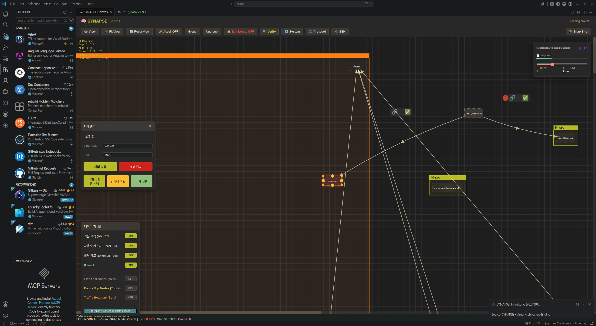
네트워크에 접속한 클라이언트의 파일이 시냅스 화면에 직접 표시되어 로직 검증 가능.

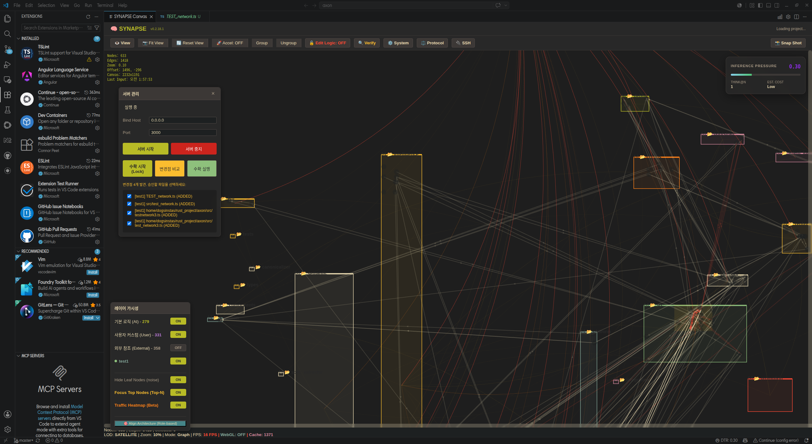
네트워크에 접속한 클라이언트의 파일들 중 검증된 파일들만 수확하듯 서버에 저장할 수 있다.

Harvest의 목적은 코드의 통합이 아니라, **안전한 수집 및 보존**입니다.

### How It Works

#### Visibility-Based Harvest

Harvest는 프로젝트 전체를 무차별적으로 수집하지 않습니다.

아키텍트가 캔버스에서 가시성(Visibility)이 활성화된 클라이언트 레이어만 선택적으로 수집하며, 복사 대상 파일 역시 UI를 통해 직접 선택할 수 있습니다.

이를 통해 불필요한 데이터 유입과 저장소 오염을 최소화합니다.

#### Client Isolation

수집된 파일은 하나의 공유 폴더에 통합되지 않습니다.

각 클라이언트는 독립된 User Root를 가지며, 수집 결과는 사용자별 Harvest 공간에 보관됩니다.

```text
.synapse/
└─ clients/
   ├─ userA/
   │  └─ harvest/
   └─ userB/
      └─ harvest/
```

이 구조는 다음을 보장합니다.

* 소유권 추적 가능
* 안전한 비교(Diff)
* 개별 삭제 가능
* 덮어쓰기 충돌 방지

#### Harvest Lock

Harvest가 진행되는 동안 대상 클라이언트에는 잠금(LOCK) 상태가 적용됩니다.

클라이언트 화면에는 Harvest 진행 중임을 알리는 경고 레이어가 표시되며, 수집 중 발생할 수 있는 상태 변경을 최소화합니다.

Harvest Lock은 데이터 무결성을 보조하기 위한 안전장치이며, 수집 과정의 결정론적 상태를 유지하는 것을 목표로 합니다.

### Directory Layout

```text
.synapse/
└─ clients/
   ├─ {username}/
   │  ├─ harvest/
   │  ├─ metadata.json
   │  ├─ snapshots/
   │  └─ cache/
   └─ ...
```

#### harvest/

실제 수집된 소스코드가 원본 구조를 유지한 채 저장됩니다.

#### metadata.json

세션 정보, 클라이언트 식별자, 협업 메타데이터를 저장합니다.

#### snapshots/

향후 버전에서 사용할 이력 및 백업 레이어입니다.

#### cache/

원격 파일 열람 및 임시 데이터 처리를 위한 버퍼 공간입니다.

### Safety Guarantees

#### File Collision Protection

동일한 파일명을 가진 경우에도 사용자별 저장 공간이 분리되어 있으므로 충돌이나 덮어쓰기가 발생하지 않습니다.

#### Path Traversal Protection

상위 디렉토리 접근(../)과 같은 경로 이탈 시도는 서버 측에서 차단됩니다.

#### Type-Safe Result Processing

Harvest 결과 데이터는 명시적인 타입 구조를 통해 처리되며, 런타임 키 불일치로 인한 데이터 손실을 방지합니다.

### Harvest Is Not Sync

Harvest는 데이터를 수집하고 보존하는 기능입니다.

Harvest는 자동 병합, 자동 덮어쓰기, 충돌 해결을 수행하지 않습니다.

코드 통합(Integration)은 아키텍트의 검토와 판단을 거쳐 수동으로 이루어지며, 자동 동기화 기능은 Harvest의 책임 범위에 포함되지 않습니다.

---

## 🔍 Verify (아키텍처 논리 리포트)

Verify는 아키텍처 그래프의 상태를 실시간으로 진단하는 Architect 전용 시스템입니다. **현재 서버에 접속 중인 모든 원격 클라이언트**의 아키텍처 레이어를 포함하여 분석합니다.

> ⚠️ **분석 범위**: Verify는 Architect의 로컬 프로젝트 그래프뿐만 아니라, 현재 연결된 협업 클라이언트들이 서버로 전송한 아키텍처 그래프도 분석 대상에 포함됩니다. 캔버스에서 레이어가 활성화(가시성 ON)된 클라이언트는 모두 진단 범위에 속합니다.

### Verify 메뉴 항목

#### 🔬 Scan Architecture (AI) — AI 아키텍처 스캔
현재 아키텍처 그래프에 대한 전체 AI 기반 의미론적 분석을 실행합니다. 모든 노드와 엣지를 스캔하여 스키마 위반, 데드엔드 노드, 끊어진 엣지, 결합도 이상을 감지합니다. 결과는 `LOGIC_REPORT.md`에 출력됩니다.

- **원격 클라이언트 포함**: SSE로 연결된 원격 클라이언트 노드도 분석 대상에 포함됩니다.
- **언어 자동 감지**: 리포트는 OS 표시 언어(한국어/영어)에 따라 자동으로 출력됩니다(`vscode.env.language` 기반).

#### 🧪 Simulation Debug — 시뮬레이션 디버그
가상 디버거 모드를 활성화합니다. 아키텍처 그래프 전체에서 런타임 동작을 시뮬레이션하여, 논리 검증에 실패한 노드에 진단 상태(Necrosis, Tombstone)를 적용합니다.

- **클라이언트 레이어 포함**: 로컬 프로젝트뿐 아니라 연결된 모든 클라이언트의 아키텍처 레이어가 진단 대상입니다.
- Harvest 없이도 어떤 원격 노드가 실패했거나 Stale 상태인지 Architect가 즉시 확인할 수 있습니다.

#### 💀 Simulate Necrosis — 괴사 시뮬레이션
선택한 노드에 **Necrosis(괴사)** 상태를 수동으로 적용합니다. 의존성이 끊기거나, 참조가 누락되었거나, AI 분석에 의해 문제로 flagged된 노드를 논리적으로 사망한 상태로 표시합니다.

괴사 노드는 빨간 테두리와 어두운 배경으로 표시되며, 연결된 엣지는 Fractured(단절) 상태로 처리됩니다.

#### 🪦 Simulate Tombstone — 툼스톤 시뮬레이션
선택한 노드에 **Tombstone(묘비)** 상태를 수동으로 적용합니다. 아키텍처에서 완전히 deprecated되거나 제거된 노드를 표시하며, 캔버스에 묘비 시각 마커로 렌더링됩니다.

#### 🧹 Clear Debug — 디버그 초기화
캔버스에서 모든 디버그 시각 상태(Necrosis, Tombstone)를 제거하고 노드를 기본 렌더링 상태로 초기화합니다. 실제 그래프 데이터에는 영향을 주지 않습니다.

#### 💎 Det Bootstrap (`v0.2.28: Determinism Bootstrap`)
결정론적 부트스트랩 시퀀스를 실행합니다. 내부 상태 체크섬을 초기화하고 현재 아키텍처 스냅샷에 대한 결정론적 기준선을 재확립합니다. 반복적인 편집으로 누적된 비결정성을 제거하는 데 사용합니다.

#### 🔄 Deep Re-Scan — 심층 재스캔
전체 프로젝트 디렉터리를 처음부터 완전히 재스캔합니다. 이전에 캐시된 모든 그래프 데이터가 폐기되고 파일-노드 파이프라인 전체가 재실행됩니다. 그래프가 실제 파일 시스템 상태에서 벗어났을 때 사용합니다.

### 인퍼런스 압력 (Inference Pressure)

Verify 시스템은 **인퍼런스 압력**을 보고합니다. 이는 아키텍처 건전성의 정규화된 척도입니다:

| 압력 | 상태 | 의미 |
|---|---|---|
| 0–10% | 🟢 Stable | 아키텍처가 건강한 상태 |
| 10–30% | 🟡 Caution | 경미한 문제 감지됨 |
| 30–60% | 🟠 Warning | 중대한 문제 존재 |
| 60%+ | 🔥 Critical | 즉각적인 조치 필요 |

압력 = `criticalIssues / totalAnalyzedNodes × 100`. 소규모(50노드)와 대규모(5000노드) 프로젝트 모두 동일한 척도로 비교 가능.

---

## 🏗️ 아키텍처

SYNAPSE는 다음 레이어들로 구성됩니다:
- **Scanner**: 다중 언어를 지원하는 깊은 의미론적 분석기.
- **Graph Engine**: 결정론적, 불변의 상태 머신.
- **Visualization Layer**: 하이브리드 2D 캔버스 & 3D WebGL 가속 렌더링.
- **AI Merge Logic**: Ghost 참조와 실제 활성 파일을 지능적으로 병합.

---

## 🧠 철학

**"당신이 보는 것이 곧 LLM의 로직입니다 (What you see is the logic of LLM)"**

SYNAPSE는 코드 중심 개발의 한계를 극복하기 위해 만들어졌습니다. 대규모 언어 모델(LLM)의 추론과 물리적인 코드 아키텍처 사이의 간극을 연결하여, 추상적인 논리를 상호작용 가능한 고성능 노드-엣지 네트워크로 변환합니다.

---

## 📜 변경 이력 (Revision History)

| 버전 | 릴리스 날짜 | 설명 |
| :---: | :---: | :--- |
| **v0.3.33.1_fix2** | 2026-07-20 | **Layout Engine 독립성 확보 및 초거대 스케일 성능 최적화**: 레이아웃 계산 로직이 가시성 상태(`cluster.collapsed`)에 오염되어 좌표계가 붕괴되는 치명적인 버그를 수정하여 Layout Graph와 Visible Graph를 완벽히 분리했습니다. `drawClusters` 및 `aggregateEdges` 구간의 O(N*C) 순회 병목을 O(1) 인덱스 매핑으로 파괴하여 렌더링 준비 시간을 1,830ms에서 5ms로 단축(약 366배 향상)했습니다. **VSCODE-main** 및 **리눅스 커널(Linux Kernel 72 rc3)** 수준의 초거대 모노레포를 대상으로 테스트를 성공적으로 완료했습니다. |
| **v0.3.33.1_fix** | 2026-07-16 | **Render Virtualization & Pipeline Repair**: VSCode-main과 같은 거대 모노레포 환경에서 엣지 수가 50,000개를 초과할 경우 렌더링 파이프라인 전체가 즉시 강제 종료(Abort)되던 하드코딩된 방어 로직을 제거했습니다. 이제 Spatial Hashing 기반 컬링으로 무사히 렌더링을 시도합니다. `LINES (No Badges)` 엣지 가시성 모드를 복구하고, 렌더러 심층부(`[EDGE_STATS]`, `[ARC_DRAW]`)에 핵심 텔레메트리 프로브를 주입하여 LOD 동작을 4단계로 추적할 수 있도록 개선했습니다. 또한 빈 디렉토리의 과도한 패딩을 제거하여 클러스터 거대화(Bloat) 버그를 수정했습니다. |
| **v0.3.33.1** | 2026-07-15 | **심미성 및 LOD 최적화**: "Roots Only(루트만 표시)" 모드에서 최상위 프로젝트 폴더만 통째로 닫혀버려 242개의 하위(Continent) 폴더들이 전부 소멸하던 가시성 버그를 수정했습니다. 이제 Depth-1 대륙 레벨까지 올바르게 루트(Root)로 식별되어 깔끔하게 펼쳐진(Expanded) 상태로 구조를 조망할 수 있습니다. 거대 모노레포에서 엣지가 조기 소멸하는 문제를 해결하기 위해 3단계 엣지 LOD(FULL/CLUSTER/NONE)를 도입했습니다. 트랙패드로 줌인/아웃 시 화면이 급격히 확대되는 현미경(Microscope) 효과를 비선형 DeltaY 민감도 로직으로 해결했습니다. |
| **v0.3.33** | 2026-07-14 | **클러스터 계층 및 드래그 로직 개편**: 기존의 고립된 노드 드래그 방식에서 벗어나, 상위 클러스터 드래그 시 소속된 모든 하위 클러스터와 노드들이 재귀적으로 함께 이동하도록 단일 경로(`draggingCluster`)로 통합했습니다. 클러스터 가시성 패널에 3개의 퀵 액션 버튼(`모든 클러스터 -`, `루트만 보기`, `모든 클러스터 +`)을 추가하여 대규모 구조의 시야를 빠르게 제어할 수 있습니다. 또한 깊이(Depth) 기반 우선순위를 적용한 히트 감지(`getClusterHeaderAt`)를 통해 중첩된 환경에서도 부모 클러스터가 정확히 선택되도록 개선했습니다. |
| **v0.3.32.4** | 2026-07-05 | **UX 및 가시성 옵션 개선**: 클러스터 가시성 패널에 하위 폴더 누적 카운트 기능 및 가시성 연쇄 동기화(Cascade)를 적용했습니다. REVEAL 기능의 실시간 좌표 추적 버그를 수정하고, 원격 접속 클라이언트의 클러스터 네임스페이스를 `👤 계정명` 형태로 완벽 격리했습니다. 또한 초기화(Reset State) 기능 작동 시 발생하던 메모리 누수를 해결했습니다. |
| **v0.3.32.1** | 2026-06-27 | **크로스-네트워크 추적 및 시맨틱 순서도 도입**: 순서도의 렌더링 품질을 크게 개선했습니다(단일 패스 Barycenter 정렬로 엣지 교차 최소화, 붉은 점선 백엣지 시각화). `[SYNAPSE_NETWORK_LINK]` 매크로를 도입하여 언어의 문법 한계를 넘은 명시적 크로스-프로젝트 의존성 파서를 구현했습니다. 로컬 노드와 원격 클라이언트 노드를 정확히 식별(IFF 로직)하여 렌더링 오류를 수정하고, Harvest를 통한 분산 아키텍처 DAG 병합을 순서도 뷰에서 완벽하게 증명했습니다. |
| **v0.3.32.2** | 2026-06-29 | **수동 노드 삭제 동기화 및 아키텍처 물리엔진 오류 수정**: 수동 생성 제네릭 노드의 삭제 동기화 실패(절대/상대 경로 조합 오류)를 해결했습니다. `EXTERNAL_PACKAGES` 화이트리스트를 7개 언어 100여 개 주요 라이브러리로 대폭 확장하여 허위 Ghost 오류를 박멸했습니다. 정규식을 고도화해 `[SYNAPSE_NETWORK_LINK]` 원격 통신 의존성을 정확히 파싱하고 `cluster_ghost_network_remote` 클러스터로 묶어냈습니다. 물리 엔진에서 누락되던 루트(Unclustered) 파일 노드를 위해 가상의 `📁 Root` 클러스터를 주입하여, 좌표 `(0,0)`의 무한 겹침 착시 버그를 고쳤습니다. UI 워크스페이스 상태 저장 시 발생하던 JSON 직렬화 스키마 검증기 오작동(False-positive)도 예외 처리했습니다. |
| **v0.3.32.1** | 2026-06-27 | **크로스-네트워크 추적 및 시맨틱 순서도 도입**: 순서도의 렌더링 품질을 크게 개선했습니다(단일 패스 Barycenter 정렬로 엣지 교차 최소화, 붉은 점선 백엣지 시각화). `[SYNAPSE_NETWORK_LINK]` 매크로를 도입하여 언어의 문법 한계를 넘은 명시적 크로스-프로젝트 의존성 파서를 구현했습니다. 로컬 노드와 원격 클라이언트 노드를 정확히 식별(IFF 로직)하여 렌더링 오류를 수정하고, Harvest를 통한 분산 아키텍처 DAG 병합을 순서도 뷰에서 완벽하게 증명했습니다. |
| **v0.3.32** | 2026-06-26 | **협업 노드 가시성 복구**: 클라이언트 노드 전체가 `!isGhost` 필터에 걸려 순서도에서 증발하던 버그를 100% 수정했습니다. `debug`/`survival`/`flow` 단계 전반에 걸쳐 분열되었던 클라이언트 식별 필터를 하나로 통일했습니다. 클라이언트 연결 시 `buildFlow()` 엔진이 무음 크래시를 일으키던 `reasons` 참조 오류를 패치했습니다. 기여 엔티티 그래프 Phase 0 (파일경로 + 유저ID 고유성 보장) 검증 완료. |
| **v0.3.31** | 2026-06-25 | **진단 안정화 및 관찰 가능성 강화**: `doc`/`file`/`folder` 타입 노드의 허위 Necrosis 경고 수정. Pressure 계산식을 `criticalIssues / totalNodes` 비율 기반으로 정규화. Ghost Cluster(`cluster_ghosts`, `doc_shelf`)를 의존성 힌트 대상에서 제외. `clientTimestamp` 기반 Stale 불투명도 시각화(Active/Stale/Offline) 추가. 툴팁에 `"[username] Updated Xm ago"` 표시. 클라이언트 크래시 후 디버깅 단서 보존을 위한 15분 Soft Disconnect 캐시 보존 구현. |
| **v0.3.30.2** | 2026-06-25 | **보안 검증 및 수확(Harvest) 안정화**: 6대 크리티컬 보안 위협(Path Traversal, 권한 우회, SSE 오염, 락 우회 등) 전면 차단 확인. 어드민 UI 포트 충돌 및 403 인증 오류 수정. 수확 실행 시 발생하던 `unshift` 에러를 방어하기 위해 레거시 배열 포맷의 `accounts.json` 및 `synapse_history.json` 파싱 역호환성 추가. |
| **v0.3.30** | 2026-06-22 | **하비스트(Harvest) 기반 협업 모델**: 세션 관리(Session), 안전한 SSH 마운트, 원격 레이어 프로젝션 기능이 포함된 대규모 아키텍처 갱신. Harvest 시스템 및 권한 계층 완벽 통합. |
| **v0.3.29** | 2026-06-06 | **클러스터 겹침 해소 및 External 레이어 수정**: FNV-1a 해시 기반 원형 배치(Initial Spread) + Mass 기반 Cluster Push-Apart 엔진 도입으로 클러스터/노드 겹침 해결. External 레이어 ON 시 External Ghosts 클러스터 박스가 보이지 않는 버그 수정. Align Architecture 시 클러스터 팽창 50% 감소(roleOffsets 절반 축소). |
| **v0.3.27** | 2026-05-28 | **데이터 동기화 탄력성 및 레이어 독립성**: 유령 엣지가 사라지는(`Edges: 0`) 치명적인 데이터 동기화 버그 해결. 스캔된 폴더와 커스텀 그룹화를 구조적 손상 없이 분리하는 UI 레이어 로직 강화. |
| **v0.3.26** | 2026-05-26 | **2D 엣지 검증 패치**: HTML5 Canvas API 컨텍스트에서 유효하지 않은 `[0, 0]` dash array Fallback으로 인해 2D 모드에서 실선 엣지가 렌더링되지 않는 버그 수정. |
| **v0.3.25** | 2026-05-25 | **클러스터 인식 로컬 정렬**: 아키텍처 정렬 시 전역 좌표 붕괴를 방지하기 위해 노드가 속한 클러스터의 중력 중심을 기준으로 정렬되도록 레이아웃 물리 엔진 리팩토링. |
| **v0.3.24** | 2026-05-24 | **RULES.md 내장 및 부트스트랩 강화**: 표준 DTR(동적 사고 라우팅) 및 강제 파일 투영 규칙을 부트스트랩 엔진에 깊게 내장하여 초기화 시 보안 및 설계 제약 조건을 기본으로 확립. |
| **v0.3.23** | 2026-05-02 | **하이브리드 블랙리스트 및 지능형 온보딩**: O(1) 경로 매칭 블랙리스트 시스템 구현. 즉시 예외 처리를 위한 탐색기 컨텍스트 메뉴 추가. 웹뷰 레이아웃 붕괴 문제 해결. |
| **v0.3.22.11** | 2026-04-22 | **상호작용 안정성 및 좌표 독립성**: 타임스탬프 가드 및 위치 영속성을 통한 노드 드래그 지터(Jitter) 해결. SSoT 레이어 전반의 절대 좌표계 통합. |
| **v0.3.22.10** | 2026-04-20 | **렌더링 일관성 및 정체성 바인딩(SSoT)**: 100% 데이터 일관성을 위한 전체 2D/3D 시각적 동기화 및 SSoT 기반 툴팁 정체성 바인딩. |
| **v0.3.21** | 2026-04-18 | **시각적 일관성 및 엣지 번들링**: 규칙(Convention) 전체 동기화, 베지어 곡선 흐름 통합 및 스냅샷 무결성을 위한 기억상실(Amnesia) 가드. |
| **v0.3.20** | 2026-04-17 | **Rust 영속성 및 엔진 강화**: Rust 지원을 위한 경로 기반 ID 도입, 물리적 안정성을 위한 속도 클램핑. |
| **v0.3.18** | 2026-04-17 | **진단 힌트 엔진**: 실시간 아키텍처 분석 (R1-R5), Zero-Unknown 의미론적 라벨링. |

[전체 변경 내역 보기](REVISION_HISTORY.md)


---

## 📜 라이선스 및 작성자
이 프로젝트는 [GNU General Public License v3.0](LICENSE) 라이선스를 따릅니다.  
Created with 🧠 by [dogsinatas29](https://github.com/dogsinatas29)
