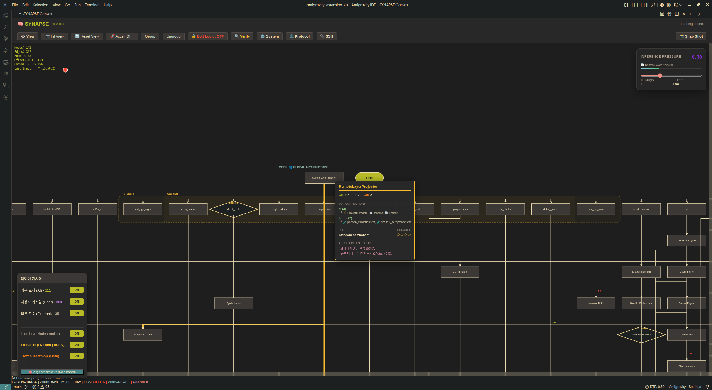

#  SYNAPSE

> **LLM 시스템을 위한 시각적 아키텍처 엔진**

**코드를 읽지 마세요. 아키텍처를 보세요.**

소프트웨어가 어려운 이유는 코드 때문이 아닙니다.

소프트웨어가 어려운 이유는 보이지 않는 관계성(relationships) 때문입니다.

SYNAPSE는 소스 코드를 탐색 가능한 아키텍처 맵으로 변환하여,
엔지니어가 대규모 소프트웨어 시스템 전반의 의존성, 실행 흐름,
병목 현상, 그리고 시스템 전체의 상호작용을 시각화할 수 있게 해줍니다.

[](https://github.com/dogsinatas29/SYNAPSE)
[](https://github.com/dogsinatas29/SYNAPSE/releases)


[🇺🇸 English Version](./README.md)


---

# 왜 시냅스인가? (Why SYNAPSE?)

현대의 소프트웨어는 더 이상 단일 개발자에 의해 작성되지 않습니다.

문제는 코드를 작성하는 것이 아닙니다.

문제는 수천 개의 파일, 수많은 개발자, 그리고 분산된 시스템이 전체로서 어떻게 상호작용하는지 '이해'하는 것입니다.

SYNAPSE는 소스 코드를 시각적인 아키텍처 맵으로 변환합니다.

아키텍트와 시니어 엔지니어는 다음을 수행할 수 있습니다:

* 아키텍처 병목 현상 식별
* 의존성 체인 추적
* 프로젝트 전체의 논리 구조 시각화
* 하비스트(Harvest)를 통한 원격 팀 산출물 수집
* 수동으로 파일을 탐색할 필요 없이 거대한 코드베이스 리뷰

SYNAPSE는 **가시성(Visibility)**에 최우선적으로 집중합니다.

동기화(Synchronization)가 아닙니다.
이슈 트래킹(Issue tracking)이 아닙니다.
소스 제어(Source control)가 아닙니다.

오로지 **가시성(Visibility)**입니다.

SYNAPSE는 시스템을 이해하도록 돕습니다.

수백 개의 파일과 수천 개의 의존성 속에서,
실제로 중요한 단 몇 개의 핵심 노드들만을 직관적으로 보여줍니다.

## 시냅스가 시스템의 구조를 어떻게 이해하는가?

| 1. 전체 의존성 맵 | 2. 외부 의존성 제거 |
| :---: | :---: |
|  |  |
| *"실제 프로젝트는 이렇게 생겼습니다."* | *"노이즈를 제거합니다"* |
| **3. 핵심 노드 집중** | **4. 트래픽 히트맵** |
|  |  |
| *"어디를 봐야 하는지 알려줍니다"* | *"어디가 가장 중요한지 보여줍니다"* |

---

# 누구를 위한 것인가? (Who Is It For?)

### 아키텍처 리뷰 (Architecture Review)
* 테크 리드 (Tech Leads)
* 스태프 엔지니어 (Staff Engineers)
* CTO

거대한 프로젝트의 구조를 파악하고 의존성을 추적해야 하는 사람들.

### 분산 개발 팀 (Distributed Development Teams)
* 원격 근무 팀
* VM 기반 개발 환경
* 다중 OS 환경

여러 사람이 만든 결과물을 한 공간에서 시각화해야 하는 팀.

### 레거시 프로젝트 (Legacy & Brownfield Projects)
* 오래된 코드베이스
* 문서 없는 프로젝트
* 구조 파악이 어려운 시스템

코드를 읽기 전에 구조를 먼저 보고 싶은 사람들.

## 📸 데모


*확대/축소, 레이어 가시성 제어 및 트래픽 히트맵 데모.*


*아이콘, 배지, 툴팁을 보여주는 딥 줌 세부 화면.*


SYNAPSE는 풍부한 시각적 어휘를 사용하여 아키텍처의 성격과 건강 상태를 전달합니다.

### 1. 📄 엔티티 타입 (정체성 아이콘)
노드의 물리적 성격이나 아키텍처적 역할을 정의합니다.

| 아이콘 | 타입 | 의미 | 시각적 스타일 |
| :--- | :--- | :--- | :--- |
| 📄 | Active Source | 물리적 소스 파일 (Logic, Config 등). | 단색 테두리, 기본 색상 |
| ⚡ | Atomic Logic | 핵심 로직 또는 진입점 (Atomic 서명 포함). | 보라색 빛 (DTR) |
| 📁 | Folder | 디렉토리 구조 클러스터. | 폴더 클러스터 컨테이너 |
| ☁️ | External API | 외부 라이브러리 (os, fs) 또는 API 호출 의존성. | 구름 모양 UI |
| 📚 | Doc Shelf | 마일스톤, 릴리즈 노트, 아키텍처 문서. | 캔버스에서 기본적으로 숨김 처리 |
| 🧪 | Test Case | 단위 테스트 및 검증 스크립트 (.test.ts). | 주황색 테두리 |
| 🧩 | Component | 모듈화된 UI 또는 논리적 컴포넌트 단위. | 청록색 테두리 |
| ⚙️ | Processor | 데이터 변환 또는 연산 엔진. | 회보라색 테두리 |
| 🤝 | Service | 공유 로직 또는 인프라 서비스 레이어. | 파란색 테두리 |
| ⛩️ | Gate | 보안, 인증 또는 트래픽 컨트롤러. | 두꺼운 노란색 테두리 |
| 📋 | Data Record | DB 스키마, JSON 모델 또는 순수 데이터 정의. | 두꺼운 테두리, 어두운 배경 |
| 👻 | Ghost Source | 물리적 파일이 누락된 내부 소스 참조. | 점선 테두리 |

### 2. 🎨 노드 상태 & 빛 효과 (Glow)
노드의 현재 추론 상태와 시각적 중요도를 정의합니다.

| 상태 | 시각적 힌트 | 색상 | 의미 |
| :--- | :--- | :--- | :--- |
| **Active** | 실선 테두리 | `#83a598` | 코드베이스에서 검증되고 현재 활성화됨. |
| **High DTR** | 보라색 빛 | `#8a2be2` | 높은 추론 밀도; 중요한 논리 지점. |
| **Ghost** | 점선 테두리 | `#928374` | 제안된 아키텍처 노드 (아직 구체화되지 않음). |
| **Deleted** | 회색 처리 | `#282828` | 안전하게 주석 처리되거나 폐기된 노드. |
| **Warning** | 붉은색 파동 | `#fb4934` | 논리 오류, 순환 참조 또는 막다른 길 감지됨. |
| **Necrosis** | 💀 | `#1d2021` | 치명적인 논리 실패; 빌드 실패 또는 심각한 물리적 결함. |
| **Tombstone** | 🪦 | `#1d2021` | 복구 불가능한 결정론적 실패; 삭제 권장. |

### 3. ➡️ 논리 & 흐름 마커
확대 수준(LOD)에 따라 노드나 엣지에 나타나는 마커입니다.

| 아이콘 | 타입 | 의미 |
| :--- | :--- | :--- |
| ↻ | Loop | 반복 로직 (for, while, map). |
| ◈ | Decision | 분기 로직 (if, switch, 검증). |
| 🖨️ | Output | 터미널 로깅, 출력 또는 부수 효과. |
| 📡 | Signal | 네트워크 요청 또는 원격 프로시저 호출 (RPC). |
| 📊 | Payload | 고대역폭 데이터 이동 또는 스트림. |
| 🕒 | Async | 비동기 처리 또는 대기 상태. |

### 4. ⚠️ 위험 & 정화 마커
시스템의 순도와 아키텍처적 건강 상태를 시각적으로 나타냅니다.

| 아이콘 | 타입 | 의미 | 시각적 스타일 |
| :--- | :--- | :--- | :--- |
| 💀 | Necrosis | 아키텍처적 실패 (순환 참조 등). | 어두운 배경 + 노이즈 |
| 🪦 | Tombstone | 지속적인 결정론적 위반 기록. | 묘비 마커 |
| 💣 | Mine | 고위험 지점 (호환성 깨짐 감지). | 붉은 경고 |
| ⚠️ | Logic Fault | 특정 코드 레벨의 오류 또는 동기화 실패. | 붉은 파동 / 경고 아이콘 |
| 🔴 | Dirty Dot | 동기화/푸시가 필요한 로컬 변경 사항. | 우측 상단 붉은 점 |

### 5. ✅ 상호작용 & 승인 배지
동기화 및 사용자 명령 상태를 나타내는 지능형 배지입니다.

| 배지 | 상태 | 의미 |
| :--- | :--- | :--- |
| ✅ | Confirmed | 아키텍트(Commander)가 수동으로 승인함. |
| 🤖 | AI Validated | 코드베이스에 대해 자동으로 검증됨. |
| ❓ | Pending | 검증 대기 중인 제안된 설계 (초안). |
| ❌ | Purge | 물리적 제거 또는 삭제 대기 상태. |
| 🔒 | Locked | 불변 상태; 수정으로부터 보호됨. |

### 🔗 엣지(연결선) 규칙
SYNAPSE는 노드 간의 다양한 논리적 연결과 데이터 흐름을 구별하기 위해 고유한 색상과 스타일을 사용합니다.

| 엣지 타입 | 색상 | 스타일 & 두께 | 의미 |
| :--- | :--- | :--- | :--- |
| **Dependency** | `#ebdbb2` | 실선 2px | 표준 모듈 의존성 또는 임포트. |
| **Data Flow** | `#83a598` | 실선 3px | 무거운 데이터 전송 또는 페이로드 이동. |
| **Event** | `#fe8019` | 실선 2px | 이벤트 트리거 또는 비동기 콜백. |
| **Conditional** | `#d3869b` | 실선 1px | if/else 또는 match와 같은 조건 분기. |
| **Origin** | `#d65d0e` | 실선 1.5px | AI 로직 추적을 위한 프롬프트 기원 링크. |
| **API Call** | `#8ec07c` | 점선 2px | 외부 API 또는 크로스 서비스 네트워크 호출. |
| **DB Query** | `#d3869b` | 실선 3px | 데이터베이스 쿼리, 뮤테이션 또는 트랜잭션. |
| **Loop / Back** | `#fe8019` | 점선(dotted) 2px | 루프백(while/for) 또는 역방향 로직 흐름. |
| **Highlighted** | `#fabd2f` | 파동 5px | 활성 실행 경로 (호버/선택 시). |

## 🚀 빠른 시작

단 몇 초 만에 시각적 아키텍처 여정을 시작해 보세요.

### 1. 확장 프로그램 설치
[Releases](https://github.com/dogsinatas29/SYNAPSE/releases)에서 최신 `.vsix` 파일을 다운로드하고 다음 명령을 실행하세요:
```bash
code --install-extension synapse-visual-architecture-v0.3.28.vsix
```

### 2. 캔버스 실행
에디터 제목 표시줄이나 사이드바에서 **🧠 캔버스 아이콘**을 클릭합니다.

### 3. 즉각적인 분석
**"Lite Bootstrap"**을 선택하여 프로젝트 아키텍처를 자동으로 스캔하고 시각화합니다.

---

## ✨ 주요 기능

- **🧠 실시간 그래프 시각화**: 프로젝트의 라이브 네트워크 매핑.
- **🚫 하이브리드 블랙리스트 시스템**: O(1) 경로 매칭을 통한 노이즈(node_modules, dist) 지능적 제외.
- **🖱️ 탐색기 컨텍스트 통합**: 파일/폴더를 우클릭하여 즉시 블랙리스트에 추가하고 그래프를 새로 고침.
  
- **🔍 N-hop 포커스 뷰**: 중요한 핵심 노드 자동 식별 및 집중 조명.
- **⚠️ 진단 지능**: 실시간 아키텍처 분석 (R1-R5 경고 시스템).
- **🧩 AI 스캔 통합**: Python, Rust, C++, TS를 지원하는 통합 스캐닝 엔진.
- **의미론적 줌 (Semantic Zoom, LOD)**: 수천 개의 노드를 탐색할 수 있는 성능 최적화.

---

## 🔍 의미론적 분석 & 레이어 가시성

SYNAPSE는 방대한 그래프를 분석하기 위해 레이어 가시성을 제어하고 중요한 논리 경로를 격리하는 강력한 의미론적 필터를 제공합니다.

| 1. 기본 뷰 (Default View) | 2. 리드 숨기기 (노이즈 감소) |
| :---: | :---: |
|  |  |
| **3. 상위 노드 포커스 (N-hop)** | **4. 트래픽 히트맵 (베타)** |
|  |  |


### 예시

**전체 그래프:**
```text
A ─ B ─ C ─ D ─ E  
│   │  
F   G ─ H ─ I  
```

---

**포커스 뷰 (N = 1, 기준점 = C):**
```text
B ─ C ─ D  
    │  
    G  
```

---

**포커스 뷰 (N = 2, 기준점 = C):**
```text
A ─ B ─ C ─ D ─ E  
│       │  
F       G ─ H  
```

### 왜 중요한가요?
- **즉각적인 범위 축소**: 거대한 그래프에서 디버깅 범위를 순식간에 좁힙니다.
- **경로 추적**: 특정 실행 흐름을 빠르게 추적합니다.
- **지역적 이상 감지**: 특정 영역 내의 구조적 결함을 찾아냅니다.

### 🔀 자동 생성 순서도 (Flow View)
SYNAPSE는 아키텍처 구조를 기반으로 논리적 흐름을 보여주는 순서도(Flowchart)를 자동 생성합니다.

**순서도 생성 조건:**
- 그래프에 `Flow`, `Calls`, `Depends` 등과 같이 유효한 논리 또는 데이터 흐름 엣지(Edge)가 최소 한 개 이상 존재해야 합니다.
- 흩어져 있는 단독 노드들이 아닌 서로 연결된 논리적 맥락을 가진 노드들이 존재해야 합니다.
- UI 상단의 `View -> Flow View` 메뉴를 클릭하여 확인할 수 있습니다.




---

## 🌾 Harvest

Harvest는 협업 참여자의 작업 결과를 아키텍트(서버)가 안전하게 수집하는 스냅샷 기반 수집 시스템입니다.

[](https://youtu.be/ctQZHE7ZZ3A)

Harvest는 일반적인 양방향 동기화(Synchronization)를 목표로 하지 않습니다. 기존의 Client ↔ Server ↔ Client 구조는 소유권 충돌과 상태 불일치(State Conflict)를 유발할 수 있으며, 이는 예측 불가능한 동작(Undefined Behavior)의 원인이 됩니다.

이를 방지하기 위해 Harvest는 **아키텍트 중심의 단방향 수집 모델**을 채택합니다.

```text
Client → Snapshot → Server → Archive
```

Harvest의 목적은 코드 통합이 아니라 **안전한 수집과 보존**입니다.

### How It Works

#### Visibility-Based Harvest

Harvest는 프로젝트 전체를 무차별적으로 수집하지 않습니다.

아키텍트가 캔버스에서 가시성(Visibility)이 활성화된 클라이언트 레이어만 선택적으로 수집하며, 복사 대상 파일 역시 UI를 통해 직접 선택할 수 있습니다.

이를 통해 불필요한 데이터 유입과 저장소 오염을 최소화합니다.

#### Client Isolation

수집된 파일은 하나의 공유 폴더에 통합되지 않습니다.

각 클라이언트는 독립된 User Root를 가지며, 수집 결과는 사용자별 Harvest 공간에 보관됩니다.

```text
.synapse/
└─ clients/
   ├─ userA/
   │  └─ harvest/
   └─ userB/
      └─ harvest/
```

이 구조는 다음을 보장합니다.

* 소유권 추적 가능
* 안전한 비교(Diff)
* 개별 삭제 가능
* 덮어쓰기 충돌 방지

#### Harvest Lock

Harvest가 진행되는 동안 대상 클라이언트에는 잠금(LOCK) 상태가 적용됩니다.

클라이언트 화면에는 Harvest 진행 중임을 알리는 경고 레이어가 표시되며, 수집 중 발생할 수 있는 상태 변경을 최소화합니다.

Harvest Lock은 데이터 무결성을 보조하기 위한 안전장치이며, 수집 과정의 결정론적 상태를 유지하는 것을 목표로 합니다.

### Directory Layout

```text
.synapse/
└─ clients/
   ├─ {username}/
   │  ├─ harvest/
   │  ├─ metadata.json
   │  ├─ snapshots/
   │  └─ cache/
   └─ ...
```

#### harvest/

실제 수집된 소스코드가 원본 구조를 유지한 채 저장됩니다.

#### metadata.json

세션 정보, 클라이언트 식별자, 협업 메타데이터를 저장합니다.

#### snapshots/

향후 버전에서 사용할 이력 및 백업 레이어입니다.

#### cache/

원격 파일 열람 및 임시 데이터 처리를 위한 버퍼 공간입니다.

### Safety Guarantees

#### File Collision Protection

동일한 파일명을 가진 경우에도 사용자별 저장 공간이 분리되어 있으므로 충돌이나 덮어쓰기가 발생하지 않습니다.

#### Path Traversal Protection

상위 디렉토리 접근(../)과 같은 경로 이탈 시도는 서버 측에서 차단됩니다.

#### Type-Safe Result Processing

Harvest 결과 데이터는 명시적인 타입 구조를 통해 처리되며, 런타임 키 불일치로 인한 데이터 손실을 방지합니다.

### Harvest Is Not Sync

Harvest는 데이터를 수집하고 보존하는 기능입니다.

Harvest는 자동 병합, 자동 덮어쓰기, 충돌 해결을 수행하지 않습니다.

코드 통합(Integration)은 아키텍트의 검토와 판단을 거쳐 수동으로 이루어지며, 자동 동기화 기능은 Harvest의 책임 범위에 포함되지 않습니다.

---

## 🏗️ 아키텍처

SYNAPSE는 다음 레이어들로 구성됩니다:
- **Scanner**: 다중 언어를 지원하는 깊은 의미론적 분석기.
- **Graph Engine**: 결정론적, 불변의 상태 머신.
- **Visualization Layer**: 하이브리드 2D 캔버스 & 3D WebGL 가속 렌더링.
- **AI Merge Logic**: Ghost 참조와 실제 활성 파일을 지능적으로 병합.

---

## 🧠 철학

**"당신이 보는 것이 곧 LLM의 로직입니다 (What you see is the logic of LLM)"**

SYNAPSE는 코드 중심 개발의 한계를 극복하기 위해 만들어졌습니다. 대규모 언어 모델(LLM)의 추론과 물리적인 코드 아키텍처 사이의 간극을 연결하여, 추상적인 논리를 상호작용 가능한 고성능 노드-엣지 네트워크로 변환합니다.

---

## 🆕 릴리즈 노트 (v0.3.x)

| 버전 | 날짜 | 설명 |
| :--- | :--- | :--- |
| **v0.3.30.1** | 2026-06-22 | **UI/UX 개선 및 기능 정리**: 노드와 엣지 중첩 호버 시 발생하는 Z-Index 겹침 현상을 해결하기 위한 툴팁 병합 로직(Merge) 도입. 시각적 구조와 맞지 않고 오류가 잦던 Tree View 모드 UI 완전 비활성화. |
| **v0.3.30** | 2026-06-22 | **하비스트(Harvest) 기반 협업 모델**: 세션 관리(Session), 안전한 SSH 마운트, 원격 레이어 프로젝션 기능이 포함된 대규모 아키텍처 갱신. Harvest 시스템 및 권한 계층 완벽 통합. |
| **v0.3.29** | 2026-06-06 | **클러스터 겹침 해소 및 External 레이어 수정**: FNV-1a 해시 기반 원형 배치(Initial Spread) + Mass 기반 Cluster Push-Apart 엔진 도입으로 클러스터/노드 겹침 해결. External 레이어 ON 시 External Ghosts 클러스터 박스가 보이지 않는 버그 수정. Align Architecture 시 클러스터 팽창 50% 감소(roleOffsets 절반 축소). |
| **v0.3.27** | 2026-05-28 | **데이터 동기화 탄력성 및 레이어 독립성**: 유령 엣지가 사라지는(`Edges: 0`) 치명적인 데이터 동기화 버그 해결. 스캔된 폴더와 커스텀 그룹화를 구조적 손상 없이 분리하는 UI 레이어 로직 강화. |
| **v0.3.26** | 2026-05-26 | **2D 엣지 검증 패치**: HTML5 Canvas API 컨텍스트에서 유효하지 않은 `[0, 0]` dash array Fallback으로 인해 2D 모드에서 실선 엣지가 렌더링되지 않는 버그 수정. |
| **v0.3.25** | 2026-05-25 | **클러스터 인식 로컬 정렬**: 아키텍처 정렬 시 전역 좌표 붕괴를 방지하기 위해 노드가 속한 클러스터의 중력 중심을 기준으로 정렬되도록 레이아웃 물리 엔진 리팩토링. |
| **v0.3.24** | 2026-05-24 | **RULES.md 내장 및 부트스트랩 강화**: 표준 DTR(동적 사고 라우팅) 및 강제 파일 투영 규칙을 부트스트랩 엔진에 깊게 내장하여 초기화 시 보안 및 설계 제약 조건을 기본으로 확립. |
| **v0.3.23** | 2026-05-02 | **하이브리드 블랙리스트 및 지능형 온보딩**: O(1) 경로 매칭 블랙리스트 시스템 구현. 즉시 예외 처리를 위한 탐색기 컨텍스트 메뉴 추가. 웹뷰 레이아웃 붕괴 문제 해결. |
| **v0.3.22.11** | 2026-04-22 | **상호작용 안정성 및 좌표 독립성**: 타임스탬프 가드 및 위치 영속성을 통한 노드 드래그 지터(Jitter) 해결. SSoT 레이어 전반의 절대 좌표계 통합. |
| **v0.3.22.10** | 2026-04-20 | **렌더링 일관성 및 정체성 바인딩(SSoT)**: 100% 데이터 일관성을 위한 전체 2D/3D 시각적 동기화 및 SSoT 기반 툴팁 정체성 바인딩. |
| **v0.3.21** | 2026-04-18 | **시각적 일관성 및 엣지 번들링**: 규칙(Convention) 전체 동기화, 베지어 곡선 흐름 통합 및 스냅샷 무결성을 위한 기억상실(Amnesia) 가드. |
| **v0.3.20** | 2026-04-17 | **Rust 영속성 및 엔진 강화**: Rust 지원을 위한 경로 기반 ID 도입, 물리적 안정성을 위한 속도 클램핑. |
| **v0.3.18** | 2026-04-17 | **진단 힌트 엔진**: 실시간 아키텍처 분석 (R1-R5), Zero-Unknown 의미론적 라벨링. |

[전체 변경 내역 보기](REVISION_HISTORY.md)

---

## 📅 상태 및 로드맵

- **현재 상태**: v0.3.30.1 – UI/UX 개선 및 Tree View 비활성화.
- **다음 계획 (Next)**:
    - 원격 분석을 위한 서버/클라이언트 완전 분리.
    - 50,000개 이상의 노드를 위한 고급 성능 최적화.
    - 실시간 협업 아키텍처 설계.

---

## 📜 라이선스 및 작성자
이 프로젝트는 [GNU General Public License v3.0](LICENSE) 라이선스를 따릅니다.  
Created with 🧠 by [dogsinatas29](https://github.com/dogsinatas29)
