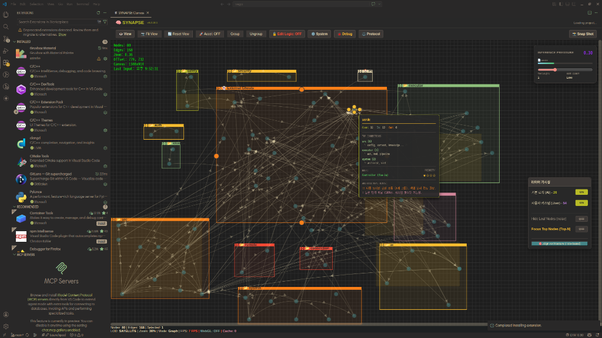

#  🧠 SYNAPSE: 비주얼 아키텍처 엔진 (v0.3.20)

> **"당신이 보는 것은 LLM의 논리입니다"** — *AI를 위한 WYSIWYG 논리 가시화*

[]
[]

[🇰🇷 한국어 버전](README.ko.md) | [🇺🇸 영어 버전](README.md)

---

## 🔥 최신 릴리즈: v0.3.20 - Rust Persistence & 엔진 안정화 (2026-04-17)

| 기능 | 설명 | 이점 |
|-------|---------|-----|
| **Rust 지원** | **경로 기반 ID 체계** | 절대 경로 식별자를 사용하여 `mod.rs`와 같은 중복 파일명 충돌 문제를 해결합니다. |
| **시맨틱 핫스팟** | **기능 영역** 매핑 | 관련 모듈을 부드러운 배경색의 "Hotspot" 영역으로 자동 그룹화합니다. |
| **물리 엔진 강화** | **속도 제한 및 감쇄** | 명시적인 속도 제한과 감쇄 로직을 통해 노드가 화면 밖으로 튕겨나가는 것을 방지합니다. |
| **Spring 정렬** | **전략적 표류** 엔진 | 논리적 구조를 유지하면서 노드들을 아키텍처 레이인 [Input → Core → Output]으로 유도합니다. |
| **엣지 번들링** | **흐름 통합** | 중복되는 시각적 경로를 우아한 "번들"로 병합하여 데이터 흐름 패턴을 드러냅니다. |
| **Top-N 포커스** | **글로벌 탐색** 시스템 | 상위 10개 핵심 노드와 그 1-hop 맥락을 자동으로 강조합니다. |
| **노드 역할 분류** | **포괄적 식별** | 임계값 최적화를 통해 소규모 모듈에서도 역할을 식별하고 기본 폴백을 제공합니다. |
| **지능형 툴팁** | **Stem 기반 매칭** | 경로 기반 ID 환경에서도 Stem 매칭을 통해 연결 상세 정보를 완벽하게 복구했습니다. |

---

## 🔍 노드 역할 분류 (Node Role Taxonomy)

SYNAPSE는 모든 노드를 연결 프로필에 따라 특정 아키텍처 역할로 분류합니다:

| 역할 | 대표 색상 | 의미 | 식별 기준 | 리팩토링 우선순위 |
|:---:|:---:|:---|:---|:---:|
| **Orchestrator** | 🟠 주황색 | 중앙 제어 노드 | OutRatio ≥ 80% & Conn ≥ 5 | 높음 |
| **Controller** | 🟢 녹색 | 인바운드 게이트웨이 | InRatio ≥ 80% & Conn ≥ 5 | 중간 |
| **Hub** | 🔵 파란색 | 고연결 중심점 | 총 연결 수 ≥ 15 | 매우 높음 |
| **Leaf Node** | ⚪ 회색 | 유틸리티 / 터미널 함수 | 총 연결 수 ≤ 3 | 낮음 |
| **Standard** | 🟡 베이지 | 일반 컴포넌트 | 기본 분류 | 낮음 |

---

## 📸 시각적 개요 (Visual Overview)

### 프로젝트 토폴로지 (Project Topology)
LLM 추론 논리와 실제 소스 파일 간의 물리적 연결을 시각화합니다.

### 노드 정보 요약 (v0.3.17)
노드 위에 마우스를 올리면 연결 수, IN/OUT 차수 등 구조적 지표를 즉시 확인하여 책임 영역과 의존성 클러스터를 빠르게 식별할 수 있습니다.

### 미니멀리스트 로직 뷰 (v0.3.16)
엣지와 배지의 가시성을 토글하여 시각적 노이즈를 줄이면서도 선택된 노드의 논리적 연결성은 유지할 수 있습니다.

### 계층형 트리 (Hierarchical Tree)
프로젝트 구조에 대한 깊이 있고 조직화된 개요를 제공합니다.

---

## 🚀 시작하기

순식간에 시각적 아키텍처 여정을 시작하세요.

1. **확장 프로그램 설치**: Antigravity/VS Code에 `synapse-visual-architecture-v0.3.20.vsix`를 설치합니다.
2. **DNA 주입**: 워크스테이스 루트에 `GEMINI.md` 또는 `Project_Spec.md` 파일을 생성하거나 배치합니다.
3. **부트스트랩**: 사이드바 또는 명령 팔레트(`Ctrl+Shift+P` -> `SYNAPSE: Open Canvas`)에서 **SYNAPSE Canvas**를 엽니다.
4. **첫 시각화**: 
    - 엔진이 폴더를 스캔하고 **제안된 노드**를 표시합니다.
    - 팝업에서 **[Confirm]**을 클릭하여 노드를 물리적으로 구체화합니다.

---

## 🆕 수정 이력 (Summary)

| 버전 | 날짜 | 설명 |
| :--- | :--- | :--- |
| **v0.3.20** | 2026-04-17 | **Rust Persistence & 엔진 안정화**: Rust 지원을 위한 경로 기반 ID 도입, 물리 시뮬레이션 폭주 방지 및 로드 성능 가이드 강화. |
| **v0.3.19** | 2026-04-17 | **Top-N 포커스 뷰**: 1-hop 맥락 확장을 포함한 상위 10개 핵심 노드 자동 식별 및 글로벌 탐색 모드 도입. |
| **v0.3.18** | 2026-04-17 | **진단 힌트 엔진**: 실시간 아키텍처 분석(R1-R5), Zero-Unknown 시맨틱 라벨링 및 툴팁 내 상세 연결 노드 리스트 출력. |
| **v0.3.17** | 2026-04-14 | **노드 요약 정보 출력**: 노드 호버 시 고유 연결 및 방향성 의존성을 보여주는 요약 툴팁 추가 및 O(E) 성능 최적화. |
| **v0.3.16** | 2026-04-14 | **미니멀리스트 로직 뷰**: 엣지 및 배지 가시성 토글 기능 도입. 선택된 노드의 엣지 반투명 노출 및 O(1) 렌더링 스킵 구현. |
| **v0.3.15** | 2026-04-13 | **쉘프 fzf 및 그리드 주권**: documentation 노드 대상 `/` 단축키 검색 기능, 40px 격자 스냅 및 강조 하이라이트 효과 도입. |

---

## 📜 라이선스 및 작성자
Licensed under the [GNU General Public License v3.0](LICENSE).  
Created with 🧠 by [dogsinatas29](https://github.com/dogsinatas29)

---
**이 프로젝트는 fzf를 사용합니다 (MIT License)**
