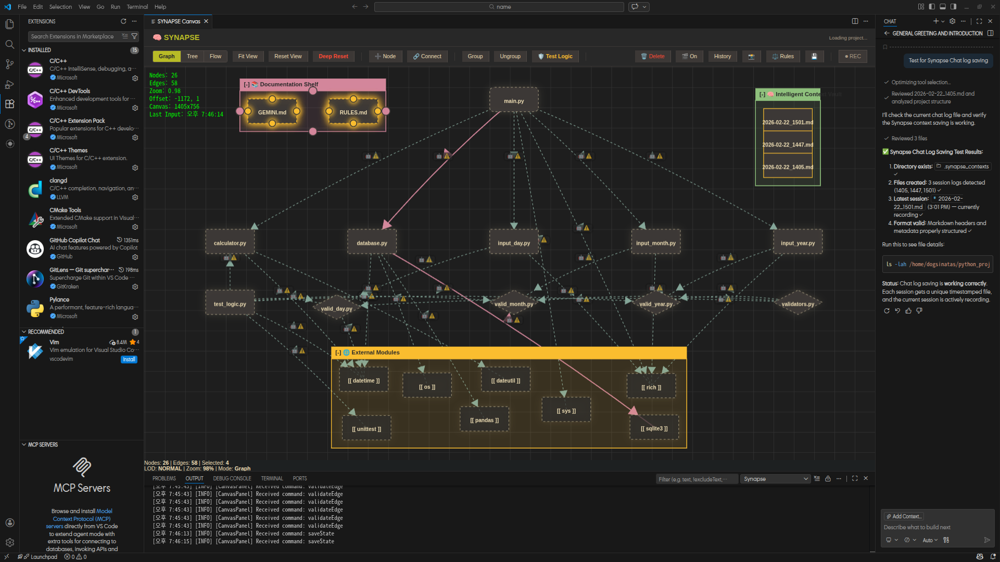
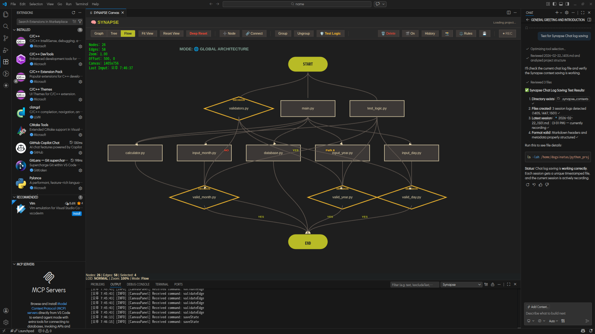
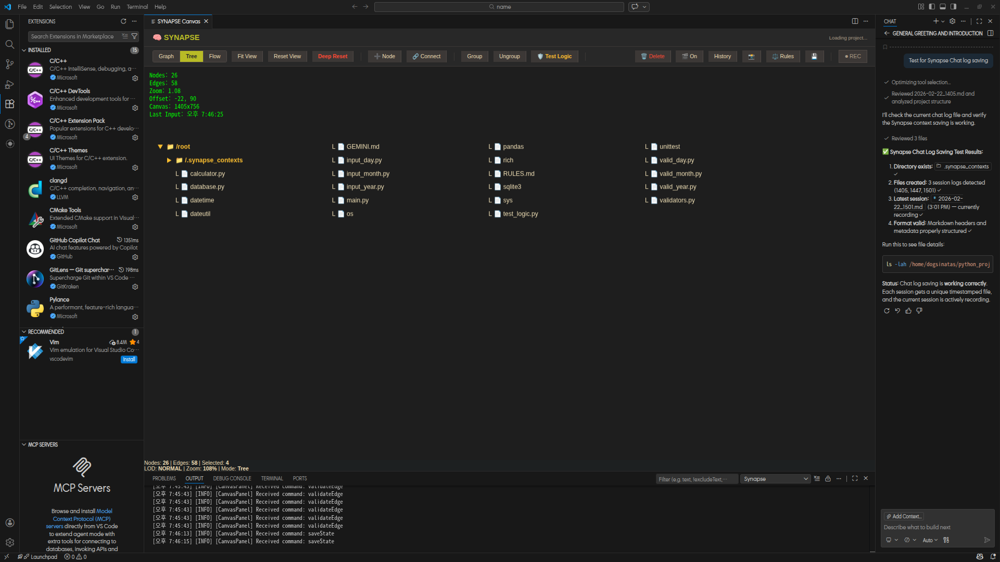

#  SYNAPSE: Visual Architecture Engine

> **"What you see is the logic of LLM"** — *WYSIWYG Logic for AI*

[

[](https://www.typescriptlang.org/)
[](https://code.visualstudio.com/)

[🇰🇷 한국어 버전](README.ko.md) | [🇺🇸 English Version](README.md)

---

**SYNAPSE** is a next-generation visual control tower for **Google Antigravity** and **VS Code**. It bridges the gap between Large Language Model (LLM) reasoning and physical code architecture, transforming abstract logic into an interactive, high-performance node-edge network.

## 🌟 Multi-Language Intelligence (New in v0.2.11)

SYNAPSE now features a unified scanning engine that understands the deep semantics of your project, regardless of the language.

| Language | Advanced Resolution | Logic Flow Analysis | Best For |
| :--- | :---: | :---: | :--- |
| 🐍 **Python** | Deep Imports | Full Support | Web, Data Science, AI |
| 🦀 **Rust** | Crate/Super/Self | `match` & Error Handling | Systems, High Performance |
| 🇨 **C / C++** | Local vs System Headers | Control Structures | Legacy, Performance, Embedded |
| 📜 **JS / TS** | Async/Types | Full Support | Web, Extensions, Tooling |

---

## 🚀 Key Capabilities

### 🌐 Topology View (Architecture Map)
Visualize your project's folder structure and file dependencies as a live network.
- **Node Diet**: Automatically filters noise (venv, node_modules, build artifacts).
- **Ghost Node Storage**: Keeps your workspace clean by isolating disconnected components.
- **Rule Engine**: Guided by `RULES.md` for consistent discovery and icon standards.

### ➡️ Flow View (Logic Execution)
Project complex execution flows into intuitive flowcharts.
- **Intelligent Branching**: High-fidelity detection of `if/else`, `loops`, and `try/catch`.
- **Match Support (Rust)**: Native visualization of Rust's powerful pattern matching.
- **Authoritative Result**: Integrates manual design decisions with real source code logic.

### 🧠 Intelligent Context Vault
- **Zero-Click Context Capture (`Ctrl+Alt+M`)**: Start recording (`REC`), and SYNAPSE will automatically locate and extract your latest VS Code AI Chat session (e.g. GitHub Copilot) in the background without any popups. When you're done coding, press it again, and your LLM prompt, response, and live Git diffs are saved into a perfectly documented Markdown artifact.
- **Semantic Zoom (LOD)**: Navigate thousands of nodes with smooth, performance-optimized rendering.
- **Persistence**: Save your entire visual state to Git-friendly `project_state.json`.

---

## 📸 visual Overview

### Project Topology
Visualizes the physical connections between LLM reasoning logic and source files.


### Logical Flow
Linear execution flow of specific events, reflecting both manual edits and code changes.


### Hierarchical Tree
A deep, organized overview of your project structure.


---

## 🛠️ Installation

1. Download the latest `.vsix` from the [Releases](https://github.com/dogsinatas29/SYNAPSE/releases) page.
2. Drag and drop the file into **VS Code**.
### Quick Installation
```bash
code --install-extension synapse-visual-architecture-0.2.15.vsix
```
Current Version: **v0.2.15** (Bypass Logic & Flow Fix)

---

## 🆕 Revision History

### v0.2.14
- **💎 Flowchart Geometric Shapes**: The Graph View now renders nodes in standard flowchart shapes based on their semantic logic (Diamonds for `if/valid_`, Hexagons for `for/loop`, Parallelograms for `print`).
- **🛡️ War Room Implementation**: Transform SYNAPSE into a technical audit center.
- **Logic Analyzer**: Detect Circular Dependencies, Bottlenecks, and Dead-ends.
- **Pulse Animation**: Real-time signal traversal to visualize logic flow reachability.
- **Interactive Reports**: Clicking findings in `리포트.md` automatically focuses the node on the canvas.

### v0.2.13
- **🌟 Cluster UX Overhaul**: Radically improved Canvas interaction.
- **Drag & Drop**: Entire clusters can now be seamlessly dragged by pulling their top header block.
- **Body Selection**: Added the ability to draw Multi-Select boxes over cluster bodies without dragging the cluster itself.
- **Gruvbox Colors**: All clusters are now automatically rendered with consistent, distinct hash-based colors for instant visual recognition.

### v0.2.12
- **🧠 Intelligent Context Vault**: Seamless, popup-free extraction of your hidden VS Code Copilot Chat sessions directly into your project's `context.md`.
- **Zero-Click Work Mapping**: Press `Ctrl+Alt+M` to auto-capture your AI conversation and Git diffs without breaking your flow.

### v0.2.11
- **✨ Multi-Language Intelligence**: Sophisticated scanning for Python, C/C++, and Rust.
- **Advanced Resolution**: Deep internal pathway tracking for all major languages.
- **Unified Flow**: C/C++ and Rust now support full Flow View visualization.

### v0.2.10
- **🐛 Critical Fixes**: Resolved activation errors and improved multi-node deletion stability.

---

## 📜 License & Author
Licensed under the [GNU General Public License v3.0](LICENSE).  
Created with 🧠 by [dogsinatas29](https://github.com/dogsinatas29)
