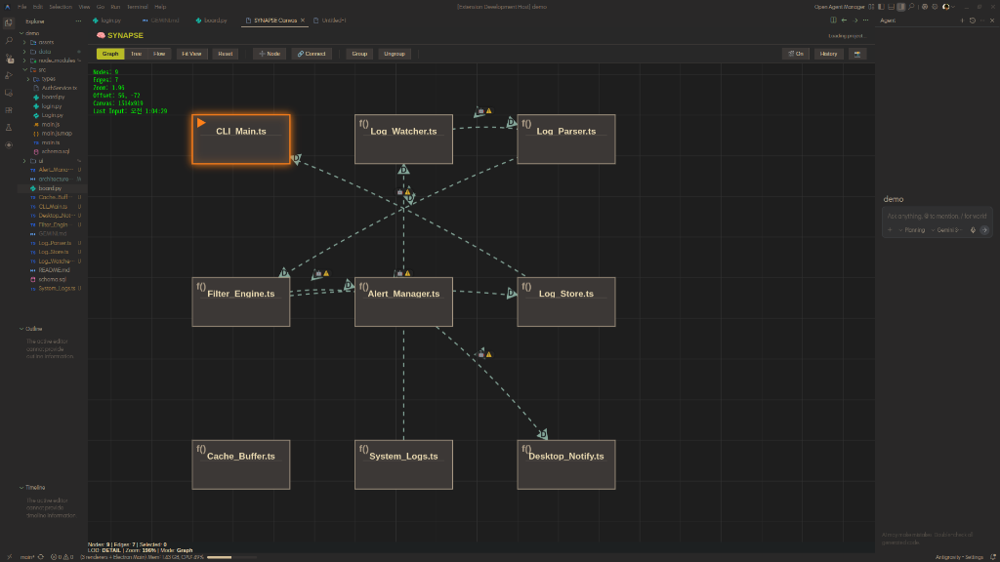

# 🧠 SYNAPSE: VS Code Visual Architecture Engine

> **Visual Studio Code (VS Code) Extension**  
> "What you see is the logic of LLM (WYSIWYG Logic for AI)"

[🇰🇷 한국어 (Korean)](README.ko.md) | [🇺🇸 English (English)](README.md)

SYNAPSE is a next-generation extension built for **Google Antigravity** and **Visual Studio Code** users. It visualizes complex reasoning logic generated or analyzed by Large Language Models (LLMs) into a physical node-edge network, helping you intuitively design, implement, and document AI thought processes.

## 🚀 Key Features

- **🌐 Topology View**: visualize project folder structure and file dependencies as a node-edge network.
- **🌳 Tree View**: A hierarchical overview of the project structure.
- **➡️ Flow View**: Projects the execution flow of specific logic into a flowchart.
- **🛡️ Node Diet (Smart Scanning)**: Automatically ignores unnecessary folders like `.venv`, `node_modules` to focus on core source code.
- **📂 Auto Folder Clustering**: Automatically groups nodes based on directory structure to ensure readability for large projects.
- **🔄 Deep Reset**: Instantly resets a messy layout and rescans with the latest filters.
- **🎯 Scan Scope Control**: Specify `Scan Paths` in `GEMINI.md` to precisely scan only desired areas.
- **⌨️ Arrow Key Navigation**: Fast and precise canvas navigation using arrow keys and Shift.
- **🔍 Semantic Zooming (LOD)**: Step-by-step detail control to manipulate thousands of nodes without performance degradation.
- **💾 Persistence**: Permanently save all visual states to `project_state.json` and manage with Git.
- **🛠️ Standalone Bridge**: Support for browser-only mode without VS Code.
- **💾 Prompt Traceability**: Save your prompts and design decisions directly from the canvas (Auto-save supported).

## 🗂️ Language Support

SYNAPSE supports multi-language architecture analysis:
- 🐍 **Python**: `.py` file analysis and virtual environment filtering
- 🦀 **Rust**: `Cargo` project structure and `.rs` logic analysis
- 🇨 **C / C++**: Header and source file dependency analysis (ReDoS prevention optimized)
- 🐚 **Shell Script**: `.sh` automation script flow and function analysis
- 🗄️ **SQL**: `.sql` table definition and schema visualization
- ⚙️ **Config (JSON/YAML/TOML)**: Analyzing relationships between infrastructure configuration files (The Glue)
- 📜 **TypeScript / JavaScript**: Basic support and folder optimization

## 🛠️ Technology Stack

- **Base**: Google Antigravity & Visual Studio Code (VS Code)
- **Language**: TypeScript
- **Engine**: HTML5 Canvas API (High Performance Rendering)
- **Scanner**: Regex-based Fast Multi-Language Scanner (Python, C++, Rust, Shell, SQL, Config)
- **Architecture**: Visual-First Design with LSP integration

### 🌐 Graph View
Visualizes the physical connection status between LLM reasoning logic and files as a node-edge network.


### 🌳 Tree View
Intuitively overview the project's folder structure and file hierarchy.


### ➡️ Flow View
Projects the logic execution flow of a specific event or function into a linear flowchart.


## 📦 Getting Started

1. **Repository Clone**
   ```bash
   git clone https://github.com/dogsinatas29/SYNAPSE.git
   ```

2. **Dependency Installation**
   ```bash
   npm install
   ```

3. **Development Server (VS Code Extension)**
   ```bash
   npm run watch
   # Then press F5 in VS Code to start extension development host
   ```

4. **Standalone Bridge Mode (New! 🚀)**
   Use this when you want to run the engine directly in the browser without VS Code.
   ```bash
   # Terminal 1: API Server
   npm run dev:standalone

   # Terminal 2: UI Server
   npm run dev:ui
   ```
   - API Server: `http://localhost:3000`
   - UI Server: `http://localhost:8080`

5. **Installation (Production)**
    If you want to use the extension permanently without running the source code:
    ```bash
    # 1. Install vsce globally
    npm install -g @vscode/vsce

    # 2. Package the extension
    npx vsce package

    # 3. Install in VS Code
    # Open VS Code Extension tab -> Click '...' -> 'Install from VSIX...' -> Select the generated .vsix file
    ```

## 🎯 Usage Guide

### 🧱 Node Creation (New!)
- **Add Node**: Click the `Add Node` button on the top toolbar to create a new node.
- **Node Input**: Select the created node to rename it.

### 🎨 Manual Edge Creation (WYSIWYG)

Design your architecture without code using SYNAPSE's core feature, **Drag & Drop Edge Creation**!

#### 1. Select Node
- Click a node on the canvas to select it.
- **4-way connection handles** (Up/Down/Left/Right) automatically appear around the selected node.

#### 2. Start Edge Creation
- Enter edge creation mode by **Alt + Clicking a connection handle**.
- A **Ghost Edge** is displayed in real-time as you move the mouse.

#### 3. Select Target
- Drag to another node or cluster.
- When hovering over a valid target, the Ghost Edge turns **Green**.

#### 4. Select Relationship Type
- Upon releasing the mouse, the **Edge Type Selection Menu** appears.
- Available types:
  - 🔗 **Dependency**: Dependency relationship
  - 📞 **Call**: Function call relationship
  - 📊 **Data Flow**: Data flow
  - ↔️ **Bidirectional**: Two-way relationship

#### 5. Auto Save
- Automatically saved to `project_state.json` upon type selection.
- Manageable via Git (Normalized JSON format).

### 📦 Clustering & Management

Manage complex nodes by grouping them!

1.  **Create Group**:
    *   Select multiple nodes with Shift/Ctrl + Click.
    *   Click the `Group` button on the toolbar.
    *   **Enter Name**: Specify a group name in the popup.
2.  **Manage Group**:
    *   **Rename**: **Double-click** the group header to edit the name.
    *   **Collapse/Expand**: Hide/Show nodes with the `[-]`/`[+]` buttons on the header right.
    *   **Smart Push**: Automatically reposition overlapping nodes within the cluster area.
3.  **Ungroup**: Select a group and click the `Ungroup` button.

### 💾 Snapshot & Rollback

Save and restore critical design points!

- **Manual Snapshot**: Click the camera icon (Snapshot) on the toolbar.
- **Auto Snapshot**: Automatically saved upon major changes (group creation, ungrouping, etc.).
- **Rollback**: Click the clock icon (History) -> Click the revert button for the desired point.
    *   (A confirmation window appears in browser mode)

### 💾 Prompt Traceability (New! v0.1.1)

Log your design decisions and prompts directly from the canvas.

- **Log Prompt**: Press `Ctrl+Alt+M` (or run `Synapse: Log Prompt`) to capture your design thoughts.
- **Save Prompt**: Click the `Save` icon (💾) on the toolbar.
- **Content**: Enter the prompt or reasoning you want to save.
- **Structured Parsing**: Automatically extracts `# Goal`, `# Decision`, etc.
- **Git Integration**: Generated `.md` files in `prompts/` are automatically staged.
- **Graph Linking**: Referenced files in the prompt appear as 'origin' edges in the canvas.
- **Auto-Save Option**: Enable `synapse.prompt.autoSave` in settings to automatically save with a timestamp filename without asking for a title.

## ⚙️ How to Install (VS Code)

### 1. Download from Release (Recommended)
Download the latest `.vsix` file from the [Releases tab](https://github.com/dogsinatas29/SYNAPSE/releases).

### 2. Load into VS Code (Installation Method)
You can install the downloaded `.vsix` file into VS Code using one of the following methods:

*   **Method A: Drag & Drop (Easiest)**
    - Drag and drop the downloaded `synapse-extension.vsix` file directly onto an open **VS Code window**. When the installation confirmation notification appears in the bottom right, click 'Install'.
*   **Method B: Using the Extension Menu**
    1. Click the **Extensions** icon in the VS Code left sidebar (Shortcut: `Ctrl+Shift+X`).
    2. Click the **`...` menu** (Views and More Actions) at the top of the Extensions pane.
    3. Select **'Install from VSIX...'** and choose the downloaded file.
*   **Method C: Terminal Command**
    - Enter the following command in the terminal (or command prompt):
    ```bash
    code --install-extension synapse-extension.vsix
    ```

---

## 🌐 Standalone Mode (Web Browser)

Use Standalone mode if you are in an environment without VS Code or want to use the analysis tool independently in a browser.

### 1. Prerequisites
```bash
git clone https://github.com/dogsinatas29/SYNAPSE.git
cd SYNAPSE
npm install
```

### 2. Launch Browser Engine
```bash
# Run Standalone Bridge Server
npm run dev:standalone
```

### 3. Access
Once the server is running, access `http://localhost:8080` (or specified port) in your browser to manipulate the canvas.

---

## 🛠️ For Developers (Build from Source)
If you want to create the package file yourself:
1. `npm install -g @vscode/vsce`
2. `npx vsce package --out synapse-extension.vsix`

## 🎥 Demo Video
https://www.youtube.com/watch?v=Va4vZWkqC8E
> *Click the image above to watch the full video on YouTube.*

## 🧹 Data Hygiene Principles

SYNAPSE follows 3 principles to prevent "Spaghetti Data":

### Principle 1: Separation of Source and State
- **GEMINI.md**: Declarative architecture definition
- **project_state.json**: UI metadata (coordinates, zoom level)

### Principle 2: Auto-Normalization
- JSON keys sorted alphabetically → Minimize Git Diff
- Automatic removal of properties identical to default values

### Principle 3: Volatile Auto-Edges
- Edges discovered by code analysis are not saved
- Real-time regeneration upon every canvas load
- `project_state.json` saves only the user's intent

## 🔥 Core Strategies

### 1. Multi-MD Strategy (Context Awareness)
SYNAPSE automatically scans and categorizes all Markdown (`.md`) files in your project:
- **History**: Files in `prompts/` are treated as conversation history or decision logs.
- **Documentation**: Other `.md` files are treated as project documentation.
- **Integration**: These files are parsed to establish relationships between your code and your design documents/prompts.

### 2. Automatic File Saving (Zero-Friction Logging)
Never lose a thought. SYNAPSE supports a robust prompt saving mechanism:
- **Auto-Save**: When enabled, prompts are saved instantly with a timestamped filename, allowing you to stay in the flow without interruption.
- **Manual Control**: Option to manually name files when precision is needed.
- **Traceability**: Every design decision is logged as a Markdown file, creating a permanent audit trail of your project's evolution.

## 📐 Philosophy

"An intuitive playground for children, a powerful control tower for experts."  
Created with the belief that the simple act of connecting lines in complex systems is, in fact, the highest level of architectural design.

---
Created by [dogsinatas29](https://github.com/dogsinatas29)
