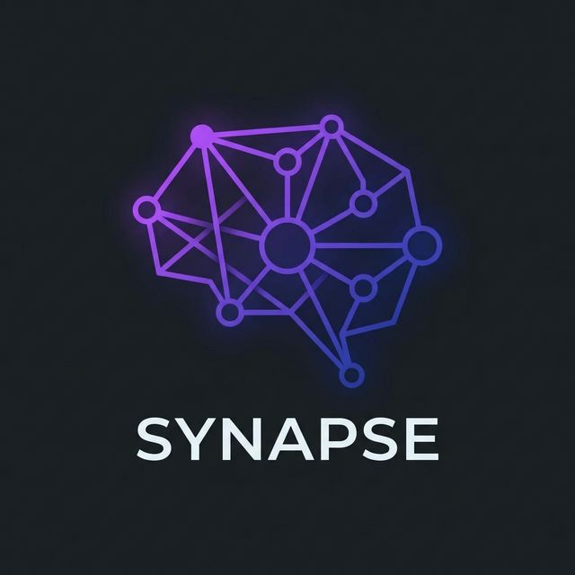
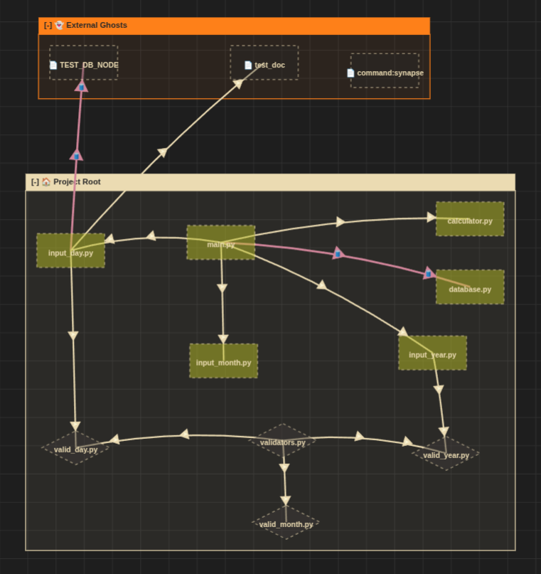
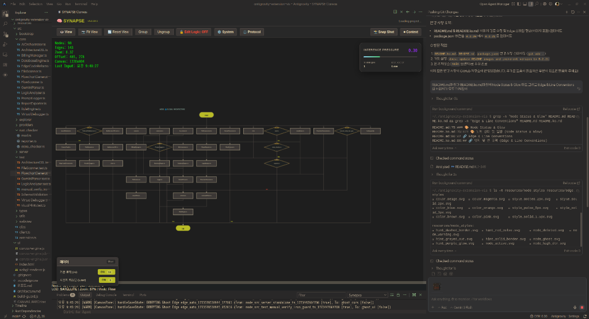
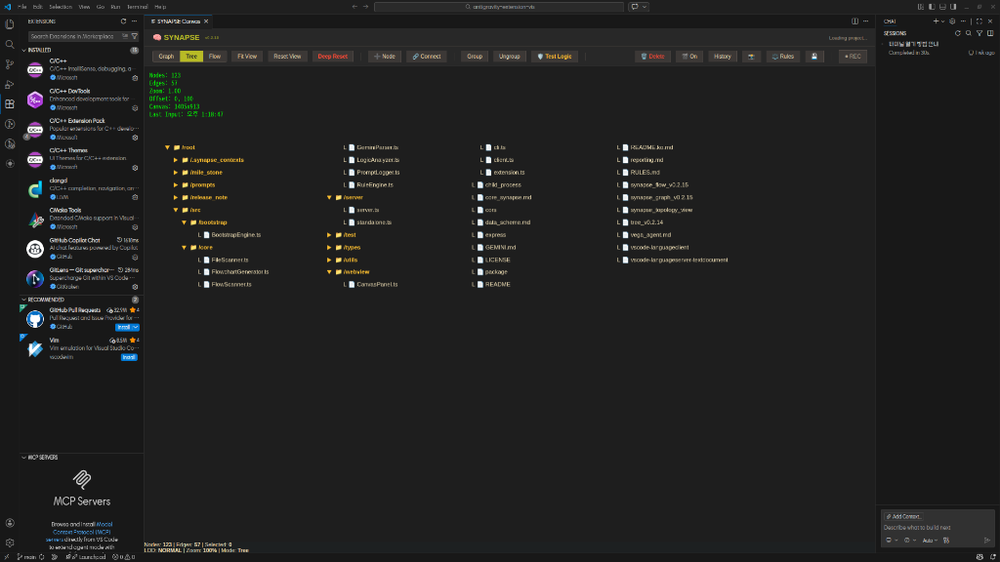

#  🧠 SYNAPSE: Visual Architecture Engine (v0.3.09_fix)

> **"What you see is the logic of LLM"** — *WYSIWYG Logic for AI*

[
[-orange.png)

[](https://www.typescriptlang.org/)
[](https://code.visualstudio.com/)

[🇰🇷 Korean Version](README.ko.md) | [🇺🇸 English Version](README.md)

---

## 🔥 Latest Release: v0.3.09 Hotfix - Phase Lock Resolution (2026-04-05)

### ✅ Critical Bug Fixes
**v0.3.09_fix** addresses a critical system-wide "LOCKED" state that occurred during heavy rendering cycles:

| Issue | Symptom | Fix | Status |
|-------|---------|-----|--------|
| **System Lock (Deadlock)**| Interaction BLOCKED in Phase 5/6 | Relaxed phase transition in `PhaseManager` + Expanded `ControlSystem` interaction scope | ✅ Fixed |
| **Canvas Height = 0** | 2D mode: nodes invisible | Min height enforcement + DOM reflow trigger | ✅ Fixed |
| **Emoji Font Missing** | 3D mode: icons show as 'D', 'B' (alphabet) | Noto Color Emoji font stack | ✅ Fixed |
| **Eco-mode Sleep** | Performance degradation during rendering | Rendering state check + idle timer reset | ✅ Fixed |
| **Edge Rendering Sync** | ⚠️ badges spam in 2D, type icons disappear in 3D on validation | Fixed validation conditionals + guaranteed fallback symbol rendering | ✅ Fixed |
| **Rendering Isolation** | View format transitions cause WebGL visual ghosting overhead | Rule 8 applied: Enforced WebGL framebuffer reset on view termination | ✅ Fixed |

---

**SYNAPSE** is a next-generation visual control tower for **Google Antigravity** and **VS Code**. It bridges the gap between Large Language Model (LLM) reasoning and physical code architecture, transforming abstract logic into an interactive, high-performance node-edge network.

## 🌟 Multi-Language Intelligence (New in v0.2.11)

SYNAPSE now features a unified scanning engine that understands the deep semantics of your project, regardless of the language.

| Language | Advanced Resolution | Logic Flow Analysis | Best For |
| :--- | :---: | :---: | :--- |
| 🐍 **Python** | Deep Imports | Full Support | Web, Data Science, AI |
| 🦀 **Rust** | Crate/Super/Self | `match` & Error Handling | Systems, High Performance |
| 🇨 **C / C++** | Local vs System Headers | Control Structures | Legacy, Performance, Embedded |
| 📜 **JS / TS** | Async/Types | Full Support | Web, Extensions, Tooling |

---

## 🚀 Key Capabilities

### 🌐 Topology View (Architecture Map)
Visualize your project's folder structure and file dependencies as a live network.
- **Node Diet**: Automatically filters noise (venv, node_modules, build artifacts).
- **Ghost Node Storage**: Keeps your workspace clean by isolating disconnected components. ([View Ghost Node Guide](GHOST_NODE.md))
- **Rule Engine**: Guided by `RULES.md` for consistent discovery and icon standards.

### ➡️ Flow View (Logic Execution)
Project complex execution flows into intuitive flowcharts.
- **Intelligent Branching**: High-fidelity detection of `if/else`, `loops`, and `try/catch`.
- **Match Support (Rust)**: Native visualization of Rust's powerful pattern matching.
- **Authoritative Result**: Integrates manual design decisions with real source code logic.

### 🧠 Intelligent Context Vault
- **Zero-Click Context Capture (`Ctrl+Alt+M`)**: Start recording (`REC`), and SYNAPSE will automatically locate and extract your latest VS Code AI Chat session (e.g. GitHub Copilot) in the background without any popups. When you're done coding, press it again, and your LLM prompt, response, and live Git diffs are saved into a perfectly documented Markdown artifact.
- **Semantic Zoom (LOD)**: Navigate thousands of nodes with smooth, performance-optimized rendering.
- **Persistence**: Save your entire visual state to Git-friendly `project_state.json`.

---

## 🧠 DTR (Density of Thought Reasoning) Engine
SYNAPSE v0.2.18 introduces the **DTR Engine**, a quantitative measure of AI reasoning depth and architectural density. It transforms fuzzy AI confidence into measurable engineering metrics.

### 🌓 The DTR Metric Spectrum
- **DTR (Density of Thought)**: (0.0 ~ 1.0) Represents how much reasoning effort was concentrated in a specific node. High DTR nodes glow with a purple aura, indicating critical decision points.
- **$\rho$ (Density Rho)**: The information compression ratio. Measures how much raw code/logic is encapsulated within a single visual abstraction.
- **Think-at-N (Simulation Paths)**: The number of alternative architectural paths simulated by the LLM before materializing the current node.
- **Panic Isolation**: A safety protocol that ensures logic failures in one language cluster (e.g., C++ crash) are contained and reported via structured error codes rather than crashing the visual engine.

### 🚀 Deterministic Thinking Foundation
DTR is not just a visual effect; it is the foundation for **Deterministic Thinking**. By quantifying reasoning density, SYNAPSE identifies "weak links" in the architecture where AI confidence is low, prompting the user for manual validation (the `?` badge flow).

---

## 🏗️ Node Conventions
SYNAPSE uses specific icons and colors to represent different types of components and their current reasoning states.

### 📄 Entity Types
| Icon | Type | Description |
| :---: | :--- | :--- |
| 📄 | **File** | A physical source file in the workspace. |
| 📁 | **Folder** | A directory containing multiple nodes or clusters. |
| 🧩 | **Component** | A logical grouping or abstract module. |
| ⚡ | **Trigger** | An entry point or event source. |

### 🎨 Node Status & Glow
| Status | Visual Hint | Color | Meaning |
| :--- | :---: | :---: | :--- |
| **Active** |  |  | Verified and currently active in the codebase. |
| **High DTR** |  |  | High reasoning density; critical logic point. |
| **Ghost** |  |  | Proposed architectural node (not yet materialized). |
| **Deleted** |  |  | Safely commented out/decommissioned node. |
| **Warning** |  |  | Logic error, circular dependency, or dead-end detected. |
| **Necrosis** | 💀 |  | Fatal logic failure; broken build or severe physical defect. |
| **Tombstone** | 🪦 |  | Irrecoverable deterministic failure; recommended for deletion. |

---

## 🔗 Edge & Line Conventions
SYNAPSE uses distinct colors and styles to represent different types of logical connections and data flows between nodes.

| Edge Type | Color | Style & Thickness | Meaning |
| :--- | :---: | :---: | :--- |
| **Dependency** |  |  | Standard module dependency or import. |
| **Data Flow** |  |  | Heavy data transfer or payload movement. |
| **Event** |  |  | Event triggers or asynchronous callbacks. |
| **Conditional** |  |  | Conditional branches like if/else or match. |
| **Origin** |  |  | Prompt origin links for AI logic tracking. |
| **API Call** |  |  | External API or cross-service network calls. |
| **DB Query** |  |  | Database queries, mutations, or transactions. |
| **Loop / Back**|  |  | Loop-backs (`while`/`for`) or reverse logic flow. |
| **Highlighted**|  |  | Active execution path (Hovered/Selected). |

### 🔡 Edge Type Tags (Symbols inside Arrows)
These symbols appear inside the edge arrows to represent the technical nature of the connection.

| Symbol | Meaning | Edge Type | Description |
| :---: | :--- | :--- | :--- |
| **🔗** | **Dependency** | Dependency | Standard file import or module reference. |
| **🛢️** | **Data/Flow** | DB Query | Database mutation or Bi-directional data exchange. |
| **📊** | **Flow** | Data Flow | Heavy data transfer or payload movement. |
| **📡** | **Call** | API Call | Function invocation or remote procedural call. |
| **🔁** | **Loop** | Loop Back | Recursive loop or backward logic flow. |
| **📍** | **Origin** | Origin | AI prompt tracing and original logic source. |

### 🏷️ Edge Interactive Badges
Status and action badges appear on edges to indicate logic health or maintenance tasks.

| Badge | Type | Meaning |
| :---: | :--- | :--- |
| **⚠️** | **Warning** | **Status**: Logic ambiguity detected or minor architectural violation. |
| **❌** | **Error** | **Status**: Fatal structural violation or broken dependency path. |
| **🤖** | **AI Logic** | **Origin**: This edge was inferred by the LLM logic engine. |
| **❓** | **Pending** | **Action**: Manually drawn edge awaiting confirmation. |
| **❗️** | **Confirmed** | **Action**: Confirmed architectural choice; triggers import injection. |

---

## 📸 visual Overview

### Project Topology
Visualizes the physical connections between LLM reasoning logic and source files.


### Logical Flow
Linear execution flow of specific events, reflecting both manual edits and code changes. Group-Aware Hierarchy and Orthogonal Edge Routing create clean, readable diagrams.


### Hierarchical Tree
A deep, organized overview of your project structure.


### 🔍 Virtual Debugging (VDE)
SYNAPSE integrates VS Code's real-time diagnostics directly into the architecture map.
- **Trigger**: Access the **"🐞 Debug"** menu in the top toolbar and click **"🔍 Virtual Debug"**.
- **Simulation Mode**: Even without real errors, you can force selected nodes into **💀 Necrosis** or **🪦 Tombstone** states to test visual impact via the simulation buttons in the Debug menu.
- **Node Necrosis**: Nodes associated with files containing Errors/Warnings will automatically morph into a 'Necrotic' state (dark red glow).
- **Edge Fracture**: Edges originating from nodes with code errors are flagged as 'Fractured', indicating unstable dependencies.
- **Impact Analysis**: Use this to visually track how a single compilation error "poisons" the rest of the architectural flow.

---

## 🛠️ Performance & 3D Acceleration

1. Download the latest `.vsix` from the [Releases](https://github.com/dogsinatas29/SYNAPSE/releases) page.
2. Drag and drop the file into **VS Code**.

### Quick Installation
```bash
code --install-extension synapse-visual-architecture-v0.3.09.vsix
```
Current Version: **v0.3.09** (With Critical Bug Fixes & Rendering Isolation)

---

## 💾 System Requirements

### Font Stack (Required for Icon Rendering)
**Critical**: SYNAPSE uses modern emoji icons (🔗, 🛢️, 📡, 📊, 📍, 🔁) in 3D visualization. These require proper emoji font support.

**Required Font Stack** (in order of preference):
```
1. Noto Color Emoji       (Google's comprehensive emoji font)
2. Apple Color Emoji       (macOS default emoji font)
3. Segoe UI Emoji          (Windows 10+ emoji font)
4. System emoji fallback
```

**Installation by OS**:

| OS | Installation | Command |
|----|--------------|---------| 
| **Linux (Ubuntu/Debian)** | Install Noto Color Emoji | `sudo apt-get install fonts-noto-color-emoji` |
| **macOS** | Pre-installed | Already bundled in system fonts |
| **Windows 10+** | Pre-installed | Segoe UI Emoji included by default |

**Symptom of Missing Emoji Font**: Edge icons display as alphabet characters ('D', 'B', 'F') instead of emoji symbols (🔗, 🛢️). **Solution**: Install one of the recommended fonts and reload VS Code.

---

## 🚀 Getting Started
Launch your visual architecture journey in seconds.

1. **Install Extension**: Install the `synapse-visual-architecture-v0.3.09.vsix` (or latest) in Antigravity/VS Code.
   - **Font Installation**: Emoji icons require Noto Color Emoji or compatible font. ([System Requirements](#-system-requirements) details)
2. **DNA Injection**: Create or drop a `GEMINI.md` (or `Project_Spec.md`) file into your workspace root.
3. **Bootstrap Phase**: Open the **SYNAPSE Canvas** from the sidebar or command palette (`Ctrl+Shift+P` -> `SYNAPSE: Open Canvas`).
4. **First Visualization**: 
    - The engine will scan your folder and display **Proposed Nodes** (transparent boxes with dashed borders).
    - **Click [Confirm]** in the proposal popup to materialize these nodes into actual files and clusters.
    - **See the Connections**: The engine automatically detects `import` or `require` calls and draws the first set of logic lines (Edges).

### 🖱️ Navigation for Beginners
- **Pan**: Left-click and drag the background canvas.
- **Zoom**: Use the mouse wheel to zoom in (Detail View) or zoom out (Satellite View).
- **Fit All**: Press the **`📷 Fit View`** button to center all nodes if you get lost.
- **Select**: Left-click a node to select it (Right-panel opens for file preview).

---

## 🧠 Core Principles: DNA to Architecture
SYNAPSE operates on a "Physical Abstraction" model where the diagram is not just a drawing, but the source of truth.

### 1. Static Analysis (LSP-Driven)
The **`FileScanner`** engine performs real-time static analysis across multiple languages:
- **Node Generation**: Identifies `class`, `interface`, `struct`, and `function` export statements to map out the system's entities.
- **Edge Generation**: Analyzes `import`, `require`, `include`, and `use` statements to detect dependencies and logical flow.
- **Auto-Normalization**: Strips redundant metadata to keep `project_state.json` lean and Git-friendly.

### 2. DTR (Deep-Thinking Ratio) Engine
The **DTR Controller** manages the "cognitive density" of the architecture:
- **High DTR (Purple Glow)**: Indicates complex nodes that require more reasoning cycles or have high dependency fan-in.
- **Dynamic LOD**: Visual density changes based on zoom level—satellite view for structure, detail view for code snippets.

### 3. Logic Edit & Confirmation
- **Pending Edges (❓)**: Manually drawn edges are marked as pending until the underlying code (e.g., an `import` statement) is successfully injected and verified.
- **Ghost Nodes (📦)**: Orphaned files or unimplemented requirements are isolated in the **Storage Cluster** until linked to the main logic.

---

## 🔍 Technical Specifications: Analysis Depth
SYNAPSE provides professional-grade architectural validation while maintaining visual clarity.

### 🔄 Circular Dependency Detection
The engine safeguards your project against architectural rot by detecting cyclic dependencies (e.g., `A → B → C → A`).
- **Algorithm**: Depth-First Search (DFS) based cycle detection in `LogicAnalyzer.ts`.
- **Reporting**: Reports cycles as **`CRITICAL`** issues in the `architecture_report.md`.
- **Visual Feedback**: Use the `🛡️ Test Logic` toolbar button to trigger a full validation sweep.

### 🔗 Edge Generation: Level 1 vs. Level 2
To prevent "Visual Spaghetti," SYNAPSE employs a hybrid approach to edge density:
- **Level 1: File-Level (Automatic)**: The `FileScanner` automatically maps `import`, `require`, `include`, and `use` statements to show the high-level dependency forest.
- **Level 2: Logic-Flow (Manual/Hybrid)**: Deep function calls and data flows are managed via **'Logic Edit' mode**.
    - **Intent-Driven**: Users draw the *critical* logic paths they want to enforce.
    - **Code Sync**: Manual edges are synchronized with code using `[SYNAPSE_PENDING]` tags, ensuring the diagram remains a living extension of the source.

---

## 🛠️ Toolbar & Menu Structure
The SYNAPSE toolbar is the command center for your architectural workflow.

### 👁️ View Menu (Layout Control)
- **Graph View**: A sprawling 2D network map showing file logic and folder clusters.
- **Tree View**: A hierarchical, left-to-right tree centered on your project's logic core.
- **Flow View**: Specialized for execution order and sequence diagrams.
- **Show Vault**: Toggles the **Context Vault** side panel for reviewing AI-assisted sessions.

### 📷 Navigation Control
- **Fit View**: Instantly zooms and pans to bring all existing nodes into the center of your screen.
- **Reset View**: Clears all manual zoom levels and returns to the default 1:1 view.

### 🔓 Edit Logic Menu (Active Design)
- **Toggle Edit Mode**: **The Master Switch.** Must be `ON` to drag nodes, create edges, or delete files.
- **🛡️ Test Logic**: Triggers the `LogicAnalyzer` to generate an **`architecture_report.md`** checking for circular dependencies.
- **➕ Node**: Creates a new logical node. If "Physical File" is checked, an empty source file is created instantly. **Important: You must include the file extension (e.g., `logic.ts`, `engine.py`) in the name.**
- **🔗 Connect**: Enables drag-and-drop connection mode (Click **Source Node** -> Click **Target Node**).
- **🗑️ Delete**: Permanently removes selected nodes or edges from both the canvas and `project_state.json`.

### ⚙️ System Menu (Meta Operations)
- **Deep Reset**: Forces the engine to perform a full project re-scan, clearing all cached topology.
- **🔄 Reset State**: Hard-wipes the current architecture to start from a blank canvas.
- **🎬 Animation**: Toggles the particle flow on edges to visualize data/execution direction.

### ⚖️ Protocol Menu (Rules & Hubs)
- **Rules.md**: Opens the governance file containing your project's architectural constraints.
- **Architecture.md**: Opens the **Master Hub**, a central documentation file that SYNAPSE reads to understand global intent.

### 📸 Snap Shot Menu (Version Control)
- **Save Now**: Captures a visual and logical timestamp of your current canvas state.
- **History View**: Opens the **Snapshot Timeline**, allowing you to preview and rollback to any previous design state.

### ⏺ Context Menu (AI Memory)
- **REC Toggle**: Toggles live recording of your interactions to provide "Dense Context" for LLM prompts.
- **Vault History**: Allows you to browser and retrieve previously recorded architectural context clips.

---

## 📖 Usage Guide (v0.2.17 Key Features)

### 1. 🔄 Reset State (Full Factory Reset)
If your canvas becomes corrupted or you want to start a completely new architecture from scratch, use the **`Reset State`** button in the top toolbar.
- **Disk Purge**: Instantly wipes all nodes, edges, and clusters from `project_state.json`.
- **Memory Flush & Visual Reset**: Clears the currently active canvas and internal engine memory.
- **Re-Bootstrap**: Prompts you to reload `GEMINI.md` to begin generating a fresh architecture.

### 2. ✏️ Edit Logic Mode (WSIWYG File Management)
The `Edit Logic` button in the toolbar empowers you to shape your workspace directly from the canvas. 
- **Creating Files**: Toggle `Edit Logic` ON, double-click anywhere on the empty canvas to spawn a new node, give it a module name, and SYNAPSE will **physically create an empty file** in your workspace.
- **Safe Deletion**: Deleting a node in `Edit Logic` mode intercepts the file system. Instead of destructive deletion, SYNAPSE wraps the physical source code entirely in `// [SYNAPSE_DELETED]` comments, ensuring no code is ever permanently lost.
- **Resurrection**: If you delete a node by mistake, the automatic Snapshot & Rollback system allows you to revert to the previous state and revive the file.

### 3. 🔗 Edge Management & Auto-Imports
SYNAPSE v0.3.1 bridges the gap between drawing pictures and writing code.
- **Inline Trash (`X`)**: Hover over any edge to reveal a red `X` badge at its center. Click it to instantly sever the logical and visual connection.
- **Confirmation Flow (`?` → `!`)**: When you manually connect two nodes in `Edit Logic` mode, the edge appears with a yellow **`?`** badge indicating a `pending_confirm` state.
- **Auto-Injected Imports**: Click the **`?`** badge to confirm the architectural decision. SYNAPSE will analyze the target node, detect the file language (`.py`, `.ts`, `.js`), and **automatically inject the correct `import` or `require()` statement at the very top of the source file.** The badge then turns perfectly green (**`!`**).

---

## 🆕 Revision History

| Version | Date | Description (English) | Description (Korean) |
| :--- | :--- | :--- | :--- |
| **v0.3.09_fix** | 2026-04-05 | **Hotfix PhaseLock**: Resolved system-wide interaction lock in RENDER/DEBUG phases and improved atomicity. | **핫픽스 페이즈락**: RENDER/DEBUG 단계의 전역 인터렉션 락 해결 및 원자적 동기화 개선. |
| **v0.3.1** | 2026-03-31 | **Bootstrap Locked**: Full Phase-based initialization (Phases 0-7) and system lockout protocol. | **부트스트랩 락**: 전 단계(Phase 0-7) 순차 초기화 강제 및 시스템 잠금 프로토콜 도입. |
| **v0.2.53** | 2026-03-31 | **The Mainframe Breach**: Main World (Context 1) CDP injection and VsCodeApi hijacking for secured return path. | **메인프레임 브리치**: Main World(Context 1) CDP 주입 및 VsCodeApi 하이재킹을 통한 데이터 귀환 경로 확보. |
| **v0.2.28** | 2026-03-22 | Rendering Parity Patch: 2D/3D color sync, camera view persistence, extensionless file guard. | 렌더링 일치 패치: 2D/3D 색상 동기화, 카메라 뷰 영속성, 확장자 없는 파일 처리. |
| **v0.2.26** | 2026-03-22 | WebGL Fix, Snapshot Restoration, Node Style Alignment. | WebGL 오류 수정, 스냅샷 뷰 복구, 노드 규격 동기화. |
| **v0.2.21** | 2026-03-15 | WebGL Acceleration, External Doc Shelf, Fuzzy search (fzf), Selection UI refinement. | WebGL 가속, Documentation Shelf 패널화, 퍼지 검색(fzf), 선택 인터페이스 정밀화. |
| **v0.2.20** | 2026-03-15 | Hybrid Guardrail & Promotion Awareness. | 하이브리드 가드레일 및 프로모션 인식. |

### v0.2.28 (Rendering Parity & Stability Patch)
- **2D/3D Color Parity**: Conditional nodes (`valid_*`, `checker`, `router`, `is_*`) now render with identical dark background (`#3c3836`) in both 2D and 3D modes. Only true `isDeterministicFracture` violation nodes use a light background (`#ebdbb2`).
- **Camera View Persistence**: The canvas camera position (zoom + pan offset) is now fully saved to `project_state.json` on every snapshot, and correctly restored on load.
- **Extensionless File Guard**: Clicking a node with no file extension now shows a descriptive warning message instead of a silent "Failed to open file" error.
- **Error Message Improvement**: File open errors now include the specific system error reason.

### v0.2.26 (Final Stabilization: WebGL & UX)
- **External Doc Shelf**: Moved the documentation list to an independent, draggable external panel.
- **FZF-style Fuzzy Search**: Implemented fuzzy matching for Context Vault and Documentation Shelf searches.
- **Selection UI Refined**: Separated Single Click (Navigation) from Double Click (Open File) and improved edge hitboxes.
- **GPU Accelerated Rendering**: Integrated WebGL-based renderer for handling large graphs (10k+ nodes) with 60 FPS performance.
- **Virtual Debug Engine**: Visual necrosis and fracture rendering for LSP diagnostic errors.

### v0.2.20 (Hybrid Guardrail & Promotion Awareness)
- **Iron Guard Protocol (v0.3.0 Preview)**: Implemented real-time edge validation via `LogicAnalyzer.ts` and VS Code Diagnostics integration.
- **Layer Gravity (Waterfall Protocol)**: Enforces unidirectional architectural flow (e.g., Frontend -> API -> Database), instantly flagging backflow references as CRITICAL VIOLATIONS.
- **Promotion Awareness System**: Added path animations (`PromotionParticle`) and visual morping for 'ghost to active' node transitions.
- **Sovereign Principles Validation**: Interactive principle monitoring that halts canvas if `# Principles` in `GEMINI.md` are violated.
- **UX & Stability Hardening**: Resolved Jitter Tracking (5px threshold), fixed multi-select drag bugs, and implemented interaction wake-up (60 FPS on demand).
- **Virtual Debug Engine**: Visual necrosis and fracture rendering for LSP diagnostic errors.

### v0.2.19 (Promotion & Side Panel Optimization)
- **Ghost-to-Active Transition**: Enhanced visual feedback during node promotion.
- **Space Management**: Decoupled History and Context Vault into side panels to maximize canvas real estate.

### v0.2.18.1 (Iron Guard Protocol & Modular Architecture)
- **Modular Documentation Hub**: Split the massive `architecture.md` into 4 specialized specs (`core_synapse`, `vega_agent`, `reporting`, `data_scheme`) with a Master Hub orchestration.
- **Lightweight Schema Guard (LOD)**: Implemented a Level of Detail validation engine for `project_state.json`. Essential fields (ID, Type, Status) are now strictly verified during save/load.
- **Panic Isolation Foundation**: Established cross-language exception handling standards to prevent error contagion.
- **Ghost Node Workflow**: Formalized the transistion model: `Ghost` (Proposal) -> `Materialize` (Approval) -> `Reserved` (Staging) -> `Active` (Code).
- **Hierarchical UI Optimization**: Restructured the toolbar into logical menu groups (`View`, `System`, `Protocol`, `Snap Shot`) for a cleaner workspace.
- **Context Vault Isolation**: Physically decoupled bulky context nodes into an external panel, accessible via a dedicated link button.
- **Ghost Node Resurrection Blocked**: Implemented an explicit validation check during the `saveState` sequence (`CanvasPanel.ts`). Nodes deleted in the UI can no longer be resurrected by stale cache.
- **Edge Badge Hitbox Expansion**: The clickable radius for Edge confirmation (`?`) and Edge deletion (`trash`) badges has been dramatically enlarged for better accessibility.
- **Buffer ➔ Reserved Automation Leap**: Dropped dragging nodes falling out of Buffer Cluster. Added physical coordinate jump to `[-1500, 1000]` when a node is officially assigned to the Reserved Cluster.
- **Strict Edge Import Semantics (A ➔ B)**: Formalized the rule that connecting Node A to Node B explicitly means Node A imports Node B, alongside status bar notifications.

### v0.2.17 (DTR & WYSIWYG Logic Editing)
- **DTR Visualization**: AI reasoning density glows purple, with Inference Pressure control straight from the VS Code status bar.
- **Buffer Cluster Automation**: Manually created nodes auto-spawn into the strictly managed `Buffer Cluster` with camera auto-focus.
- **Logic Edit Toggle**: Destructive generation tools (`Node`, `Connect`) are completely hidden until the `Edit Logic` master switch is engaged.
- **Safe Node Deletion**: Physical files are commented out instead of hard-deleted to prevent data loss.
- **Auto-Snapshot on State Change**: Any canvas action (node/edge deletion or position change) automatically captures the latest state into the snapshot history.
- **Edge Auto-Imports**: Confirming an edge visually injects the actual `import` statement into the source file. Wait/confirm badges (`?`, `!`) are massively enlarged for clarity.
- **Reset State Protocol**: 4-step full reset system (Disk, Memory, Canvas, Prompt).
- **Data Hygiene**: Eliminated JSON buffer encoding corruption and RangeErrors.

### v0.2.16 (Strategic Execution Flow Update)
- **Ready Handshake**: Extension now waits for WebView readiness, preventing initialization race conditions.
- **Stable Layout BFS**: Replaced potentially infinite BFS loops with a stable topological rank calculation.
- **NaN/Infinity Guards**: Strict coordinate validation to prevent UI engine freezes on complex graphs.
- **Throttled Communication**: Reduced progress update frequency and batched messages for smoother UI performance.
- **Recursion Safety**: Added depth limits to rank calculation to handle extremely complex or circular dependencies.

### v0.2.15 (Performance & Visibility Release)

### v0.2.14fix (The Clarity Update)
- **Group-Aware Hierarchy**: Nodes in the Flow View now persist their grouped `cluster_id` from the Graph view, preserving modular context with visual dashed boxes (`[ MODULES ]`).
- **Orthogonal Edge Routing**: Eradicated diagonal spaghetti edges. Edges now use 90-degree Manhattan routing with smart bypass logic to avoid piercing unrelated nodes.
- **Virtual End-Point Bus**: Added a `Merge / Sync` virtual node before `END` to multiplex and cleanly route parallel pathways down a logical bus line.
- **Decision Node Resizing**: Scaled down the horizontal bloat of decision diamonds to preserve grid layout integrity.

### v0.2.14
- **💎 Flowchart Geometric Shapes**: The Graph View now renders nodes in standard flowchart shapes based on their semantic logic (Diamonds for `if/valid_`, Hexagons for `for/loop`, Parallelograms for `print`).
- **🛡️ War Room Implementation**: Transform SYNAPSE into a technical audit center.
- **Logic Analyzer**: Detect Circular Dependencies, Bottlenecks, and Dead-ends.
- **Pulse Animation**: Real-time signal traversal to visualize logic flow reachability.
- **Interactive Reports**: Clicking findings in `리포트.md` automatically focuses the node on the canvas.

### v0.2.13
- **🌟 Cluster UX Overhaul**: Radically improved Canvas interaction.
- **Drag & Drop**: Entire clusters can now be seamlessly dragged by pulling their top header block.
- **Body Selection**: Added the ability to draw Multi-Select boxes over cluster bodies without dragging the cluster itself.
- **Gruvbox Colors**: All clusters are now automatically rendered with consistent, distinct hash-based colors for instant visual recognition.

### v0.2.12
- **🧠 Intelligent Context Vault**: Seamless, popup-free extraction of your hidden VS Code Copilot Chat sessions directly into your project's `context.md`.
- **Zero-Click Work Mapping**: Press `Ctrl+Alt+M` to auto-capture your AI conversation and Git diffs without breaking your flow.

### v0.2.11
- **✨ Multi-Language Intelligence**: Sophisticated scanning for Python, C/C++, and Rust.
- **Advanced Resolution**: Deep internal pathway tracking for all major languages.
- **Unified Flow**: C/C++ and Rust now support full Flow View visualization.

### v0.2.10
- **🐛 Critical Fixes**: Resolved activation errors and improved multi-node deletion stability.

---

## ⚠️ Known Issues

| Issue | Affected Version | Status | Planned Fix |
| :--- | :---: | :---: | :--- |
| **External Ghosts cluster nodes not saved in snapshots**: Nodes placed inside the "External Ghosts" cluster are not persisted when taking a snapshot. They will be missing after a rollback or project reload. | v0.2.28 | 🔧 Pending | v0.2.29 |
| **2D drag-to-select no visual refresh**: The selection rectangle in 2D mode does not trigger a canvas repaint, making it impossible to see which nodes are selected until switching to 3D mode. | v0.2.28 | 🔧 Pending | v0.2.29 |
| **DTR slider not appearing**: The DTR (Density of Thought Reasoning) slider UI does not appear after clicking a node in some states. | v0.2.28 | 🔧 Pending | v0.2.29 |

---

## 🗺️ Roadmap: v0.3.0 (The Iron Guard Protocol)

SYNAPSE is evolving from a visual analysis tool into an **enforceable architecture control tower**.

- **Sovereign Mastery**: Full implementation of the Master Hub (`architecture.md`) to govern all sub-modules.
- **Cluster-to-Cluster Semantic Connections**: Advanced zoom-out logic that merges complex connections into a single, high-level "representative edge".
- **Real-time Guardrails**: Automated rejection of circular dependencies and layer gravity violations (e.g., UI cannot call Database directly).
- **Interactive Prototyping**: Drag-and-drop architectural design that automatically generates structural code templates.

---

## 📜 License & Author
Licensed under the [GNU General Public License v3.0](LICENSE).  
Created with 🧠 by [dogsinatas29](https://github.com/dogsinatas29)
