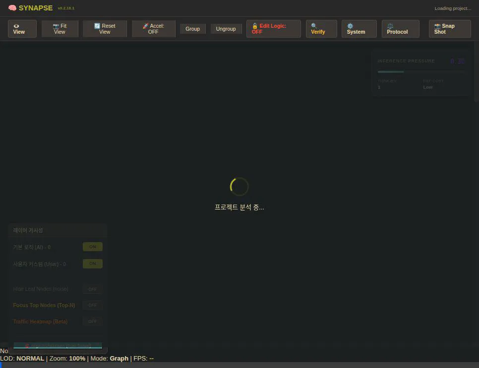
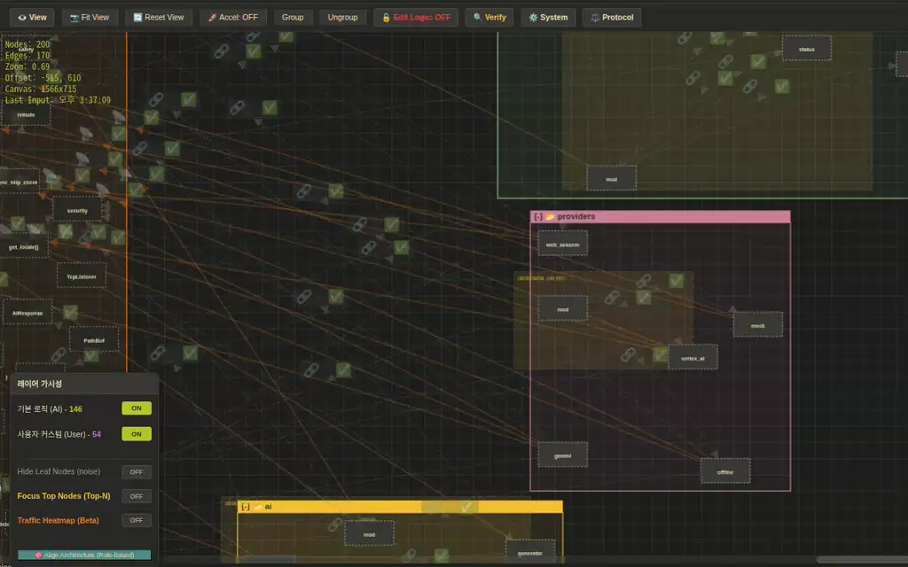
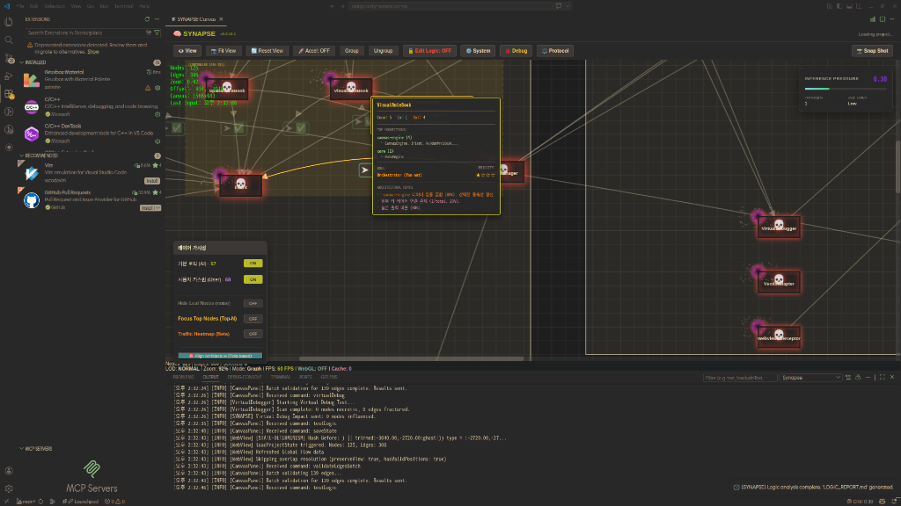
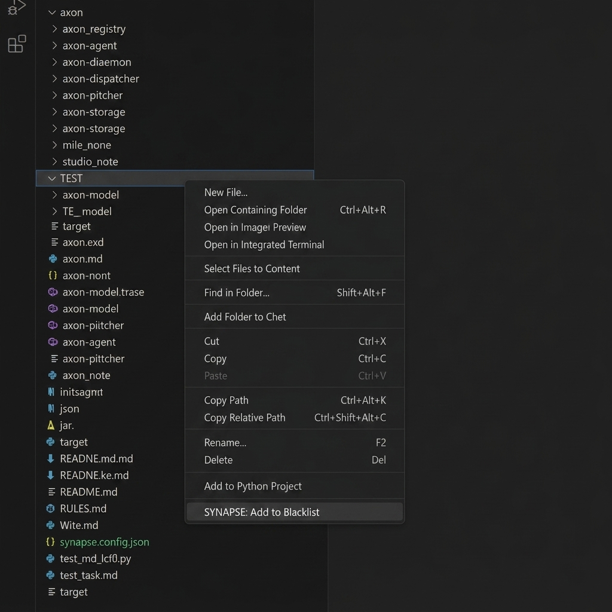
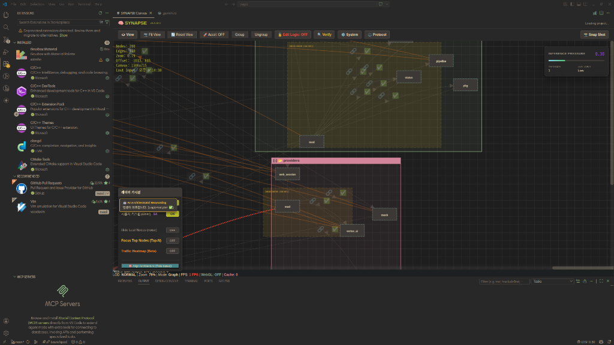
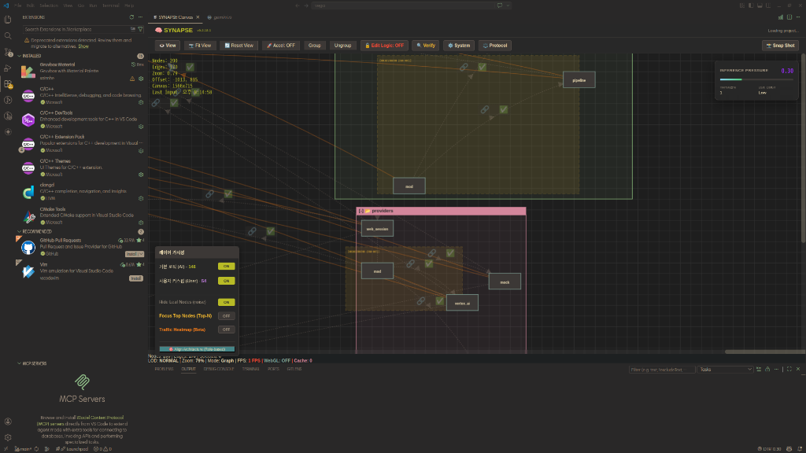
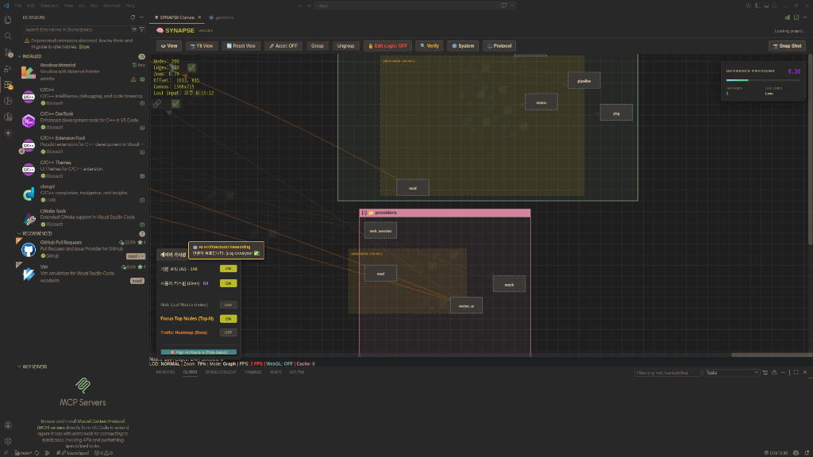
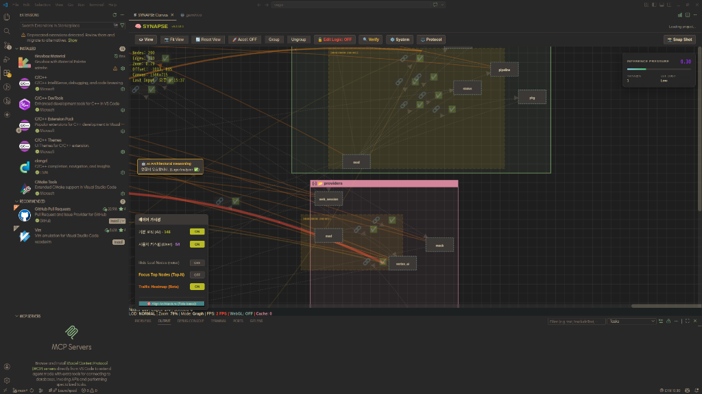
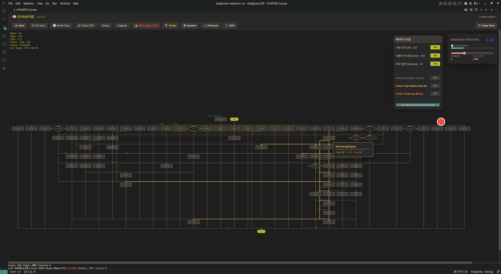

#  SYNAPSE

> **Visual Architecture Engine for LLM Systems**

**Don't read the code. See the architecture.**

[](https://github.com/dogsinatas29/SYNAPSE)
[](https://github.com/dogsinatas29/SYNAPSE/releases)


[🇰🇷 한국어 버전](./README.ko.md)


---

## 💡 What is SYNAPSE?

SYNAPSE is a high-performance engine that visualizes the internal structure of LLM-based systems into a real-time graph.

- **Trace Execution Flow**: Visualize logic paths instantly.
- **Analyze Dependency Graphs**: Map complex module relationships.
- **Detect Architecture Drift**: Identify deviations between code and design.

## ⚠️ Problem

LLM-based systems face these critical structural challenges:
- **Invisible Flow**: Internal logic paths are hidden behind abstractions.
- **Dependency Explosion**: Relationships become complex and unmanageable.
- **Impossible Debugging**: Debugging the overall structure is fundamentally difficult.

## ✅ Solution

SYNAPSE transforms "reading code" into "seeing architecture" by projecting execution flows and structures into an interactive graph.

## 📸 Demo


*Zoom, Layer Visibility, and Traffic Heatmap demonstration.*


*Deep Zoom detail showing icons, badges, and tooltips.*


SYNAPSE uses a rich visual vocabulary to communicate the nature and health of your architecture.

### 1. 📄 Entity Types (Identity Icons)
Defines the physical nature or architectural role of the node.

| Icon | Type | Meaning | Visual Style |
| :--- | :--- | :--- | :--- |
| 📄 | Active Source | A physical source file (Logic, Config, etc.). | Solid border, base color |
| ⚡ | Atomic Logic | Core logic or Entry Point (contains Atomic signature). | Purple glow (DTR) |
| 📁 | Folder | A directory structure cluster. | Folder cluster container |
| ☁️ | External API | External library (os, fs) or API call dependency. | Cloud-like UI |
| 📚 | Doc Shelf | Milestone, release note, architecture document. | Hidden by default on canvas |
| 🧪 | Test Case | Unit tests and validation scripts (.test.ts). | Orange border |
| 🧩 | Component | Modular UI or logical component unit. | Blue-green border |
| ⚙️ | Processor | Data transformation or computational engine. | Purple-grey border |
| 🤝 | Service | Shared logic or infrastructure service layer. | Blue border |
| ⛩️ | Gate | Security, authentication, or traffic controller. | Thick yellow border |
| 📋 | Data Record | DB schema, JSON model, or pure data definition. | Thick border, dark background |
| 👻 | Ghost Source | Referenced internal source missing physical file. | Dashed border |

### 2. 🎨 Node Status & Glow
Defines the current reasoning state and visual prominence of the node.

| Status | Visual Hint | Color | Meaning |
| :--- | :--- | :--- | :--- |
| **Active** | solid border | `#83a598` | Verified and currently active in the codebase. |
| **High DTR** | purple glow | `#8a2be2` | High reasoning density; critical logic point. |
| **Ghost** | dashed border | `#928374` | Proposed architectural node (not yet materialized). |
| **Deleted** | grayed out | `#282828` | Safely commented out/decommissioned node. |
| **Warning** | red pulse | `#fb4934` | Logic error, circular dependency, or dead-end detected. |
| **Necrosis** | 💀 | `#1d2021` | Fatal logic failure; broken build or severe physical defect. |
| **Tombstone** | 🪦 | `#1d2021` | Irrecoverable deterministic failure; recommended for deletion. |

### 3. ➡️ Logic & Flow Markers
Markers that occur on nodes or edges depending on the Zoom level (LOD).

| Icon | Type | Meaning |
| :--- | :--- | :--- |
| ↻ | Loop | Iterative logic (for, while, map). |
| ◈ | Decision | Branching logic (if, switch, validation). |
| 🖨️ | Output | Terminal logging, printing, or side-effect output. |
| 📡 | Signal | Network request or remote procedure call (RPC). |
| 📊 | Payload | High-bandwidth data movement or stream. |
| 🕒 | Async | Asynchronous processing or wait states. |

### 4. ⚠️ Hazard & Purification Markers
Visual indicators of system purity and architectural health.

| Icon | Type | Meaning | Visual Style |
| :--- | :--- | :--- | :--- |
| 💀 | Necrosis | Architectural failure (circular dependency, etc.). | Dark background + noise |
| 🪦 | Tombstone | Persistent deterministic violation record. | Tombstone marker |
| 💣 | Mine | High-hazard point (breaking changes detected). | Red-out warning |
| ⚠️ | Logic Fault | Specific code-level error or sync failure. | Red pulse / Warning icon |
| 🔴 | Dirty Dot | Local changes that require synchronization/push. | Top-right red dot |

### 5. ✅ Interaction & Approval Badges
Intelligent badges representing synchronization and user command status.

| Badge | Status | Meaning |
| :--- | :--- | :--- |
| ✅ | Confirmed | Manually approved by the Commander. |
| 🤖 | AI Validated | Automatically verified against the codebase. |
| ❓ | Pending | Proposed design awaiting verification (Draft). |
| ❌ | Purge | Marked for physical removal or deletion. |
| 🔒 | Locked | Immutable state; protected from modification. |

### 🔗 Edge & Line Conventions
SYNAPSE uses distinct colors and styles to represent different types of logical connections and data flows between nodes.

| Edge Type | Color | Style & Thickness | Meaning |
| :--- | :--- | :--- | :--- |
| **Dependency** | `#ebdbb2` | solid 2px | Standard module dependency or import. |
| **Data Flow** | `#83a598` | solid 3px | Heavy data transfer or payload movement. |
| **Event** | `#fe8019` | solid 2px | Event triggers or asynchronous callbacks. |
| **Conditional** | `#d3869b` | solid 1px | Conditional branches like if/else or match. |
| **Origin** | `#d65d0e` | solid 1.5px | Prompt origin links for AI logic tracking. |
| **API Call** | `#8ec07c` | dashed 2px | External API or cross-service network calls. |
| **DB Query** | `#d3869b` | solid 3px | Database queries, mutations, or transactions. |
| **Loop / Back** | `#fe8019` | dotted 2px | Loop-backs (while/for) or reverse logic flow. |
| **Highlighted** | `#fabd2f` | pulse 5px | Active execution path (Hovered/Selected). |

## 🚀 Quick Start

Launch your visual architecture journey in seconds.

### 1. Install Extension
Download the latest `.vsix` from [Releases](https://github.com/dogsinatas29/SYNAPSE/releases) and run:
```bash
code --install-extension synapse-visual-architecture-v0.3.28.vsix
```

### 2. Launch Canvas
Click the **🧠 Canvas icon** in the editor title bar or Sidebar.

### 3. Instant Analysis
Select **"Lite Bootstrap"** to automatically discover your project architecture.

---

## ✨ Key Features

- **🧠 Real-time Graph Visualization**: Live network mapping of your project.
- **🚫 Hybrid Blacklist System**: Intelligent exclusion of noise (node_modules, dist) with O(1) path matching.
- **🖱️ Explorer Context Integration**: Right-click any file/folder to instantly add to blacklist and refresh the graph.
  
- **🔍 N-hop Focus View**: Automated identification of critical core nodes.
- **⚠️ Diagnostic Intelligence**: Real-time architectural analysis (R1-R5).
- **🧩 AI Scan Integration**: Unified scanning engine for Python, Rust, C++, and TS.
- **Semantic Zoom (LOD)**: Navigate thousands of nodes with performance optimization.

---

## 🔍 Semantic Analysis & Layer Visibility

SYNAPSE provides powerful semantic filters to analyze massive graphs by controlling layer visibility and isolating critical logic paths.

| 1. Default View | 2. Hide Lead (Noise Reduction) |
| :---: | :---: |
|  |  |
| **3. Focus Top Nodes (N-hop)** | **4. Traffic Heatmap (Beta)** |
|  |  |


### Example

**Full Graph:**
```text
A ─ B ─ C ─ D ─ E  
│   │  
F   G ─ H ─ I  
```

---

**Focus View (N = 1, Center = C):**
```text
B ─ C ─ D  
    │  
    G  
```

---

**Focus View (N = 2, Center = C):**
```text
A ─ B ─ C ─ D ─ E  
│       │  
F       G ─ H  
```

### Why it matters
- **Instant Scope Reduction**: Narrow down debugging range in massive graphs.
- **Path Tracing**: Rapidly trace specific execution flows.
- **Local Anomaly Detection**: Identify structural defects within a localized area.

### 🔀 Auto-Generated Flow View
SYNAPSE automatically generates a logical flowchart based on the underlying architecture.

**Generation Conditions:**
- The graph must contain valid logical or data flow edges (e.g., `Flow`, `Calls`, `Depends`).
- Nodes must be properly connected; standalone, scattered nodes without connections will not form a meaningful flowchart.
- Accessible via the `View -> Flow View` menu in the top navigation bar.



---

## 🌾 Harvest

Harvest is a snapshot-based collection system where the Architect (Server) safely collects the work results of collaboration participants.

<video src="assets/harvest.mp4" controls="controls" width="100%"></video>

Harvest does not aim for general bi-directional synchronization. The traditional Client ↔ Server ↔ Client architecture can cause ownership conflicts and state inconsistencies, leading to undefined behaviors.

To prevent this, Harvest adopts an **Architect-centric uni-directional collection model**.

```text
Client → Snapshot → Server → Archive
```

The goal of Harvest is not code integration, but **safe collection and preservation**.

### How It Works

#### Visibility-Based Harvest

Harvest does not collect the entire project indiscriminately.

The Architect selectively collects only from client layers with active visibility on the canvas, and can manually select files to copy via the UI.

This minimizes unnecessary data influx and repository pollution.

#### Client Isolation

Collected files are not merged into a single shared folder.

Each client is assigned an independent User Root, and their harvest results are kept in isolated user-specific Harvest spaces.

```text
.synapse/
└─ clients/
   ├─ userA/
   │  └─ harvest/
   └─ userB/
      └─ harvest/
```

This structure guarantees:

* Traceable ownership
* Safe diffing
* Independent deletion
* Prevention of overwrite collisions

#### Harvest Lock

While Harvest is in progress, a LOCK state is applied to the target clients.

A warning overlay appears on the clients' screens indicating that Harvest is underway, minimizing potential state changes during the collection.

Harvest Lock is a safeguard to support data integrity, aiming to maintain a deterministic state during the collection process.

### Directory Layout

```text
.synapse/
└─ clients/
   ├─ {username}/
   │  ├─ harvest/
   │  ├─ metadata.json
   │  ├─ snapshots/
   │  └─ cache/
   └─ ...
```

#### harvest/

Stores the actually collected source code while maintaining its original structure.

#### metadata.json

Stores session information, client identifiers, and collaboration metadata.

#### snapshots/

A history and backup layer intended for future versions.

#### cache/

Buffer space for remote file viewing and temporary data processing.

### Safety Guarantees

#### File Collision Protection

Even if files share the same name, they will not conflict or overwrite each other because each user's storage space is isolated.

#### Path Traversal Protection

Attempts to escape paths, such as parent directory access (`../`), are blocked on the server side.

#### Type-Safe Result Processing

Harvest result data is processed through explicit type structures, preventing data loss caused by runtime key mismatches.

### Harvest Is Not Sync

Harvest is a feature for collecting and preserving data.

It does not perform auto-merging, auto-overwriting, or conflict resolution.

Code integration is executed manually through the Architect's review and judgment; automated synchronization is beyond the scope of Harvest.

---

## 🏗️ Architecture

SYNAPSE consists of the following layers:
- **Scanner**: Deep semantic multi-lang analyzer.
- **Graph Engine**: Deterministic, immutable state machine.
- **Visualization Layer**: Hybrid 2D Canvas & 3D WebGL accelerated rendering.
- **AI Merge Logic**: Intelligent resolution of ghost references and active files.

---

## 🧠 Philosophy

**"What you see is the logic of LLM"**

SYNAPSE was created to overcome the limitations of code-centric development. It bridges the gap between Large Language Model (LLM) reasoning and physical code architecture, transforming abstract logic into an interactive, high-performance node-edge network.

---

## 🆕 Revision History (v0.3.x)

| Version | Date | Description |
| :--- | :--- | :--- |
| **v0.3.30.1** | 2026-06-22 | **UI/UX Refinement & Feature Cleanup**: Implemented Tooltip Merge Logic to resolve Z-Index bleeding when hovering overlapping nodes and edges. Disabled problematic Tree View mode to align with graph-centric architecture. |
| **v0.3.30** | 2026-06-22 | **Harvest-Based Collaboration Model**: Major architecture upgrade introducing session management, secure SSH transport, and remote projection layers. Full integration of Harvest Engine and Identity permissions. |
| **v0.3.29** | 2026-06-06 | **Cluster Overlap Resolution & External Layer Fix**: Implemented Initial Spread (circular layout via FNV-1a hash) + Cluster Push-Apart engine (Mass-weighted AABB push-apart) to resolve cluster/node overlapping. Fixed External Ghosts cluster box not showing when External layer is ON. Reduced Align Architecture cluster expansion by 50% (roleOffsets halved). |
| **v0.3.27** | 2026-05-28 | **Data Sync Resilience & Layer Sovereignty**: Resolved critical data synchronization bugs causing phantom edge disappearances (`Edges: 0`). Ensured UI layer separation logic properly isolates scanned folders and custom groupings without structural damage. |
| **v0.3.26** | 2026-05-26 | **2D Edge Validation Patch**: Fixed a bug where solid edges would silently fail to render in 2D mode due to invalid dash array fallback `[0, 0]` not supported by HTML5 Canvas API context. |
| **v0.3.25** | 2026-05-25 | **Cluster-Aware Local Alignment**: Refactored the layout alignment physics so that nodes align cleanly relative to their specific cluster's gravity center, preventing global coordinate collapses when arranging architecture. |
| **v0.3.24** | 2026-05-24 | **RULES.md Embedding & Bootstrap Hardening**: Embedded standard DTR (Dynamic Thought Routing) & Forced File Projection Rules deeply into the Bootstrap Engine, establishing security and design constraints by default upon initialization. |
| **v0.3.23** | 2026-05-02 | **Hybrid Blacklist & Intelligent Onboarding**: Implemented O(1) path-matching blacklist system. Added Explorer context menu for instant exclusion. Fixed webview layout collapse issues. |
| **v0.3.22.11** | 2026-04-22 | **Interaction Stability & Coordinate Sovereignty**: Resolved node dragging jitter via Timestamp Guards and Position Persistence. Unified absolute coordinate system across SSoT layers. |22.11** | 2026-04-22 | **Interaction Stability & Coordinate Sovereignty**: Resolved node dragging jitter via Timestamp Guards and Position Persistence. Unified absolute coordinate system across SSoT layers. |
| **v0.3.22.10** | 2026-04-20 | **Rendering Parity & Identity Binding (SSoT)**: Full 2D/3D visual synchronization, and SSoT-based tooltip identity binding for 100% data consistency. |
| **v0.3.21** | 2026-04-18 | **Visual Consistency & Edge Bundling**: Full convention synchronization, Bezier flow consolidation, and Amnesia Guard for snapshot integrity. |
| **v0.3.20** | 2026-04-17 | **Rust Persistence & Engine Hardening**: Path-based IDs for Rust support, Velocity clamping for physics stability. |
| **v0.3.18** | 2026-04-17 | **Diagnostic Hint Engine**: Real-time architectural analysis (R1-R5), Zero-Unknown semantic labeling. |

[View Full History](REVISION_HISTORY.md)

---

## 📅 Status & Roadmap

- **Status**: v0.3.29 – Cluster Overlap Resolution & External Layer Fix.
- **Next**:
    - Server / Client separation for remote analysis.
    - Advanced Performance optimization for 50k+ nodes.
    - Real-time collaborative architecture design.

---

## 📜 License & Author
Licensed under the [GNU General Public License v3.0](LICENSE).  
Created with 🧠 by [dogsinatas29](https://github.com/dogsinatas29)
