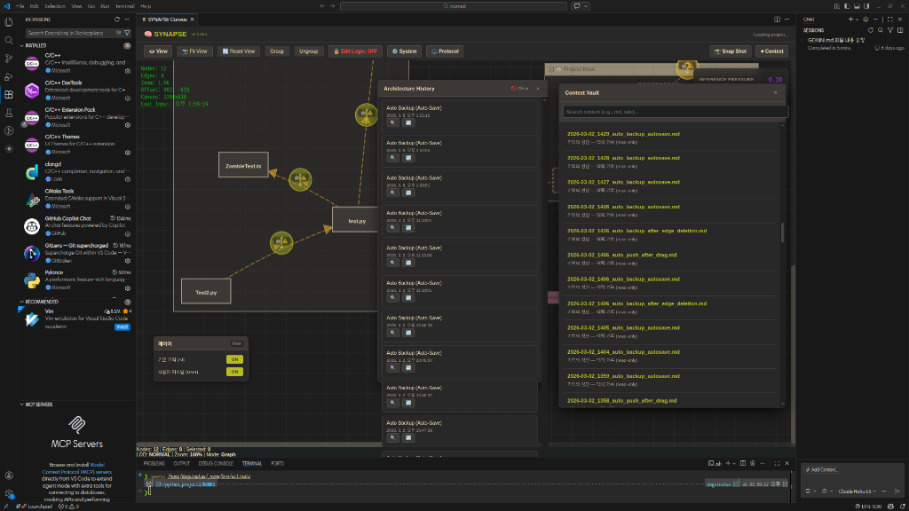
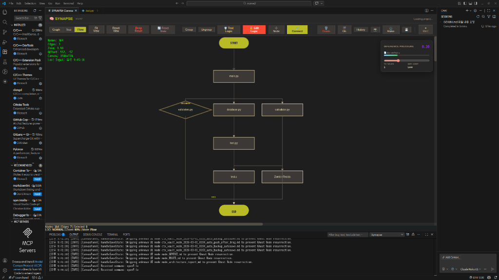

#  🧠 SYNAPSE: Visual Architecture Engine (v0.2.18.1)

> **"What you see is the logic of LLM"** — *WYSIWYG Logic for AI*

[

[](https://www.typescriptlang.org/)
[](https://code.visualstudio.com/)

[🇰🇷 Korean Version](README.ko.md) | [🇺🇸 English Version](README.md)

---

**SYNAPSE** is a next-generation visual control tower for **Google Antigravity** and **VS Code**. It bridges the gap between Large Language Model (LLM) reasoning and physical code architecture, transforming abstract logic into an interactive, high-performance node-edge network.

## 🌟 Multi-Language Intelligence (New in v0.2.11)

SYNAPSE now features a unified scanning engine that understands the deep semantics of your project, regardless of the language.

| Language | Advanced Resolution | Logic Flow Analysis | Best For |
| :--- | :---: | :---: | :--- |
| 🐍 **Python** | Deep Imports | Full Support | Web, Data Science, AI |
| 🦀 **Rust** | Crate/Super/Self | `match` & Error Handling | Systems, High Performance |
| 🇨 **C / C++** | Local vs System Headers | Control Structures | Legacy, Performance, Embedded |
| 📜 **JS / TS** | Async/Types | Full Support | Web, Extensions, Tooling |

---

## 🚀 Key Capabilities

### 🌐 Topology View (Architecture Map)
Visualize your project's folder structure and file dependencies as a live network.
- **Node Diet**: Automatically filters noise (venv, node_modules, build artifacts).
- **Ghost Node Storage**: Keeps your workspace clean by isolating disconnected components. ([View Ghost Node Guide](GHOST_NODE.md))
- **Rule Engine**: Guided by `RULES.md` for consistent discovery and icon standards.

### ➡️ Flow View (Logic Execution)
Project complex execution flows into intuitive flowcharts.
- **Intelligent Branching**: High-fidelity detection of `if/else`, `loops`, and `try/catch`.
- **Match Support (Rust)**: Native visualization of Rust's powerful pattern matching.
- **Authoritative Result**: Integrates manual design decisions with real source code logic.

### 🧠 Intelligent Context Vault
- **Zero-Click Context Capture (`Ctrl+Alt+M`)**: Start recording (`REC`), and SYNAPSE will automatically locate and extract your latest VS Code AI Chat session (e.g. GitHub Copilot) in the background without any popups. When you're done coding, press it again, and your LLM prompt, response, and live Git diffs are saved into a perfectly documented Markdown artifact.
- **Semantic Zoom (LOD)**: Navigate thousands of nodes with smooth, performance-optimized rendering.
- **Persistence**: Save your entire visual state to Git-friendly `project_state.json`.

---

## 🧠 DTR (Density of Thought Reasoning) Engine
SYNAPSE v0.2.18 introduces the **DTR Engine**, a quantitative measure of AI reasoning depth and architectural density. It transforms fuzzy AI confidence into measurable engineering metrics.

### 🌓 The DTR Metric Spectrum
- **DTR (Density of Thought)**: (0.0 ~ 1.0) Represents how much reasoning effort was concentrated in a specific node. High DTR nodes glow with a purple aura, indicating critical decision points.
- **$\rho$ (Density Rho)**: The information compression ratio. Measures how much raw code/logic is encapsulated within a single visual abstraction.
- **Think-at-N (Simulation Paths)**: The number of alternative architectural paths simulated by the LLM before materializing the current node.
- **Panic Isolation**: A safety protocol that ensures logic failures in one language cluster (e.g., C++ crash) are contained and reported via structured error codes rather than crashing the visual engine.

### 🚀 Deterministic Thinking Foundation
DTR is not just a visual effect; it is the foundation for **Deterministic Thinking**. By quantifying reasoning density, SYNAPSE identifies "weak links" in the architecture where AI confidence is low, prompting the user for manual validation (the `?` badge flow).

---

## 🏗️ Node Conventions
SYNAPSE uses specific icons and colors to represent different types of components and their current reasoning states.

### 📄 Entity Types
| Icon | Type | Description |
| :---: | :--- | :--- |
| 📄 | **File** | A physical source file in the workspace. |
| 📁 | **Folder** | A directory containing multiple nodes or clusters. |
| 🧩 | **Component** | A logical grouping or abstract module. |
| ⚡ | **Trigger** | An entry point or event source. |

### 🎨 Node Status & Glow
| Status | Visual Hint | Color | Meaning |
| :--- | :---: | :---: | :--- |
| **Active** |  |  | Verified and currently active in the codebase. |
| **High DTR** |  |  | High reasoning density; critical logic point. |
| **Ghost** |  |  | Proposed architectural node (not yet materialized). |
| **Deleted** |  |  | Safely commented out/decommissioned node. |
| **Warning** |  |  | Logic error, circular dependency, or dead-end detected. |

---

## 🔗 Edge & Line Conventions
SYNAPSE uses distinct colors and styles to represent different types of logical connections and data flows between nodes.

| Edge Type | Color | Style & Thickness | Meaning |
| :--- | :---: | :---: | :--- |
| **Dependency** |  |  | Standard module dependency or import. |
| **Data Flow** |  |  | Heavy data transfer or payload movement. |
| **Event** |  |  | Event triggers or asynchronous callbacks. |
| **Conditional** |  |  | Conditional branches like if/else or match. |
| **Origin** |  |  | Prompt origin links for AI logic tracking. |
| **API Call** |  |  | External API or cross-service network calls. |
| **DB Query** |  |  | Database queries, mutations, or transactions. |
| **Loop / Back**|  |  | Loop-backs (`while`/`for`) or reverse logic flow. |
| **Highlighted**|  |  | Active execution path (Hovered/Selected). |

### 🏷️ Edge Interactive Badges
Interactive badges appear on edges during **Edit Logic** mode to facilitate architectural decisions.

| Badge | Action | Meaning |
| :---: | :--- | :--- |
| ❌ | **Delete** | Clicking the red 'X' instantly removes the edge and its logical connection. |
| ❓ | **Pending** | Indicates a manually created edge that is awaiting architectural confirmation. |
| ❗️ | **Confirmed** | A confirmed edge. In supported languages, this triggers an **automatic import injection**. |

---

## 📸 visual Overview

### Project Topology
Visualizes the physical connections between LLM reasoning logic and source files.


### Logical Flow
Linear execution flow of specific events, reflecting both manual edits and code changes. Group-Aware Hierarchy and Orthogonal Edge Routing create clean, readable diagrams.


### Hierarchical Tree
A deep, organized overview of your project structure.


---

## 🛠️ Installation

1. Download the latest `.vsix` from the [Releases](https://github.com/dogsinatas29/SYNAPSE/releases) page.
2. Drag and drop the file into **VS Code**.
### Quick Installation
```bash
code --install-extension synapse-visual-architecture-0.2.18.1.vsix
```
    Current Version: **v0.2.18.1** (Iron Guard Protocol & Modular Architecture)

## 🚀 Getting Started
Launch your visual architecture journey in seconds.

1. **Install Extension**: Install the `synapse-visual-architecture-v0.2.20.vsix` (or latest) in Antigravity/VS Code.
2. **DNA Injection**: Create or drop a `GEMINI.md` (or `Project_Spec.md`) file into your workspace root.
3. **Bootstrap**: Open the **SYNAPSE Canvas** from the sidebar or command palette. The engine will automatically scan your folder structure and propose an initial architecture.
4. **Confirm & Solidify**: Review the proposed nodes in the canvas and click **[Confirm]** to generate the actual project structure and files.

---

## 🧠 Core Principles: DNA to Architecture
SYNAPSE operates on a "Physical Abstraction" model where the diagram is not just a drawing, but the source of truth.

### 1. Static Analysis (LSP-Driven)
The **`FileScanner`** engine performs real-time static analysis across multiple languages:
- **Node Generation**: Identifies `class`, `interface`, `struct`, and `function` export statements to map out the system's entities.
- **Edge Generation**: Analyzes `import`, `require`, `include`, and `use` statements to detect dependencies and logical flow.
- **Auto-Normalization**: Strips redundant metadata to keep `project_state.json` lean and Git-friendly.

### 2. DTR (Deep-Thinking Ratio) Engine
The **DTR Controller** manages the "cognitive density" of the architecture:
- **High DTR (Purple Glow)**: Indicates complex nodes that require more reasoning cycles or have high dependency fan-in.
- **Dynamic LOD**: Visual density changes based on zoom level—satellite view for structure, detail view for code snippets.

### 3. Logic Edit & Confirmation
- **Pending Edges (❓)**: Manually drawn edges are marked as pending until the underlying code (e.g., an `import` statement) is successfully injected and verified.
- **Ghost Nodes (📦)**: Orphaned files or unimplemented requirements are isolated in the **Storage Cluster** until linked to the main logic.

---

## 🛠️ Toolbar & Menu Structure
The SYNAPSE toolbar is organized into logical groups to streamline your architectural workflow.

### 👁️ View Menu
- **Graph View**: Parallel network map showing file dependencies and folder topology.
- **Tree View**: Traditional hierarchical overview of the project structure.
- **Flow View**: Logic-first flowchart visualizing execution paths and branching.
- **Show Vault**: Toggles the visibility of the **Context Vault** (AI recording browser).

### 🔓 Edit Logic Menu (Master Switch)
- **Toggle Edit Mode**: Enables destructive actions like node creation, edge drawing, and deletion.
- **🛡️ Test Logic**: Runs a static analysis engine to detect dead-ends, circular dependencies, and bottlenecks.
- **➕ Node**: Manually spawns a new architectural node (automatically creates a physical file).
- **🔗 Connect**: Enables edge drawing between nodes (Alt+Click shortcut available).
- **🗑️ Delete**: Safely removes nodes (comments out code) or severs logical edges.

### ⚙️ System Menu
- **Deep Reset**: Performs a complete re-scan of the project, re-initializing the entire topology.
- **🔄 Reset State**: Hard-reset of `project_state.json` to start from a clean canvas.
- **🎬 Animation**: Toggles real-time edge flow animations for logic path visualization.

### ⚖️ Protocol Menu
- **Rules.md**: Direct access to the project's governing architectural rules.
- **Architecture.md**: Opens the central **Master Hub** for high-level design.
- **Modular Specs**: Access to specialized sub-specifications (`core`, `agent`, `reporting`).

### 📸 Snap Shot Menu
- **Save Now**: Captures the exact coordinate, zoom level, and color state of the current canvas.
- **History View**: Opens the **Architecture Timeline** for rolling back to previous design states.

### ⏺ Context Menu
- **REC Toggle**: Activates zero-click AI context recording (`Ctrl+Alt+M`).
- **Vault History**: Browse and review previously saved LLM interaction artifacts.

---

## 📖 Usage Guide (v0.2.17 Key Features)

### 1. 🔄 Reset State (Full Factory Reset)
If your canvas becomes corrupted or you want to start a completely new architecture from scratch, use the **`Reset State`** button in the top toolbar.
- **Disk Purge**: Instantly wipes all nodes, edges, and clusters from `project_state.json`.
- **Memory Flush & Visual Reset**: Clears the currently active canvas and internal engine memory.
- **Re-Bootstrap**: Prompts you to reload `GEMINI.md` to begin generating a fresh architecture.

### 2. ✏️ Edit Logic Mode (WSIWYG File Management)
The `Edit Logic` button in the toolbar empowers you to shape your workspace directly from the canvas. 
- **Creating Files**: Toggle `Edit Logic` ON, double-click anywhere on the empty canvas to spawn a new node, give it a module name, and SYNAPSE will **physically create an empty file** in your workspace.
- **Safe Deletion**: Deleting a node in `Edit Logic` mode intercepts the file system. Instead of destructive deletion, SYNAPSE wraps the physical source code entirely in `// [SYNAPSE_DELETED]` comments, ensuring no code is ever permanently lost.
- **Resurrection**: If you delete a node by mistake, the automatic Snapshot & Rollback system allows you to revert to the previous state and revive the file.

### 3. 🔗 Edge Management & Auto-Imports
SYNAPSE v0.2.17 bridges the gap between drawing pictures and writing code.
- **Inline Trash (`X`)**: Hover over any edge to reveal a red `X` badge at its center. Click it to instantly sever the logical and visual connection.
- **Confirmation Flow (`?` → `!`)**: When you manually connect two nodes in `Edit Logic` mode, the edge appears with a yellow **`?`** badge indicating a `pending_confirm` state.
- **Auto-Injected Imports**: Click the **`?`** badge to confirm the architectural decision. SYNAPSE will analyze the target node, detect the file language (`.py`, `.ts`, `.js`), and **automatically inject the correct `import` or `require()` statement at the very top of the source file.** The badge then turns perfectly green (**`!`**).

---

## 🆕 Revision History

### v0.2.18.1 (Iron Guard Protocol & Modular Architecture)
- **Modular Documentation Hub**: Split the massive `architecture.md` into 4 specialized specs (`core_synapse`, `vega_agent`, `reporting`, `data_scheme`) with a Master Hub orchestration.
- **Lightweight Schema Guard (LOD)**: Implemented a Level of Detail validation engine for `project_state.json`. Essential fields (ID, Type, Status) are now strictly verified during save/load.
- **Panic Isolation Foundation**: Established cross-language exception handling standards to prevent error contagion.
- **Ghost Node Workflow**: Formalized the transistion model: `Ghost` (Proposal) -> `Materialize` (Approval) -> `Reserved` (Staging) -> `Active` (Code).
- **Hierarchical UI Optimization**: Restructured the toolbar into logical menu groups (`View`, `System`, `Protocol`, `Snap Shot`) for a cleaner workspace.
- **Context Vault Isolation**: Physically decoupled bulky context nodes into an external panel, accessible via a dedicated link button.
- **Ghost Node Resurrection Blocked**: Implemented an explicit validation check during the `saveState` sequence (`CanvasPanel.ts`). Nodes deleted in the UI can no longer be resurrected by stale cache.
- **Edge Badge Hitbox Expansion**: The clickable radius for Edge confirmation (`?`) and Edge deletion (`trash`) badges has been dramatically enlarged for better accessibility.
- **Buffer ➔ Reserved Automation Leap**: Dropped dragging nodes falling out of Buffer Cluster. Added physical coordinate jump to `[-1500, 1000]` when a node is officially assigned to the Reserved Cluster.
- **Strict Edge Import Semantics (A ➔ B)**: Formalized the rule that connecting Node A to Node B explicitly means Node A imports Node B, alongside status bar notifications.

### v0.2.17 (DTR & WYSIWYG Logic Editing)
- **DTR Visualization**: AI reasoning density glows purple, with Inference Pressure control straight from the VS Code status bar.
- **Buffer Cluster Automation**: Manually created nodes auto-spawn into the strictly managed `Buffer Cluster` with camera auto-focus.
- **Logic Edit Toggle**: Destructive generation tools (`Node`, `Connect`) are completely hidden until the `Edit Logic` master switch is engaged.
- **Safe Node Deletion**: Physical files are commented out instead of hard-deleted to prevent data loss.
- **Auto-Snapshot on State Change**: Any canvas action (node/edge deletion or position change) automatically captures the latest state into the snapshot history.
- **Edge Auto-Imports**: Confirming an edge visually injects the actual `import` statement into the source file. Wait/confirm badges (`?`, `!`) are massively enlarged for clarity.
- **Reset State Protocol**: 4-step full reset system (Disk, Memory, Canvas, Prompt).
- **Data Hygiene**: Eliminated JSON buffer encoding corruption and RangeErrors.

### v0.2.16 (Strategic Execution Flow Update)
- **Ready Handshake**: Extension now waits for WebView readiness, preventing initialization race conditions.
- **Stable Layout BFS**: Replaced potentially infinite BFS loops with a stable topological rank calculation.
- **NaN/Infinity Guards**: Strict coordinate validation to prevent UI engine freezes on complex graphs.
- **Throttled Communication**: Reduced progress update frequency and batched messages for smoother UI performance.
- **Recursion Safety**: Added depth limits to rank calculation to handle extremely complex or circular dependencies.

### v0.2.15 (Performance & Visibility Release)

### v0.2.14fix (The Clarity Update)
- **Group-Aware Hierarchy**: Nodes in the Flow View now persist their grouped `cluster_id` from the Graph view, preserving modular context with visual dashed boxes (`[ MODULES ]`).
- **Orthogonal Edge Routing**: Eradicated diagonal spaghetti edges. Edges now use 90-degree Manhattan routing with smart bypass logic to avoid piercing unrelated nodes.
- **Virtual End-Point Bus**: Added a `Merge / Sync` virtual node before `END` to multiplex and cleanly route parallel pathways down a logical bus line.
- **Decision Node Resizing**: Scaled down the horizontal bloat of decision diamonds to preserve grid layout integrity.

### v0.2.14
- **💎 Flowchart Geometric Shapes**: The Graph View now renders nodes in standard flowchart shapes based on their semantic logic (Diamonds for `if/valid_`, Hexagons for `for/loop`, Parallelograms for `print`).
- **🛡️ War Room Implementation**: Transform SYNAPSE into a technical audit center.
- **Logic Analyzer**: Detect Circular Dependencies, Bottlenecks, and Dead-ends.
- **Pulse Animation**: Real-time signal traversal to visualize logic flow reachability.
- **Interactive Reports**: Clicking findings in `리포트.md` automatically focuses the node on the canvas.

### v0.2.13
- **🌟 Cluster UX Overhaul**: Radically improved Canvas interaction.
- **Drag & Drop**: Entire clusters can now be seamlessly dragged by pulling their top header block.
- **Body Selection**: Added the ability to draw Multi-Select boxes over cluster bodies without dragging the cluster itself.
- **Gruvbox Colors**: All clusters are now automatically rendered with consistent, distinct hash-based colors for instant visual recognition.

### v0.2.12
- **🧠 Intelligent Context Vault**: Seamless, popup-free extraction of your hidden VS Code Copilot Chat sessions directly into your project's `context.md`.
- **Zero-Click Work Mapping**: Press `Ctrl+Alt+M` to auto-capture your AI conversation and Git diffs without breaking your flow.

### v0.2.11
- **✨ Multi-Language Intelligence**: Sophisticated scanning for Python, C/C++, and Rust.
- **Advanced Resolution**: Deep internal pathway tracking for all major languages.
- **Unified Flow**: C/C++ and Rust now support full Flow View visualization.

### v0.2.10
- **🐛 Critical Fixes**: Resolved activation errors and improved multi-node deletion stability.

---

## 📜 License & Author
Licensed under the [GNU General Public License v3.0](LICENSE).  
Created with 🧠 by [dogsinatas29](https://github.com/dogsinatas29)
