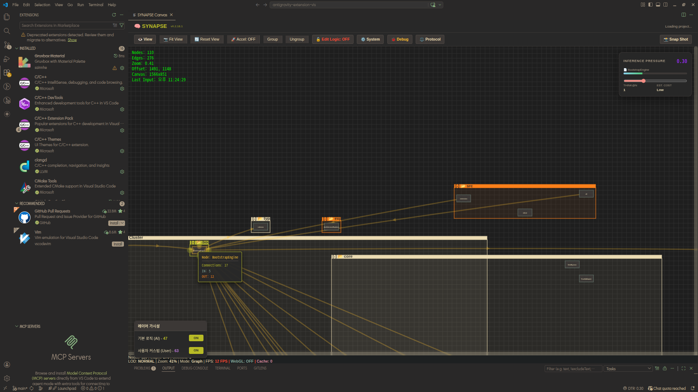
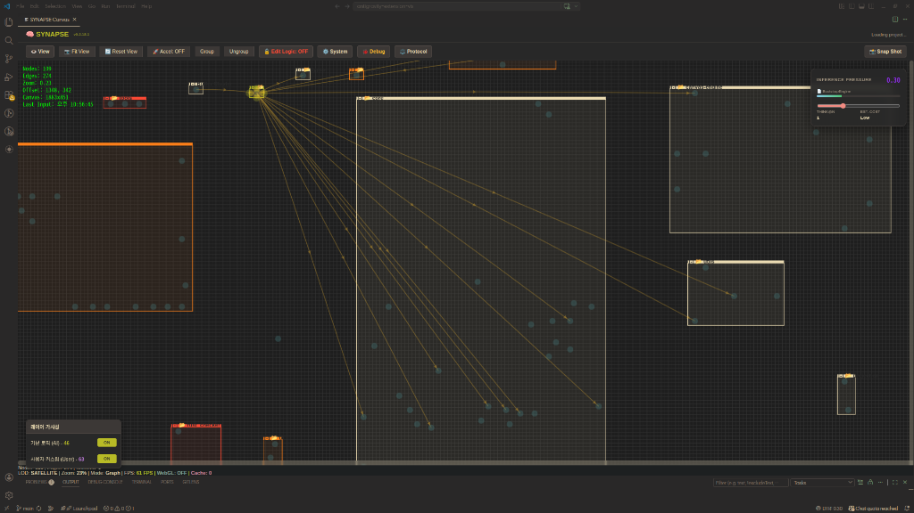

#  🧠 SYNAPSE: Visual Architecture Engine (v0.3.18)

> **"What you see is the logic of LLM"** — *WYSIWYG Logic for AI*

[
[

[](https://www.typescriptlang.org/)
[](https://code.visualstudio.com/)

[🇰🇷 Korean Version](README.ko.md) | [🇺🇸 English Version](README.md)

---

## 🔥 Latest Release: v0.3.18 - Triple Expression & Node Taxonomy (2026-04-17)

| Feature | Description | Benefit |
|-------|---------|-----|
| **Triple Expression** | **Color · Layer · Priority** System | Instant role recognition via colors, noise reduction via leaf filtering, and priority stars for refactoring focus. |
| **Node Role Taxonomy** | Architectural Identity Classification | Identifies **Orchestrator, Controller, Hub, Leaf** with strict Single-Role principle. |
| **Identity-Aware Tooltip** | Detailed Connection Breakdown | Displays star ratings (`★★★☆`) and specific file/library names to provide evidence-based insights. |
| **Zero-Unknown Principle** | Semantic Node Labeling | Eliminates `unknown` labels by classifying unmapped nodes as `External`, `Ghost`, or `Unmapped`. |

---

## 🔍 Node Role Taxonomy

SYNAPSE v0.3.18 classifies every node into a specific architectural role based on its connectivity profile:

| Role | Action Color | Meaning | Identification Criteria | Refactoring Priority |
|:---:|:---:|:---|:---|:---:|
| **Orchestrator** | 🟠 Orange | Central Control Node | OutRatio ≥ 80% & Conn ≥ 10 | High |
| **Controller** | 🟢 Green | Inbound Gateway / Facade | InRatio ≥ 80% & Conn ≥ 10 | Medium |
| **Hub** | 🔵 Blue | High Connectivity Center | Total Connections ≥ 20 | Very High |
| **Leaf Node** | ⚪ Gray | Utility / Terminal Function | Total Connections ≤ 2 | Low |

### 🛠️ Triple Expression System
- **Color (Perception)**: Instant Role recognition via border/glow colors.
- **Layer (Focus)**: `Hide Leaf Nodes` toggle to eliminate structural noise.
- **Priority (Judgment)**: Star rating (`★`) system indicating refactoring urgency.

---

## 🔍 Architecture Diagnostics (R1-R5 Refined)

## 🔥 v0.3.16 - Minimalist Logic View (2026-04-14)

| Feature | Description | Benefit |
|-------|---------|-----|
| **Edge Filtering** | Toggle Edge/Badge Visibility | Reduces visual clutter by hiding edges and badges while keeping logical connectivity. |
| **Path Highlighting** | Transparent Edge Persistence | When edges are hidden, selecting/hovering a node reveals its connections with 0.3 alpha. |
| **O(1) Rendering Skip** | Performance-Optimized Loop | Optimized WebGL / 2D Canvas loops skip hidden edges without array re-allocations. |
| **Badge Unification** | Unified Edge Type & Status Badge | Consolidates multiple redundant icons into a single, high-density info capsule (`🔗 ✅`). |

---

## 🔥 v0.3.15 - Shelf fzf & Grid Sovereignty (2026-04-13)

---

## 🔥 v0.3.14 - Emergency Rendering & Sync Patch (2026-04-13)

| Feature | Description | Benefit |
|-------|---------|-----|
| **Ghost Purification** | Documentation routing to `doc_shelf` | Cleans up and purifies "External Ghosts" by isolating non-code artifacts. |
| **Visual Guide** | 9-category Marker Standardization | Immediate visual identification of node types (Active, Doc, External, etc.). |
| **Intelligent Sync** | Extension-aware Node Resolution | Automatically links ghost references (e.g., `canvas-engine`) to active files (`.js`). |
| **UI Recovery** | Fixed `cpX` SyntaxError in `renderEdge` | Restores the main rendering loop; eliminates "Blank Canvas" issues. |
| **Purification** | Removed Deprecated Context Vault | Hardens data hygiene by removing `.synapse_contexts` and associated logging bloat. |
| **Sync Hardening** | Immutable State Updates for Clusters | Prevents `TypeError` when modifying frozen system objects. |

---

## 🔥 v0.3.13 - Kinetic Stability (2026-04-12)

**v0.3.13** focuses on anti-pollution logic and dynamic layout behavior.

| Feature | Description | Benefit |
|-------|---------|-----|
| **Auto-Purge Pipeline** | Hardened `node_modules` Exclusion | Automatically cleans up node explosions (4,500+ nodes) caused by improper scanning. |
| **Grid Overlap Resolver**| O(N) Anti-Overlap Logic | Dynamically nudges nodes apart in dense clusters (126+ nodes) to maintain visibility. |
| **Legacy Badges** | Restored 'B' & 'D' Signature Markers | Restores classic architectural clarity with "Broken" and "Dependency" edge markers. |
| **TDZ Protection** | Reference Order Optimization | Eliminates Temporal Dead Zone errors during high-frequency edge rendering. |

---

## 🔥 v0.3.12 - Zen Sovereignty & Signature Authority (Older)

---

## 🔥 v0.3.11 - Core Freeze & Transactional Pipeline (Older)

**v0.3.11** introduced the **Core Freeze Architecture**, transforming SYNAPSE into a deterministic, immutable state machine:

| Feature | Description | Benefit |
|-------|---------|-----|
| **Core Freeze** | Immutable `GraphSnapshot` + `DeepFreeze` | Prevents unauthorized state mutation; read-only truth layer. |
| **Commit Pipeline** | 5-Stage Verification (Validate ↔ Execute) | Zero-loss transaction with atomic rollback on FS failure. |
| **Self-Healing** | Auto-recovery of System Clusters | Ghosts, Reserved, and Docs clusters are restored on every load. |

---

## 🔥 v0.3.10 - Hard Lock Protocol & Click Resilience (Older)

**v0.3.10** bridges the gap between manual UI design and physical file atomicity:

| Feature | Description | Benefit |
|-------|---------|-----|
| **Hard Lock Protocol** | Atomic `fs.writeFile` + `fs.stat` verification | Guarantees physical file existence before UI 'Solid' state. |
| **Click Resilience** | Intelligent Label-priority Fallback (`test.py`) | Fixes click failures for manual nodes with system IDs. |

---

**SYNAPSE** is a next-generation visual control tower for **Google Antigravity** and **VS Code**. It bridges the gap between Large Language Model (LLM) reasoning and physical code architecture, transforming abstract logic into an interactive, high-performance node-edge network.

## 🌟 Multi-Language Intelligence (New in v0.2.11)

SYNAPSE now features a unified scanning engine that understands the deep semantics of your project, regardless of the language.

| Language | Advanced Resolution | Logic Flow Analysis | Best For |
| :--- | :---: | :---: | :--- |
| 🐍 **Python** | Deep Imports | Full Support | Web, Data Science, AI |
| 🦀 **Rust** | Crate/Super/Self | `match` & Error Handling | Systems, High Performance |
| 🇨 **C / C++** | Local vs System Headers | Control Structures | Legacy, Performance, Embedded |
| 📜 **JS / TS** | Async/Types | Full Support | Web, Extensions, Tooling |

---

## 🚀 Key Capabilities

### 🌐 Topology View (Architecture Map)
Visualize your project's folder structure and file dependencies as a live network.
- **Node Diet**: Automatically filters noise (venv, node_modules, build artifacts).
- **Ghost Node Storage**: Keeps your workspace clean by isolating disconnected components. ([View Ghost Node Guide](GHOST_NODE.md))
- **Rule Engine**: Guided by `RULES.md` for consistent discovery and icon standards.

### ➡️ Flow View (Logic Execution)
Project complex execution flows into intuitive flowcharts.
- **Intelligent Branching**: High-fidelity detection of `if/else`, `loops`, and `try/catch`.
- **Match Support (Rust)**: Native visualization of Rust's powerful pattern matching.
- **Authoritative Result**: Integrates manual design decisions with real source code logic.

### 🧠 Persistence & State
- **Semantic Zoom (LOD)**: Navigate thousands of nodes with smooth, performance-optimized rendering.
- **Persistence**: Save your entire visual state to Git-friendly `project_state.json`.
- **Grid Sovereignty**: All node positions are normalized to a 40px grid to maintain architectural order and reduce visual clutter.

### 🔍 Documentation Search (fzf-style)
Rapidly navigate through your project's documentation assets.
- **Instant Search**: Press `/` anywhere to open the Documentation Shelf search bar.
- **Fuzzy Matching**: Type partial names or fuzzy characters (e.g., `gs` for `GHOST_NODE.md`).
- **Teleport & Highlight**: Selecting a result (Click or `Enter`) centers the view on the node with a 2-second Gold Glow highlight.
- **File Access**: Double-click a search result to open the physical `.md` file in the VS Code editor.

---

## 🧠 DTR (Density of Thought Reasoning) Engine
SYNAPSE v0.2.18 introduces the **DTR Engine**, a quantitative measure of AI reasoning depth and architectural density. It transforms fuzzy AI confidence into measurable engineering metrics.

### 🌓 The DTR Metric Spectrum
- **DTR (Density of Thought)**: (0.0 ~ 1.0) Represents how much reasoning effort was concentrated in a specific node. High DTR nodes glow with a purple aura, indicating critical decision points.
- **$\rho$ (Density Rho)**: The information compression ratio. Measures how much raw code/logic is encapsulated within a single visual abstraction.
- **Think-at-N (Simulation Paths)**: The number of alternative architectural paths simulated by the LLM before materializing the current node.
- **Panic Isolation**: A safety protocol that ensures logic failures in one language cluster (e.g., C++ crash) are contained and reported via structured error codes rather than crashing the visual engine.

### 🚀 Deterministic Thinking Foundation
DTR is not just a visual effect; it is the foundation for **Deterministic Thinking**. By quantifying reasoning density, SYNAPSE identifies "weak links" in the architecture where AI confidence is low, prompting the user for manual validation (the `?` badge flow).

---

## 🏗️ Node Conventions
SYNAPSE uses specific icons and colors to represent different types of components and their current reasoning states.

### 1. 📄 Entity Types (Identity Icons)
Defines the physical nature or architectural role of the node.

| Icon | Type | Meaning | Visual Style |
| :---: | :--- | :--- | :--- |
| **📄** | **Active Source** | A physical source file (Logic, Config, etc.). | Solid border, base color |
| **⚡** | **Atomic Logic** | Core logic or Entry Point (contains `Atomic` signature). | Purple glow (DTR) |
| **📁** | **Folder** | A directory structure cluster. | Folder cluster container |
| **☁️** | **External API** | External library (os, fs) or API call dependency. | Cloud-like UI |
| **📚** | **Doc Shelf** | Milestone, release note, architecture document. | Hidden by default on canvas |
| **🧪** | **Test Case** | Unit tests and validation scripts (`.test.ts`). | Orange border |
| **🧩** | **Component** | Modular UI or logical component unit. | Blue-green border |
| **⚙️** | **Processor** | Data transformation or computational engine. | Purple-grey border |
| **🤝** | **Service** | Shared logic or infrastructure service layer. | Blue border |
| **⛩️** | **Gate** | Security, authentication, or traffic controller. | Thick yellow border |
| **📋** | **Data Record** | DB schema, JSON model, or pure data definition. | Thick border, dark background |
| **👻** | **Ghost Source** | Referenced internal source missing physical file. | Dashed border |

### 2. 🎨 Node Status & Glow
Defines the current reasoning state and visual prominence of the node.

| Status | Visual Hint | Color | Meaning |
| :--- | :---: | :---: | :--- |
| **Active** |  |  | Verified and currently active in the codebase. |
| **High DTR** |  |  | High reasoning density; critical logic point. |
| **Ghost** |  |  | Proposed architectural node (not yet materialized). |
| **Deleted** |  |  | Safely commented out/decommissioned node. |
| **Warning** |  |  | Logic error, circular dependency, or dead-end detected. |
| **Necrosis** | 💀 |  | Fatal logic failure; broken build or severe physical defect. |
| **Tombstone** | 🪦 |  | Irrecoverable deterministic failure; recommended for deletion. |

### 3. ➡️ Logic & Flow Markers
Markers that occur on nodes or edges depending on the Zoom level (LOD).

| Icon | Type | Meaning |
| :---: | :--- | :--- |
| **↻** | **Loop** | Iterative logic (`for`, `while`, `map`). |
| **◈** | **Decision** | Branching logic (`if`, `switch`, `validation`). |
| **🖨️** | **Output** | Terminal logging, printing, or side-effect output. |
| **📡** | **Signal** | Network request or remote procedure call (RPC). |
| **📊** | **Payload** | High-bandwidth data movement or stream. |
| **🕒** | **Async** | Asynchronous processing or wait states. |

### 4. ⚠️ Hazard & Purification Markers
Visual indicators of system purity and architectural health.

| Icon | Type | Meaning | Visual Style |
| :---: | :--- | :--- | :--- |
| **💀** | **Necrosis** | Architectural failure (circular dependency, etc.). | Dark background + noise |
| **🪦** | **Tombstone** | Persistent deterministic violation record. | Tombstone marker |
| **💣** | **Mine** | High-hazard point (breaking changes detected). | Red-out warning |
| **⚠️** | **Logic Fault**| Specific code-level error or sync failure. | Red pulse / Warning icon |
| **🔴** | **Dirty Dot** | Local changes that require synchronization/push. | Top-right red dot |

### 5. ✅ Interaction & Approval Badges
Intelligent badges representing synchronization and user command status.

| Badge | Status | Meaning |
| :---: | :--- | :--- |
| **✅** | **Confirmed** | Manually approved by the Commander. |
| **🤖** | **AI Validated**| Automatically verified against the codebase. |
| **❓** | **Pending** | Proposed design awaiting verification (Draft). |
| **❌** | **Purge** | Marked for physical removal or deletion. |
| **🔒** | **Locked** | Immutable state; protected from modification. |

---

## 🔗 Edge & Line Conventions
SYNAPSE uses distinct colors and styles to represent different types of logical connections and data flows between nodes.

| Edge Type | Color | Style & Thickness | Meaning |
| :--- | :---: | :---: | :--- |
| **Dependency** |  |  | Standard module dependency or import. |
| **Data Flow** |  |  | Heavy data transfer or payload movement. |
| **Event** |  |  | Event triggers or asynchronous callbacks. |
| **Conditional** |  |  | Conditional branches like if/else or match. |
| **Origin** |  |  | Prompt origin links for AI logic tracking. |
| **API Call** |  |  | External API or cross-service network calls. |
| **DB Query** |  |  | Database queries, mutations, or transactions. |
| **Loop / Back**|  |  | Loop-backs (`while`/`for`) or reverse logic flow. |
| **Highlighted**|  |  | Active execution path (Hovered/Selected). |

### 🧠 Integrated Intelligence Badges (v0.3.11)
SYNAPSE v0.3.11 introduces **High-Density Info-Badges** that combine logical typing and confirmation status into a single, unified capsule.

| Badge Component | Icon | Meaning |
| :--- | :---: | :--- |
| **Type Icon** | `🔗`, `📡`, `📊` | The logical nature of the connection (Integrated). |
| **Pending** | `❓` | Connection proposed by AI/Human, awaiting approval. |
| **Confirmed** | `✅` | Human-approved or established logical connection. |
| **AI Validated** | `🤖` | Connection automatically verified against source code. |
| **Delete Action** | `❌` | (Red) Immediate physical termination of the edge. |

### 🔍 Edge Icon Mapping
The following icons are used within the center badge and arrowheads to define the semantic nature of the link:

| Type | Icon | Detailed Meaning |
| :--- | :---: | :--- |
| **Dependency** | `🔗` | Module import, inheritance, or package usage. |
| **Call** | `📡` | Synchronous function/method invocation. |
| **Data Flow** | `📊` | High-bandwidth data/stream movement. |
| **Reference** | `📝` | Pointer, variable reference, or documentation link. |
| **Event** | `⚡` | Asynchronous trigger or callback signal. |
| **Conditional** | `❓` | Decision branch (`if`, `match`, `switch`). |
| **API Call** | `🌐` | Cross-service or external HTTP/RCP network call. |
| **DB Query** | `🛢️` | SQL query, NoSQL mutation, or cache access. |
| **Loop / Back** | `🔁` | Logical recursion or iteration wrap-around. |
| **Fracture** | `💥` | Circular dependency or architectural breakdown. |

---

## 📸 visual Overview

### Project Topology
Visualizes the physical connections between LLM reasoning logic and source files.


### Node Information Output (v0.3.17)
Hover over any node to see its structural metrics (Connections, IN, OUT) instantly. This allows for rapid identification of responsibility and dependency clusters.


### Minimalist Logic View (v0.3.16)
Toggle edge and badge visibility to reduce clutter while maintaining logical connectivity for selected nodes.


### Logical Flow
Linear execution flow of specific events, reflecting both manual edits and code changes. Group-Aware Hierarchy and Orthogonal Edge Routing create clean, readable diagrams.


### Hierarchical Tree
A deep, organized overview of your project structure.


---

## 🛠️ Performance & 3D Acceleration

1. Download the latest `.vsix` from the [Releases](https://github.com/dogsinatas29/SYNAPSE/releases) page.
2. Drag and drop the file into **VS Code**.

### Quick Installation
```bash
code --install-extension synapse-visual-architecture-v0.3.17.vsix
```
Current Version: **v0.3.17** (Node Summary)

---

## 💾 System Requirements

### Font Stack (Required for Icon Rendering)
**Critical**: SYNAPSE uses modern emoji icons (🔗, 🛢️, 📡, 📊, 📍, 🔁) in 3D visualization. These require proper emoji font support.

**Required Font Stack** (in order of preference):
1. Noto Color Emoji       (Google's comprehensive emoji font)
2. Apple Color Emoji       (macOS default emoji font)
3. Segoe UI Emoji          (Windows 10+ emoji font)
4. System emoji fallback

**Installation by OS**:

| OS | Installation | Command |
|----|--------------|---------| 
| **Linux (Ubuntu/Debian)** | Install Noto Color Emoji | `sudo apt-get install fonts-noto-color-emoji` |
| **macOS** | Pre-installed | Already bundled in system fonts |
| **Windows 10+** | Pre-installed | Segoe UI Emoji included by default |

---

## 🚀 Getting Started
Launch your visual architecture journey in seconds.

1. **Install Extension**: Install the `synapse-visual-architecture-v0.3.18.vsix` (or latest) in Antigravity/VS Code.
2. **DNA Injection**: Create or drop a `GEMINI.md` (or `Project_Spec.md`) file into your workspace root.
3. **Bootstrap Phase**: Open the **SYNAPSE Canvas** from the sidebar or command palette (`Ctrl+Shift+P` -> `SYNAPSE: Open Canvas`).
4. **First Visualization**: 
    - The engine will scan your folder and display **Proposed Nodes**.
    - **Click [Confirm]** in the proposal popup to materialize nodes.

---

## 🆕 Revision History

| Version | Date | Description (English) | Description (Korean) |
| :--- | :--- | :--- | :--- |
| **v0.3.18** | 2026-04-17 | **Diagnostic Hint Engine**: Real-time architectural analysis (R1-R5), Zero-Unknown semantic labeling, and detailed node identity list in tooltips. | **진단 힌트 엔진**: 실시간 아키텍처 분석(R1-R5), Zero-Unknown 시맨틱 라벨링 및 툴팁 내 상세 연결 노드 리스트 출력. |
| **v0.3.17** | 2026-04-14 | **Node Summary Feature**: Added interactive node summary tooltips showing unique connections and directional degrees. Optimized with O(E) pre-calculation. | **노드 요약 정보 출력**: 노드 호버 시 고유 연결 및 방향성 의존성을 보여주는 요약 툴팁 추가 및 O(E) 성능 최적화. |
| **v0.3.16** | 2026-04-14 | **Minimalist Logic View**: Introduced toggle controls for edge and badge visibility. Implemented transparent edge persistence for selected nodes and O(1) rendering skips. | **미니멀리스트 로직 뷰**: 엣지 및 배지 가시성 토글 기능 도입. 선택된 노드의 엣지 반투명 노출 및 O(1) 렌더링 스킵 구현. |
| **v0.3.15** | 2026-04-13 | **Shelf fzf & Grid Sovereignty**: Added fuzzy search for documentation nodes with `/` shortcut, 40px grid snapping, and centering highlight effects. | **쉘프 fzf 및 그리드 주권**: documentation 노드 대상 `/` 단축키 검색 기능, 40px 격자 스냅 및 강조 하이라이트 효과 도입. |
| **v0.3.14** | 2026-04-13 | **Purification & Emergency Restoration**: Removed deprecated Context Vault. Fixed SyntaxError in edge rendering and TypeError in frozen cluster synchronization. | **긴급 복구**: 엣지 렌더링 SyntaxError 및 Frozen 클러스터 동기화 TypeError 해결. |
| **v0.3.13** | 2026-04-12 | **Kinetic Stability**: Auto-purge pipeline for `node_modules` pollution, grid-based overlap resolution, and legacy badge restoration. | **키네틱 안정성**: `node_modules` 오염 자동 정화, 격자 기반 겹침 해결 및 레거시 배지 복구. |
| **v0.3.12** | 2026-04-12 | **Zen Sovereignty & Signature Authority**: Buffer-less deterministic engine, signature-exclusive sovereignty, documentation anchors, and authoritative movement logic. | **Zen 주권 및 시그니처 권한**: 버퍼리스 결정론적 분류 엔진, 물리 시그니처 배타적 주권, 문서 보관함 고정 및 권위적 이동 로직 도입. |
| **v0.3.11** | 2026-04-11 | **Core Freeze & Identity Stability**: Immutable snapshots, 5-stage transactions, ID-based layer authority, and edge persistence. | **코어 프리즈 및 ID 안정성**: 불변 스냅샷, 5단계 트랜잭션, ID 기반 레이어 권한 강제 및 엣지 영속성 강화. |
| **v0.3.10** | 2026-04-07 | **Hard Lock Protocol**: Atomic file creation, ID persistence fix, and label-priority click resilience. | **하드 락 프로토콜**: 원자적 파일 생성 보증, ID 정합성 수복 및 라벨 우선 클릭 상호작용 개선. |
| **v0.3.09_fix** | 2026-04-05 | **Hotfix PhaseLock**: Resolved system-wide interaction lock in RENDER/DEBUG phases. | **핫픽스 페이즈락**: RENDER/DEBUG 단계의 전역 인터렉션 락 해결 및 원자적 동기화 개선. |
| **v0.3.1** | 2026-03-31 | **Bootstrap Locked**: Full Phase-based initialization (Phases 0-7). | **부트스트랩 락**: 전 단계(Phase 0-7) 순차 초기화 강제 및 시스템 잠금 프로토콜 도입. |

---

## 📜 License & Author
Licensed under the [GNU General Public License v3.0](LICENSE).  
Created with 🧠 by [dogsinatas29](https://github.com/dogsinatas29)

---
**This project uses fzf (MIT License)**  
This software incorporates fzf, which is licensed under the MIT License.
