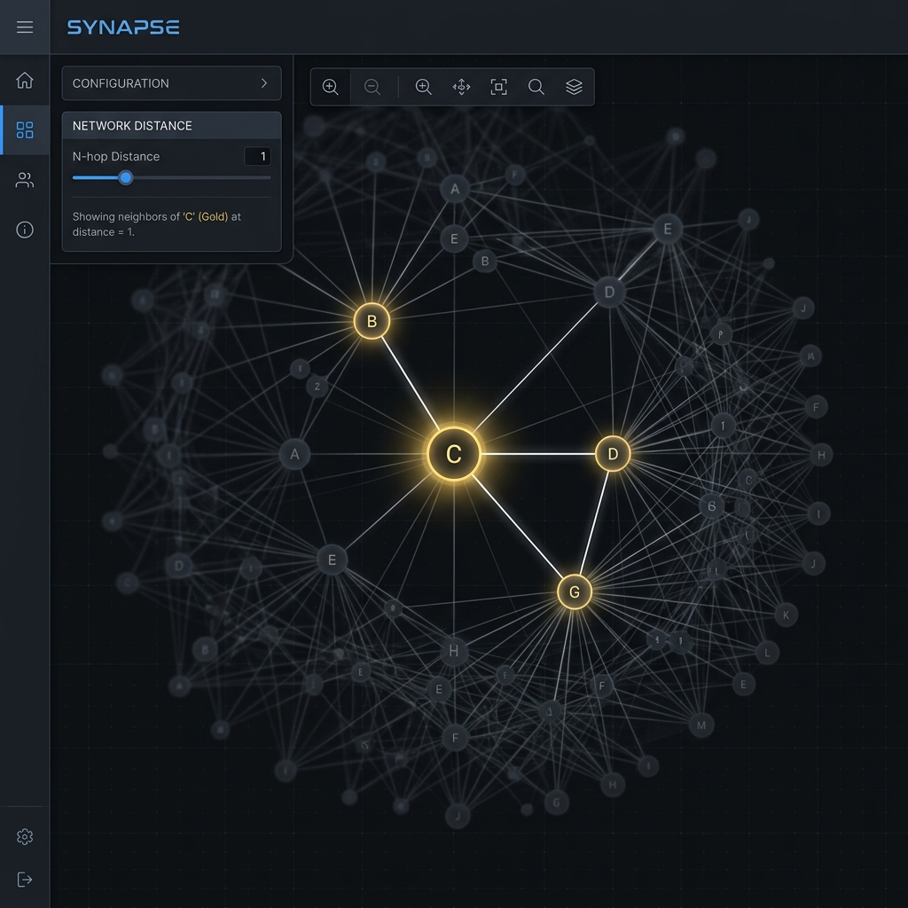

#  SYNAPSE

> **Visual Architecture Engine for LLM Systems**

**Don't read the code. See the architecture.**

[](https://github.com/dogsinatas29/SYNAPSE)
[](https://github.com/dogsinatas29/SYNAPSE/releases)


---

## 💡 What is SYNAPSE?

SYNAPSE is a high-performance engine that visualizes the internal structure of LLM-based systems into a real-time graph.

- **Trace Execution Flow**: Visualize logic paths instantly.
- **Analyze Dependency Graphs**: Map complex module relationships.
- **Detect Architecture Drift**: Identify deviations between code and design.

## ⚠️ Problem

LLM-based systems face these critical structural challenges:
- **Invisible Flow**: Internal logic paths are hidden behind abstractions.
- **Dependency Explosion**: Relationships become complex and unmanageable.
- **Impossible Debugging**: Debugging the overall structure is fundamentally difficult.

## ✅ Solution

SYNAPSE transforms "reading code" into "seeing architecture" by projecting execution flows and structures into an interactive graph.

## 📸 Demo


*Actual view of SYNAPSE analyzing its own architecture.*

## 🚀 Quick Start

Launch your visual architecture journey in seconds.

### 1. Install Extension
Download the latest `.vsix` from [Releases](https://github.com/dogsinatas29/SYNAPSE/releases) and run:
```bash
code --install-extension synapse-visual-architecture-v0.3.22.vsix
```

### 2. Launch Canvas
Click the **🧠 Canvas icon** in the editor title bar or Sidebar.

### 3. Instant Analysis
Select **"Lite Bootstrap"** to automatically discover your project architecture.

---

## ✨ Key Features

- **🧠 Real-time Graph Visualization**: Live network mapping of your project.
- **🔍 N-hop Focus View**: Automated identification of critical core nodes.
- **⚠️ Diagnostic Intelligence**: Real-time architectural analysis (R1-R5).
- **🧩 AI Scan Integration**: Unified scanning engine for Python, Rust, C++, and TS.
- **Semantic Zoom (LOD)**: Navigate thousands of nodes with performance optimization.

---

## 🔍 Focus View (N-hop)

Extract only the connections up to N steps from a specific node to focus on the **Local Context** in a complex global graph.


*Focus View (N=1) isolating node C and its immediate neighbors.*

### Example

**Full Graph:**
```text
A ─ B ─ C ─ D ─ E  
│   │  
F   G ─ H ─ I  
```

---

**Focus View (N = 1, Center = C):**
```text
B ─ C ─ D  
    │  
    G  
```

---

**Focus View (N = 2, Center = C):**
```text
A ─ B ─ C ─ D ─ E  
│       │  
F       G ─ H  
```

### Why it matters
- **Instant Scope Reduction**: Narrow down debugging range in massive graphs.
- **Path Tracing**: Rapidly trace specific execution flows.
- **Local Anomaly Detection**: Identify structural defects within a localized area.

---

## 🏗️ Architecture

SYNAPSE consists of the following layers:
- **Scanner**: Deep semantic multi-lang analyzer.
- **Graph Engine**: Deterministic, immutable state machine.
- **Visualization Layer**: Hybrid 2D Canvas & 3D WebGL accelerated rendering.
- **AI Merge Logic**: Intelligent resolution of ghost references and active files.

---

## 🧠 Philosophy

**"What you see is the logic of LLM"**

SYNAPSE was created to overcome the limitations of code-centric development. It bridges the gap between Large Language Model (LLM) reasoning and physical code architecture, transforming abstract logic into an interactive, high-performance node-edge network.

---

## 🆕 Revision History (v0.3.x)

| Version | Date | Description |
| :--- | :--- | :--- |
| **v0.3.22** | 2026-04-20 | **Rendering Parity & Intelligent Tooltips**: Full 2D/3D visual synchronization, debounced tooltips with identity binding, and LOD-aware lists. |
| **v0.3.21** | 2026-04-18 | **Visual Consistency & Edge Bundling**: Full convention synchronization, Bezier flow consolidation, and Amnesia Guard for snapshot integrity. |
| **v0.3.20** | 2026-04-17 | **Rust Persistence & Engine Hardening**: Path-based IDs for Rust support, Velocity clamping for physics stability. |
| **v0.3.18** | 2026-04-17 | **Diagnostic Hint Engine**: Real-time architectural analysis (R1-R5), Zero-Unknown semantic labeling. |

[View Full History](REVISION_HISTORY.md)

---

## 📅 Status & Roadmap

- **Status**: v0.3.22 – Core features stabilized.
- **Next**:
    - Server / Client separation for remote analysis.
    - Advanced Performance optimization for 50k+ nodes.
    - Real-time collaborative architecture design.

---

## 📜 License & Author
Licensed under the [GNU General Public License v3.0](LICENSE).  
Created with 🧠 by [dogsinatas29](https://github.com/dogsinatas29)
