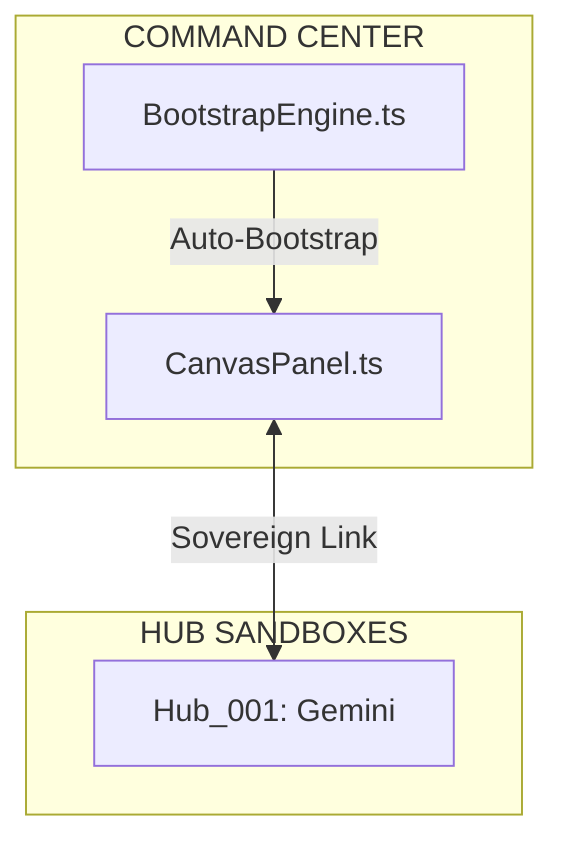

# 🏛️ PROJECT ARCHITECTURE: MASTER HUB (v0.2.21 Sovereign Spec)

> **"One Truth, Distributed Execution."**
> 이 문서는 SYNAPSE의 중앙 관제탑이자 모든 모듈화된 명령 체계의 허브입니다.

---

## 🗺️ Documentation Orchestration (Modular Specs)
복잡도를 제어하기 위해 상세 설계는 다음 도메인 전문 문서로 분산 관리됩니다.

- [🧠 Core Engine (Rendering & Logic)](file:///home/dogsinatas/TypeScript_project/antigravity-extension-vis/core_synapse.md)
- [🚀 Execution & Agent Control](file:///home/dogsinatas/TypeScript_project/antigravity-extension-vis/vega_agent.md)
- [📜 Reporting & Diagnosis](file:///home/dogsinatas/TypeScript_project/antigravity-extension-vis/reporting.md)
- [📦 Data Scheme & Persistence](file:///home/dogsinatas/TypeScript_project/antigravity-extension-vis/data_scheme.md)

---

## 🛰️ Sovereign Protocol: Hub & Worker Mapping
팀 기반 협업 및 자치 구역 설계를 위한 권한지도입니다.

### [HUB: HUB_MASTER]
- **OWNER**: Commander (Admin)
- **STATUS**: Authority
- **SCOPE**: Root, src/core/*, src/webview/*
- **RESOURCES**: [규약.md](file:///home/dogsinatas/TypeScript_project/antigravity-extension-vis/RULES.md)

### [HUB: HUB_001_GEMINI]
- **OWNER**: Gemini (Worker)
- **STATUS**: Active
- **SANDBOX**: /src/workers/gemini/
- **CLUSTER**: `CL_LOGIC_SCANNER`
- **NODES**: [N001, N002, N003]

---

## 🏗️ System Topology Overview
전체 시스템의 핵심 계층 구조입니다. 상세 내용은 각 모듈 문서를 참조하십시오.

---

## ⚠️ Operation Rules
1. **SSoT (Single Source of Truth)**: 모든 물리적 변화는 시냅스 캔버스에서 승인된 후 이 문서와 소스코드에 동시 각인됩니다.
2. **Modular Integrity**: 각 모듈 문서는 독립적으로 작동하되, 이 마스터 허브의 [Interface] 규약을 절대 준수해야 합니다.
3. **Audit Trail**: 모든 허브의 `Status` 변화는 스냅샷 히스토리에 영구 기록됩니다.
