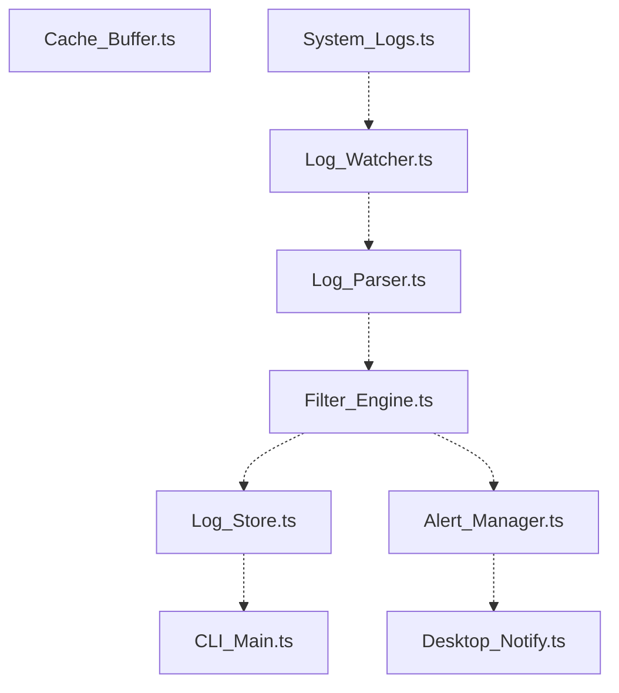

# 프로젝트 아키텍처

Auto-generated by SYNAPSE

```mermaid
flowchart TD
  node_0[CLI_Main.ts]
  node_1[Log_Watcher.ts]
  node_2[Log_Parser.ts]
  node_3[Filter_Engine.ts]
  node_4[Alert_Manager.ts]
  node_5[Log_Store.ts]
  node_6[Cache_Buffer.ts]
  node_7[System_Logs.ts]
  node_8[Desktop_Notify.ts]

  node_7 -.-> node_1
  node_1 -.-> node_2
  node_2 -.-> node_3
  node_3 -.-> node_5
  node_3 -.-> node_4
  node_4 -.-> node_8
  node_5 -.-> node_0
```
